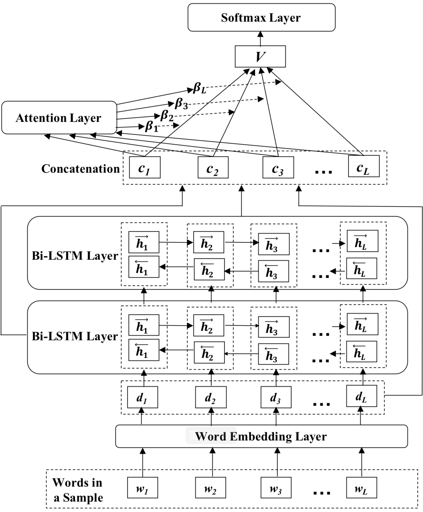

# SEntiMoji: An Emoji-Powered Learning Approach for Sentiment Analysis in Software Engineering

SEntiMoji: An Emoji-Powered Learning Approach for Sentiment
## Analysis in Sofware Engineering

Zhenpeng Chen
Key Lab of High-Confidence Software
Technology, MoE (Peking University)
Beijing, China
czp@pku.edu.cn

Yanbin Cao
Key Lab of High-Confidence Software
Technology, MoE (Peking University)
Beijing, China
caoyanbin@pku.edu.cn

Xuan Lu
Key Lab of High-Confidence Software
Technology, MoE (Peking University)
Beijing, China
luxuan@pku.edu.cn

## Xuanzhe Liu∗

Qiaozhu Mei
School of Information, University of
Michigan
Ann Arbor, USA
qmei@umich.edu

Key Lab of High-Confidence Software
Technology, MoE (Peking University)
Beijing, China
xzl@pku.edu.cn

KEYWORDS

ABSTRACT

Sentiment analysis has various application scenarios in software
engineering (SE), such as detecting developers’ emotions in commit
messages and identifying their opinions on Q&A forums. However,
commonly used out-of-the-box sentiment analysis tools cannot obtain reliable results on SE tasks and the misunderstanding of technical jargon is demonstrated to be the main reason. Then, researchers
have to utilize labeled SE-related texts to customize sentiment analysis for SE tasks via a variety of algorithms. However, the scarce
labeled data can cover only very limited expressions and thus cannot guarantee the analysis quality. To address such a problem, we
turn to the easily available emoji usage data for help. More specifically, we employ emotional emojis as noisy labels of sentiments and
propose a representation learning approach that uses both Tweets
and GitHub posts containing emojis to learn sentiment-aware representations for SE-related texts. These emoji-labeled posts can not
only supply the technical jargon, but also incorporate more general
sentiment patterns shared across domains. They as well as labeled
data are used to learn the final sentiment classifier. Compared to
the existing sentiment analysis methods used in SE, the proposed
approach can achieve significant improvement on representative
benchmark datasets. By further contrast experiments, we find that
the Tweets make a key contribution to the power of our approach.
This finding informs future research not to unilaterally pursue the
domain-specific resource, but try to transform knowledge from the
open domain through ubiquitous signals such as emojis.

## Emoji; Sentiment analysis; Software engineering

ACM Reference Format:
Zhenpeng Chen, Yanbin Cao, Xuan Lu, Qiaozhu Mei, and Xuanzhe Liu. 2019.
SEntiMoji: An Emoji-Powered Learning Approach for Sentiment Analysis
in Software Engineering. In Proceedings of the 27th ACM Joint European Software Engineering Conference and Symposium on the Foundations of Software
Engineering (ESEC/FSE ’19), August 26–30, 2019, Tallinn, Estonia. ACM, New
York, NY, USA, 12 pages. https://doi.org/10.1145/3338906.3338977

1
INTRODUCTION

Software development is a highly collaborative activity that is susceptible to the affective states of developers [29, 39, 48, 51]. On
the one hand, negative sentiments can make developers underperform in the software projects that they contribute to [26] and
lead to longer issue fixing time [51]. Therefore, project managers
need to stay aware of the affective states of developers, in order
to detect negative sentiments and take timely necessary actions
to ensure high productivity of developers [29]. On the other hand,
understanding the sentiments in developers’ discussions can help
software practitioners be aware of collective opinions about specific SE topics (e.g., adding a new feature in software) or artifacts
(e.g., software libraries or APIs) [30, 40, 41, 56, 57], which can then
help their further actions about these topics and their usage and
improvement of these artifacts.
Sentiment analysis has been a frequently used natural language
processing (NLP) technique in SE. It aims to identify the affective
states and subjective opinions in texts. Many out-of-the-box sentiment analysis tools (e.g., SentiStrength [63]) not designed for
SE-related texts have been applied to SE tasks, but recent work has
indicated that they cannot produce reliable results on SE tasks [38].
Furthermore, Islam and Zibran [35] applied SentiStrength to an SErelated dataset and found that misunderstanding of domain-specific
meanings of words (namely technical jargon in the rest of this paper)
accounts for the most misclassifications. Such a finding inspires
a series of research efforts in recent years to generate SE-specific
datasets and develop customized sentiment analysis methods based
on them [8, 14, 41]. Various machine-learning or deep-learning

# CCS CONCEPTS

• Information systems →Sentiment analysis.

∗Corresponding author: Xuanzhe Liu (xzl@pku.edu.cn).

Permission to make digital or hard copies of all or part of this work for personal or
classroom use is granted without fee provided that copies are not made or distributed
for profit or commercial advantage and that copies bear this notice and the full citation
on the first page. Copyrights for components of this work owned by others than ACM
must be honored. Abstracting with credit is permitted. To copy otherwise, or republish,
to post on servers or to redistribute to lists, requires prior specific permission and/or a
fee. Request permissions from permissions@acm.org.
ESEC/FSE ’19, August 26–30, 2019, Tallinn, Estonia
© 2019 Association for Computing Machinery.
ACM ISBN 978-1-4503-5572-8/19/08...$15.00
https://doi.org/10.1145/3338906.3338977

ESEC/FSE ’19, August 26–30, 2019, Tallinn, Estonia
Zhenpeng Chen, Yanbin Cao, Xuan Lu, Qiaozhu Mei, and Xuanzhe Liu

• We propose an emoji-powered learning approach for SE-customized
sentiment analysis, which utilizes Tweets to capture the general
sentimental expressions and GitHub posts as well as manually
labeled data to incorporate the technical jargon.
• We demonstrate the effectiveness of SEntiMoji for SE tasks using
four representative benchmark datasets. SEntiMoji can significantly improve the state-of-the-art results on all these datasets.
• We explore the underlying reasons behind the performance of
SEntiMoji by rigorous contrast experiments and provide future
research some insightful implications.

techniques have been applied, but the performance still falls short
of producing adequate results in practice for some SE tasks [41].
One possible reason behind the poor performance could be the
customized methods that are trained based on scarce SE-related
labeled data (only thousands of samples), and inevitably lack the
knowledge of other expressions that are not contained in them.
Given the large volume of English vocabulary, these missing expressions are indeed non-trivial. To tackle this problem, a straightforward solution is to annotate abundant SE-related texts with
sentiment labels. However, manual annotation on a large scale is
quite difficult, time-consuming, and error-prone [23]. Instead, recent work in NLP attempted to employ emotional emojis as noisy
labels of sentiments on social media [23]. As emojis become an
emerging ubiquitous language used worldwide [43], emoji-labeled
texts are easily available, which can help tackle the scarcity of manually labeled texts and thus benefit the sentiment analysis tasks [23].
Inspired by this work, we aim to explore the emoji usage data into
sentiment analysis in SE. Here then comes a question. Where should
we extract such data?
In fact, emojis not only pervasively exist in social media, but are
also widely adopted in the communication of developers to express
sentiment [44]. For example, in the post “thanks for writing this
great plugin
”1 on GitHub, the emoji “
” can be considered a
positive sentiment signal. In order to ensure the representativeness
of emoji usage data, we employ posts containing emojis from both
Twitter (a typical social media platform) and GitHub (a typical
software development platform). Here, the core insight is: posts
from GitHub can provide more technical information beyond the
limited labeled data, while posts from Twitter can help learn more
general sentimental patterns that are shared in both technical and
non-technical communication.
We propose SEntiMoji, an emoji-powered learning approach for
sentiment analysis in SE. Through SEntiMoji, vector representations
of texts are first derived based on modeling how emojis are used
alongside words on Twitter and GitHub. These sentiment-aware
representations are then used to predict the sentiment polarities
on the labeled data. To evaluate the performance of SEntiMoji, we
answer two research questions:
• RQ1: How does SEntiMoji perform compared to the existing sentiment analysis methods in SE? By rigorous contrast experiments, we
find that SEntiMoji can significantly outperform existing sentiment
analysis methods in SE on all the selected benchmark datasets. This
finding indicates that the incorporation of emoji usage data is a
promising solution to the SE-customized sentiment analysis.
• RQ2: Which training corpora contribute more to the power of
SEntiMoji? We find that GitHub posts do not make a key contribution. The combination of large-scale Tweets and a small amount of
labeled data can already achieve satisfactory performance. Such results highlight the significance of the general sentimental patterns
learned from Tweets. Our finding informs future research not to
focus only on the domain-specific resource. Instead, they can also
pay attention to the general sentimental patterns that can be easily
extracted from the open domain.
The main contributions of this paper are as follows:

The rest of this paper is organized as follows. Section 2 summarizes the literature related to this study. Section 3 presents the
workflow of SEntiMoji. Section 4 compares SEntiMoji with baseline
methods on representative benchmark datasets and answers the
two research questions based on the achieved results. Section 5
summarizes the lessons learned in this study and the implications.
## Section 6 discusses the threats that could affect the validity of this
study, followed by concluding remarks in Section 7.

2
# RELATED WORK

We start with the literature related to this study. Our research
is particularly inspired by two streams of literature: sentiment
analysis in SE and emojis in sentiment analysis.

2.1
## Sentiment Analysis in SE

In recent years, sentiment analysis has been widely applied in
SE for enhancing software development, maintenance, and evolution [13, 25, 29, 37, 46, 51, 52, 54, 61, 68, 69]. Most of these studies used the out-of-the-box sentiment analysis tools (e.g., SentiStrength [63], NLTK [12], and Stanford NLP [45]) trained on
non-technical texts. Among these tools, SentiStrength is considered to be the most widely adopted one in SE studies [18, 26, 28–
30, 37, 49, 51, 59, 64]. However, some researchers noticed unreliable
results when directly employing such tools for SE tasks [38, 41].
Jongeling et al. [38] observed the disagreement among these existing tools on the datasets in SE and found that the results of
several SE studies involving these sentiment analysis tools cannot
be confirmed when a different tool is used. To investigate the challenges in sentiment analysis in SE, Islam and Zibran [35] applied
the most popular SentiStrength to some labeled issue comments
extracted from JIRA issue tracking system and conducted an indepth qualitative study to uncover twelve difficulties in identifying
the sentiments of SE-related texts by analyzing the misclassified
samples. Among the identified difficulties, lacking domain-specific
knowledge is demonstrated to be the most dominant, accounting for
about 81% of the classification errors. Since then, how to effectively
leverage SE-related texts to introduce technical jargon becomes the
main direction of the sentiment analysis in SE [8, 14, 41]. Against
such a background, many SE-customized sentiment analysis tools
and methods are proposed, including SentiStrength-SE [35], Senti-
CR [8], Senti4SD [14], etc. We take them along with the most popular SentiStrength as baseline methods in this study and introduce
them detailedly in Section 4.1.

1https://github.com/MikaAK/s3-plugin-webpack/issues/65, retrieved in November
2018.

SEntiMoji: An Emoji-Powered Learning Approach for Sentiment Analysis in Sofware Engineering
## ESEC/FSE ’19, August 26–30, 2019, Tallinn, Estonia

2.2
## Emojis in Sentiment Analysis

vector space, which captures the semantic relationship between
words.

Traditional sentiment analysis in NLP is mainly performed in unsupervised or supervised ways. Unsupervised tools (e.g., SentiStrength)
simply make use of lists of words annotated with sentiment polarity to determine the overall sentiment of a given text. However,
fixed word lists cannot cope with the dynamic nature of the natural language [27]. Then, researchers started to use labeled text to
train sentiment classifiers for different purposes in a supervised
way. However, it is time-consuming to manually annotate text on
a large scale, thus resulting in a scarcity of labeled text. To tackle
this problem, many researchers attempted to perform sentiment
analysis in a distantly supervised way. For example, they used binarized emoticons [42] and specific hashtags [20] as a proxy for the
emotional contents of a text. Recent studies extended the distant
supervison to emojis, a more diverse set of noisy labels [17, 23].
As emojis are becoming increasingly popular [9, 16, 43] and have
the ability to express emotions [33], they are considered benign
noisy labels of sentiments in current sentiment analysis [17, 23].
The sentiment information contained in the emoji usage data can
supplement the limited manually labeled data.
Recently, to address the challenge of sentiment analysis in SE,
researchers also started to analyze emoticons and emojis in software
development platforms so as to find some potential solutions. Claes
et al. [19] investigated the use of emoticons in open source software
development. Lu et al. [44] analyzed the emoji usage on GitHub
and found that emojis are often used to express sentiment on this
platform. Furthermore, Imtiaz et al. [34] directly used emojis as the
indicators of developers’ sentiments on GitHub. Calefato et al. [14]
and Ding et al. [22] took emoticons into account in their proposed
sentiment analysis techniques built on SE-related texts. All of them
demonstrated the feasibility of leveraging these emotional cues to
benefit sentiment analysis in SE. Following this line of research,
this study leverages the large-scale emoji usage from both technical
and open domains to address sentiment analysis in SE.

LSTM. Recurrent neural network (RNN) [58] is a kind of neural
network specialized for processing sequential data such as texts. It
connects computational units of the network in a directed cycle such
that at each time step, a unit in RNN takes both the current input
and the hidden state of the same unit from the previous time step
as the input. Due to the recurrent nature of RNN, it can capture the
sequential information, which is important to NLP tasks. However,
due to the well-known gradient vanishing problem, vanilla RNNs
are difficult to train to capture long-term dependency for sequential
texts. LSTM [32] addresses this problem by introducing a gating
mechanism to determine when and how the states of hidden layers
can be updated. Each LSTM unit contains a memory cell, an input
gate, a forget gate, and an output gate. The input gate controls the
input activations into the memory cell, and the output gate controls
the output flow of cell activations into the rest of the network. The
memory cells in LSTM store the sequential states of the network,
and each memory cell has a self-loop whose weight is controlled
by the forget gate. The LSTM structure ensures that the gradient of
the long-term dependencies cannot vanish.

Fine-tuning. Labeled data are often limited for NLP tasks, especially new ones. For such tasks, training a neural network from
scratch with limited data may result in over-fitting. One approach
to getting around this problem is to take a network model, which
has been trained for a given task, to perform the target task. This
process is commonly called fine-tuning [70]. Assuming the target
task is similar to the original task, fine-tuning enables us to take
advantages of the prior efforts on feature extraction (i.e., the pretrained parameters of the network). The first step of fine-tuning
is to replace the last fully-connected layer of the original network
with a new one that can output a probability vector whose dimension is the desired number of classes in the target task. Then, we
can use the labeled data for the target task to fine-tune parameters
of the original network and make the network be suitable for the
new task.

3
METHODOLOGY

As we mentioned before, sentiment analysis is a traditional NLP
task. In this section, we give a brief description to the fundamental
concepts of related techniques and then illustrate the workflow of
SEntiMoji detailedly.

3.2
## The SEntiMoji Approach

SEntiMoji is an SE-customized sentiment classifier trained based on
a small amount of labeled SE-related data as well as large scale emojilabeled data from both Twitter and GitHub. As emojis are widely
used to express sentiment [33, 44], we learn sentiment-aware representations of texts by using emoji prediction as an instrument. More
specifically, we use emojis as noisy labels of sentiments and learn
vector representations of sentences by predicting which emojis are
used in a sentence. Sentences that tend to occur with the same emoji
are represented similarly, which captures the sentiment relationship
between sentences and can thus benefit the downstream sentiment
classification. Since such a representation model trained on large
scale Tweets has been off-the-shelf, i.e., DeepMoji model [3, 23].
We directly build SEntiMoji upon DeepMoji. It takes a two-stage
approach: 1) fine-tune DeepMoji using emoji-labeled texts from
GitHub to incorporate technical knowledge. The fine-tuned model
is still a representation model based on the emoji-prediction task
and we call it DeepMoji-SE; 2) use DeepMoji-SE to obtain vector

3.1
Preliminaries

We first present some background knowledge on the NLP techniques that will be used in this paper, including word embedding,
Long Short-Term Memory (LSTM) network, and fine-tuning.

Word Embedding. To eliminate the discrete nature of words,
word embedding is employed by NLP tasks to encode every single
word into a continuous vector space as a high dimensional vector. It
is usually trained by learning from large scale corpus via GloVe [55],
CBOW [47], or skip-gram algorithm [47]. In this paper, the skipgram algorithm is employed for word embedding. This algorithm
scans each example in the training corpus and uses each word it
has scanned as an input to predict words within a certain range
before and after this word. By such a prediction task, words that
commonly occur in a similar context are embedded closely in the

ESEC/FSE ’19, August 26–30, 2019, Tallinn, Estonia
Zhenpeng Chen, Yanbin Cao, Xuan Lu, Qiaozhu Mei, and Xuanzhe Liu

Figure 1: The architecture of DeepMoji.

representations of the sentiment-labeled texts and then use these
vectors as features to train the sentiment classifier.
Next, we describe the existing DeepMoji model and the two-stage
learning process in details.

3.2.1
DeepMoji Model. Felbo et al. [23] learned DeepMoji model
through predicting emojis used in Tweets. To this end, they collected
56.6 billion Tweets (denoted as T), selected the top 64 emojis in this
corpus, and excluded the Tweets that do not contain any of these
emojis. For each remaining Tweet, they created separate samples
for each unique emoji in it. For example, “Good idea!
” can
be separated into two samples, i.e., (“Good idea!”,
) and (“Good
idea!”,
). Finally, the generated 1.2 billion samples (denoted as
ET) were used to train the representation model.
The model architecture is illustrated in Figure 1. First, for a given
sample, words in it are inputted into the word embedding layer pretrained onT. In this step, each word can be represented as a unique
vector. These word vectors are then processed by two bi-directional
LSTM layers and one attention layer. Through these steps, the
sample can be represented as one sentence vector instead of several
word vectors. Finally, the softmax layer treats the sentence vector
as the input and outputs the probabilities that this sample contains
each emoji. Taking the real emoji contained in each sample in
ET as ground truth, the model learns parameters by minimizing
the output error of the softmax layer. The details of the model
architecture are described below.

Word Embedding Layer. The word embedding layer is pre-trained
based on T. Through this layer, each sample in ET can be denoted
as (x,e), where x = [d1,d2, ...,dL] as the word vector sequences of
the plain text removed emoji (di as the vector representation of the
i-th word) and e as the emoji contained in the sample.

Bi-Directional LSTM Layer. Given the input x = [d1,d2, ...,dL],
at step t, LSTM computes unit states of the network as follows:

i(t) = σ(Uidt +Wih(t−1) + bi),

f (t) = σ(Uf dt +Wf h(t−1) + bf ),

o(t) = σ(Uodt +Woh(t−1) + bo),

c(t) = ft ⊙c(t−1) + i(t) ⊙tanh(Ucdt +Wch(t−1) + bc),

h(t) = o(t) ⊙tanh(c(t)),

where i(t), f (t), o(t), c(t), and h(t) denote the states of the input
gate, forget gate, output gate, memory cell, and hidden layer at
step t. W , U , b, and ⊙denote the recurrent weights, input weights,
biases, and element-wise product, respectively. In order to take both
the past and the future words of the current word at each time step
into consideration, we employ bi-directional LSTMs instead of the
traditional LSTM. Each bi-directional LSTM network contains two
sub-networks (i.e., a forward network and a backward network) to
encode the sequential contexts of each word in the two directions
respectively. We thus compute an encoded vector hi of each word
vector di by concatenating the latent vectors from both directions:

hi =
→
hi ||
←
hi,

where
→
hi and
←
hi denote the forward and backward states of di,
respectively.
In order to enable the unimpeded information flow in the whole
model, the outputs of the two LSTM layers and the word embedding
layer are concatenated by the skip-connection algorithm [31], then
as input into the attention layer. Specifically, each word of the input
sample is further represented as ci:

ci = di ||hi1||hi2,
where di, hi1, and hi2 represent the encoded vectors of the i-th
word extracted from the word embedding layer and the first and
second bi-directional LSTM layers.
Attention Layer. Since not all words contribute equally to the
overall sentiment polarity of the sample, the model employs the
attention mechanism [66] to determine the importance of each
word. The attention score (i.e., the importance) of the i-th word is
computed as:

αi =
exp(Wci)
ÍL
j=1 exp(Wcj)
,

where W is the weight matrix of the attention layer. Then the
sample can be represented as the weighted sum of all words in it:

L
Õ

# V =

i=1
αici.

Softmax Layer. The final representation V is inputted into the
softmax layer to output a 64-dimension probability vector, each
element of which denotes the probability that this sample contains
one specific emoji.
DeepMoji learns parameters by minimizing the cross entropy
between the output probability vectors and the one-hot representations of the emoji actually contained in each sample. Through such

844

SEntiMoji: An Emoji-Powered Learning Approach for Sentiment Analysis in Sofware Engineering
## ESEC/FSE ’19, August 26–30, 2019, Tallinn, Estonia

SentiStrength [1, 63] is a lexicon-based sentiment classifier
trained for informal English texts rather than technical texts. It
utilizes a dictionary of several word and phrase lists to compute
the sentiment of texts. The dictionary contains a sentiment word
strength list, a booster word list, a negating word list, an emoticon
list, etc. For an input text, SentiStrength outputs a positive score
and a negative score based on its coverage of the built-in dictionary.
Based on the algebraic sum of the two scores, SentiStrength can
report a trinary score, i.e., 1 (positive), 0 (neutral), or -1 (negative).
SentiStrength-SE [5, 35] is a lexicon-based tool adapted from
SentiStrength. It is developed based on the results obtained by
running SentiStrength on Group-1 of the JIRA dataset (an SE-related
dataset that will be described in Section 4.2). It first identifies the
reasons behind the misclassified cases and then makes efforts to
address them. For example, it adapts the raw inherent dictionary
of SentiStrength to contain some SE-related terms.
SentiCR [4, 8] is a supervised sentiment analysis method originally proposed for code reviews. It computes Term Frequency -
Inverse Document Frequency (TF-IDF) [10] of bag-of-words in a
corpus as features and uses traditional machine learning algorithms
to train the sentiment classifier. In addition, it applies SMOTE [15]
for over-sampling to address class imbalance in the training data.
In this study, we use the Gradient Boosting Tree [24] to reproduce
this approach as recommended by its authors.
Senti4SD [7, 14] is a supervised sentiment analysis method for
developer-generated texts. It leverages three kinds of features for
sentiment classification, including lexicon-based features (based on
the sentimental word list of SentiStrength), keyword-based features
(such as uni-grams and bi-grams), and semantic features (based on
the word embeddings trained on large scale posts collected from
Stack Overflow). Finally, it uses Support Vector Machine [62] to
train the sentiment classifier.
Besides the four existing methods, we also adopt six variants of
SEntiMoji as baseline methods, so as to measure the contribution
of Tweets, GitHub posts, and manually labeled data to the overall
performance of SEntiMoji. The six variants are described as follows:
SEntiMoji-G adopts the model architecture of DeepMoji and
uses GitHub posts to directly train the DeepMoji-SE, instead of
using GitHub data to fine-tune DeepMoji. Then the re-trained
DeepMoji-SE is used for training the final sentiment classifier. Compared to SEntiMoji, SEntiMoji-G is trained purely based on GitHub
data while not leveraging any Tweet.
SEntiMoji-T uses DeepMoji rather than DeepMoji-SE for the
final training of the sentiment classifier in the second stage. Compared to SEntiMoji, SEntiMoji-T does not use any GitHub post. It
can learn the knowledge of SE-related jargon only from the manually labeled data in the second stage.
T-80%, T-60%, T-40%, and T-20% are adapted from SEntiMoji-T.
They differ from SEntiMoji-T only in the size of the labeled data.
They randomly select 80%, 60%, 40%, and 20% of the labeled data
used by SEntiMoji-T to train the sentiment classifier and keep other
settings unchanged.

a learning phase, the plain texts occur with the same emoji can be
represented similarly.

3.2.2
Stage 1: Fine-tuning DeepMoji Using GitHub Data. As Deep-
Moji is trained on Tweets, we need some developer-generated emojilabeled texts to customize it into an SE-specific setting. To this end,
we use the conversation data (i.e., issues, issue comments, pull requests, and pull request comments) in the GitHub-Emoji dataset
collected by Lu et al. [44], which cover more than one hundred
million posts on GitHub, to fine-tune the parameters of DeepMoji.
We first conduct the following procedures to pre-process the
GitHub data. We tokenize all the texts into words and convert all
the words into lowercase. Then we replace URLs, references, code
snippets, and mentions with specific tokens in case the concrete
contents of these texts influence the sentiment polarity. For example,
we replace any code snippets with “[code].” From the processed
GitHub data, we extract the posts containing emojis and then create
separate samples for each unique emoji in each post. Then the
samples containing any of the 64 emojis predicted by DeepMoji
are finally selected for fine-tuning DeepMoji. We denote about 1
million remaining samples as EG.
Next, we use EG to fine-tune DeepMoji by the chain-thaw approach [23]. The chain-thaw approach sequentially unfreezes and
fine-tunes a single layer in DeepMoji. By training each layer separately, it can adjust the individual patterns across the network with
a reduced risk of over-fitting. More specifically, it first fine-tunes the
softmax layer, and then fine-tunes each layer individually starting
from the first layer (i.e., the word embedding layer) in the network.
Finally, the entire model is trained with all layers and we obtain an
SE-customized representation model that learns from emoji-labeled
Tweets and GitHub posts. We refer to it as DeepMoji-SE in this
paper.

3.2.3
Stage 2: Training the Sentiment Classifier. Based on DeepMoji-
SE, labeled SE-related data (denoted as LD) can be represented as
sentiment-aware vectors, which are further used as features to learn
the final sentiment classifier.
Specifically, the training phase of the sentiment classifier is also a
process of fine-tuning. With other settings of the whole DeepMoji-
SE unchanged, we replace its 64-dimension softmax layer with
an n-dimension softmax layer, where n denotes the number of
sentiment polarities in the classification task. Then, we use LD to
fine-tune the parameters of DeepMoji-SE by the aforementioned
chain-thaw approach.

4
EVALUATION

We then evaluate the performance of SEntiMoji by comparing it
with some baseline methods on existing benchmark datasets.

4.1
## Baseline Methods

We employ four existing sentiment analysis methods for comparisons, including SentiStrength, SentiStrength-SE, SentiCR, and
Senti4SD. SentiStrength is not designed for technical texts but has
been the most popular sentiment analysis tool in previous SE studies, while the other three tools are specifically proposed for SErelated texts in recent years. We now describe these methods briefly:

4.2
## Benchmark Datasets

We compare the performance of our approach and the ten baseline
methods on four representative datasets covering SE-related texts

ESEC/FSE ’19, August 26–30, 2019, Tallinn, Estonia
Zhenpeng Chen, Yanbin Cao, Xuan Lu, Qiaozhu Mei, and Xuanzhe Liu

Table 1: Benchmark datasets used in this study.

from different platforms, i.e., JIRA dataset, Stack Overflow dataset,
Code Review dataset, and Java Library dataset. All of them are collected and annotated for sentiment analysis in SE and have been
released online. More details of the four datasets are provided in
the following:
JIRA dataset [2, 53] originally contained 5,992 issue comments
extracted from the JIRA issue tracking system. It was divided into
Group-1, Group-2, and Group-3, containing 392, 1,600, and 4,000
issue comments, respectively. As SentiStrength-SE is developed
by analyzing Group-1 data, in order to compare these methods
fairly, we exclude Group-1 comments from this dataset. Group-2
and Group-3 comments were labeled with love, joy, surprise, anger,
sadness, fear, or neutral. In accordance with the previous study [50],
we consider love and joy as positive, sadness and fear as negative,
and discard the surprise label to avoid introducing noise as it can
match either positive or negative. For Group-2 comments, the original annotations by all three coders were released. We assign each
comment with positive, negative, or neutral if it was annotated
with the corresponding label by at least two coders. Under such
criteria, comments that cannot match any sentiment label are excluded. For each comment in Group-3, authors of the JIRA dataset
directly released its golden emotion label, which was assigned if
at least two raters marked the presence of this emotion [51]. After
excluding the surprise labels, we also discard the comments with no
label or opposite sentiment labels. Finally, we have 2,573 remained
comments from Group-2 and Group-3, 42.9% of which are positive,
27.3% neutral, and 29.8% negative.
Stack Overflow dataset [7, 14] contains 4,423 samples and covers four types of Stack Overflow posts, including questions, answers,
question comments, and answer comments. The raw dataset was
originally extracted from the Stack Overflow dump from July 2008
to September 2015. Then, to ensure a balanced polarity distribution,
4,800 posts were remained based on their sentiment detected by
SentiStrength. Next, each post was labeled by three coders with
positive, negative, or neutral. Based on the annotations, the posts
annotated with opposite polarity labels were excluded by its authors. Then the final label of each text was determined via majority
voting. Finally, among the remaining 4,423 posts, 34.5% are positive,
38.3% neutral, and the rest 27.2% negative.
Code Review dataset [4, 8] contains 1,600 code review comments extracted from code review repositories of 20 popular open
source software projects. The dataset originally contained 2,000
comments, each of which was independently labeled by three coders
with positive, negative, or neutral. For the comments where raters
had different opinions, their final labels were determined through
discussion. Then the distribution of the labeled review comments
were: 7.7% positive, 19.9% negative, and 72.4% neutral. Due to the
serious class imbalance, its authors randomly excluded a subset
of the majority class (i.e., neutral) and aggregated the remaining
neutral and positive comments into “non-negative” class. Finally,
among the remaining 1,600 comments, 24.9% are negative and 75.1%
non-negative.
Java Library dataset [6, 41] contains 1,500 sentences about
Java libraries or Java APIs extracted from the Stack Overflow dump
of July 2017. Each sentence was annotated by two coders. The
coders labeled each sentence with a sentiment score from -2 to 2
(-2 indicates strong negative, -1 weak negative, 0 neutral, 1 weak

Dataset
Size
Polarity distribution
Positive
Neutral
Negative
JIRA
2,573
1,104 (42.9%)
702 (27.3%)
767 (29.8%)
Stack Overflow
4,423
1.527 (34.5%)
1,694 (38.3%)
1,202 (27.2%)
Code Review
1,600
1,202 (75.1%)
398 (24.9%)
Java Library
1,500
131 (8.7%)
1,191 (79.4%)
178 (11.9%)

positive, and 2 strong positive). After the labeling process, two of
the authors worked on conflict resolution and gave each sentence
a consistent and double-checked sentiment label. Finally, among
the 1,500 collected sentences, 8.7% are positive, 79.4% neutral, and
11.9% negative.
We summarize the statistics of the four datasets in Table 1.

4.3
## Experimental Setting

In this study, we evaluate SEntiMoji and all the baseline methods on
the four benchmark datasets. To make a fair comparison, for each
dataset, we test each method in the same five-fold cross validation
setting. More specifically, for a given dataset, we randomly split it
into five equal subsets and thus can test each method for five times.
Each time, we use one unique subset as the test set and the remaining four subsets as the training set to train all the methods. Since
SentiStrength and SentiStrength-SE are not based on supervised
machine learning but on a set of rules, we do not re-train them.
In accordance with the recent study on assessing sentiment
analysis methods on SE tasks [41], we measure the performance
of each method in terms of the precision, recall, and F-score of each
polarity class as well as the overall accuracy. For each dataset, we
calculate the aforementioned metrics of each method for five turns
in cross validation and finally report the mean value of each metric.
Because we adopt so many metrics to evaluate each method from
different aspects, it is hard for us to conclude whether one method
outperforms the others just based on the difference in one specific
metric. To test whether the performance gap between methods is
statistically significant, we apply the non-parametric McNemar’s
test [21]. This test suits well for our purpose as it does not require
the normal distribution of data and is also adopted in a related
study [36]. Through the five-fold cross validation, each method has
output a predicted label for each sample. To compare method A
with method B via McNemar’s test, we need to derive the number
of samples misclassified by A but not by B (denoted as n01) and
the number of samples misclassified by B but not by A (denoted

as n10). Then we can compute the statistic (|n01−n10 |−1)2

n01+n10
, which is
distributed as χ2 with 1 degree of freedom. Note that when we apply
multi-hypothesis tests, we use Benjamini-Yekutieli procedure [11]
for correction. More specifically, we use “p.adjust” in R and set
“p.adjust.methods” as "BY" to adjust the p-value of each individual
test to obtain more strict and reliable results. The performance
difference is considered statistically significant, only if the p-value
of the computed statistic is lower than a pre-specified significance
level.

4.4
## Research Questions and Results

In Table 2, we summarize the performance of SEntiMoji and baseline
methods. For each combination of dataset and metric, we highlight

SEntiMoji: An Emoji-Powered Learning Approach for Sentiment Analysis in Sofware Engineering
## ESEC/FSE ’19, August 26–30, 2019, Tallinn, Estonia

Table 2: Performance of our emoji-powered models and existing sentiment analysis tools.

Dataset
Class
Metric
SentiStrength
SentiStrength-SE
SentiCR
Senti4SD
SEntiMoji
SEntiMoji-G
SEntiMoji-T
T-80%
T-60%
T-40%
T-20%

Pos
Precision
0.847
0.936
0.950
0.880
0.947
0.938
0.939
0.952
0.948
0.940
0.950
Recall
0.889
0.922
0.919
0.921
0.945
0.920
0.933
0.931
0.935
0.937
0.921
F-score
0.868
0.929
0.934
0.900
0.946
0.928
0.936
0.941
0.941
0.938
0.935

Neu
Precision
0.614
0.710
0.735
0.741
0.823
0.780
0.808
0.795
0.798
0.779
0.775
Recall
0.634
0.844
0.904
0.731
0.880
0.869
0.866
0.887
0.883
0.861
0.861
F-score
0.623
0.771
0.811
0.736
0.850
0.822
0.845
0.838
0.838
0.817
0.815

JIRA

Neg
Precision
0.775
0.871
0.929
0.835
0.922
0.888
0.913
0.905
0.905
0.901
0.879
Recall
0.699
0.734
0.768
0.789
0.864
0.818
0.839
0.835
0.835
0.813
0.825
F-score
0.735
0.796
0.840
0.811
0.892
0.851
0.874
0.868
0.868
0.854
0.851
Accuracy
0.763
0.846
0.872
0.830
0.904
0.876
0.893
0.891
0.891
0.880
0.876

Pos
Precision
0.887
0.908
0.868
0.904
0.932
0.908
0.921
0.926
0.922
0.923
0.918
Recall
0.927
0.823
0.921
0.915
0.940
0.864
0.937
0.929
0.930
0.922
0.912
F-score
0.907
0.863
0.894
0.910
0.936
0.885
0.929
0.928
0.926
0.926
0.915

Neu
Precision
0.922
0.726
0.783
0.829
0.840
0.753
0.841
0.830
0.826
0.819
0.813
Recall
0.632
0.784
0.838
0.772
0.842
0.805
0.840
0.837
0.830
0.836
0.828
F-score
0.750
0.754
0.809
0.800
0.841
0.778
0.841
0.834
0.828
0.827
0.820

Stack
Overflow

Neg
Precision
0.674
0.755
0.843
0.778
0.846
0.762
0.854
0.840
0.837
0.834
0.825
Recall
0.931
0.759
0.686
0.841
0.833
0.736
0.838
0.827
0.827
0.810
0.811
F-score
0.780
0.757
0.753
0.808
0.838
0.748
0.845
0.833
0.828
0.828
0.817
Accuracy
0.815
0.800
0.826
0.840
0.873
0.806
0.873
0.866
0.862
0.858
0.852

Non-Neg
Precision
0.806
0.795
0.872
0.840
0.869
0.801
0.850
0.857
0.857
0.839
0.818
Recall
0.814
0.919
0.895
0.912
0.941
0.943
0.958
0.950
0.948
0.957
0.948
F-score
0.809
0.852
0.883
0.875
0.904
0.865
0.900
0.900
0.899
0.894
0.877

Code
Review

Neg
Precision
0.506
0.537
0.660
0.638
0.762
0.633
0.793
0.778
0.774
0.778
0.717
Recall
0.474
0.238
0.600
0.475
0.572
0.291
0.491
0.521
0.527
0.447
0.364
F-score
0.488
0.372
0.627
0.544
0.653
0.393
0.603
0.614
0.618
0.561
0.469
Accuracy
0.712
0.761
0.823
0.804
0.849
0.780
0.841
0.841
0.841
0.829
0.801

Pos
Precision
0.202
0.320
0.553
0.472
0.849
0.737
0.878
0.825
0.803
0.828
0.728
Recall
0.369
0.224
0.318
0.203
0.329
0.230
0.281
0.214
0.222
0.192
0.142
F-score
0.206
0.262
0.401
0.266
0.472
0.349
0.426
0.337
0.343
0.309
0.235

Neu
Precision
0.858
0.824
0.883
0.860
0.880
0.834
0.869
0.863
0.862
0.850
0.836
Recall
0.768
0.929
0.910
0.926
0.964
0.967
0.971
0.967
0.972
0.972
0.979
F-score
0.810
0.873
0.896
0.893
0.920
0.895
0.917
0.912
0.914
0.907
0.902

Java
Library

Neg
Precision
0.396
0.487
0.546
0.522
0.729
0.489
0.734
0.737
0.735
0.706
0.769
Recall
0.434
0.183
0.593
0.463
0.583
0.223
0.513
0.518
0.490
0.412
0.335
F-score
0.412
0.265
0.565
0.481
0.644
0.302
0.599
0.598
0.586
0.513
0.448
Accuracy
0.693
0.778
0.821
0.807
0.863
0.814
0.859
0.849
0.849
0.838
0.829

Note: For each metric, the highest value is highlighted with shading.

Table 3: McNemar’s statistics between the results of SEnti-
Moji and other existing methods on each dataset, with pvalues in parentheses.

the best result with shading. Based on the achieved results, we first
want to investigate whether SEntiMoji performs better than the
other existing methods.

Methods
JIRA
Stack Overflow
Code Review
Java Library
SentiStrength
231.843**
95.394**
102.202**
160.160**
(0.000)
(0.000)
(0.000)
(0.000)
SentiStrength-SE
62.510**
128.548**
55.840**
69.522**
(0.000)
(0.000)
(0.000)
(0.000)
SentiCR
23.616**
76.963**
7.320*
20.556**
(0.000)
(0.000)
(0.023)
(0.000)
Senti4SD
85.708**
38.686**
19.711**
40.786**
(0.000)
(0.000)
(0.000)
(0.000)

4.4.1
RQ1: How does SEntiMoji perform compared to the existing
sentiment analysis methods in SE?. To answer this question, we
compare SEntiMoji with four existing methods (i.e., SentiStrength,
SentiStrength-SE, SentiCR, and Senti4SD). It is observed that SEnti-
Moji can achieve the best performance on most metrics. To verify
whether the superiority of SEntiMoji is statistically significant, for
each dataset, we perform McNemar’s test between the results of
SEntiMoji and each existing method, and show statistics in Table 3.
Based on the results of statistical tests, we now derive a straightforward answer to RQ1: SEntiMoji can significantly outperform these
existing sentiment analysis methods on all of the datasets. Next,
we want to compare the results more thoroughly.
We first compare SEntiMoji with the most widely used SentiStrength, which is an out-of-the-box sentiment analysis tool without SE-customized efforts. In terms of overall accuracy, SEntiMoji
can outperform SentiStrength by at least 0.1 on the JIRA, Code
Review, and Java Library datasets. By comparison, the performance
difference on the Stack Overflow dataset is only 0.058. This “outlier”
can be attributed to the creation process of the Stack Overflow
dataset. Calefato et al. [14] created this dataset by sampling the
originally collected posts based on their sentiment scores computed
by SentiStrength. It is easier for SentiStrength to correctly classify
the samples selected by itself, which thus results in a relatively

Note: Results labeled with ** / * are significant at the 1% / 5% level.

small performance gap between SEntiMoji and SentiStrength on
the Stack Overflow dataset.
Then we want to compare SEntiMoji with the SE-customized
methods (i.e., SentiStrength-SE, SentiCR, and Senti4SD). In general,
SentiCR performs the best among the three existing methods as it
can achieve the highest accuracy and the highest F-score of each
polarity class on each dataset except the Stack Overflow dataset.
On the Stack Overflow dataset, it performs slightly worse than
Senti4SD. It is reasonable as the semantic features used by Senti4SD
are extracted based on the embeddings trained on large scale Stack
Overflow corpus and thus Senti4SD is more knowledgable than
SentiCR when dealing with Stack Overflow posts. As SentiCR has
an obvious advantage over other SE-customized tools in general, we
then just compare our SEntiMoji with it. At a glance of the results,

| Dataset | Class Metric | SentiStrength | SentiStrength-SE SentiCR Senti4SD | SEntiMoji | SEntiMoji-G SEntiMoji-T |  | T-80% T-60% T-40% T-20% |  |
| --- | --- | --- | --- | --- | --- | --- | --- | --- |
| JIRA | Precision Pos Recall F-score | 0.847 0.889 0.868 | 0.936 0.950 0.880 0.922 0.919 0.921 0.929 0.934 0.900 | 0.947 | 0.938 0.939 0.920 0.933 0.928 0.936 |  | 0.952 |  |
|  |  |  |  | 0.945 |  |  |  |  |
|  |  |  |  | 0.946 |  |  |  |  |
|  | Precision Neu Recall F-score | 0.614 0.634 0.623 | 0.710 0.735 0.741 0.844 0.904 0.731 0.771 0.811 0.736 | 0.823 | 0.780 0.808 0.869 0.866 0.822 0.845 |  | 0.795 0.798 0.779 0.775 0.887 0.883 0.861 0.861 0.838 0.838 0.817 0.815 |  |
|  |  |  |  | 0.880 |  |  |  |  |
|  |  |  |  | 0.850 |  |  |  |  |
|  | Precision Neg Recall F-score | 0.775 0.699 0.735 | 0.871 0.929 0.835 0.734 0.768 0.789 0.796 0.840 0.811 | 0.922 | 0.888 0.913 0.818 0.839 0.851 0.874 |  | 0.905 0.905 0.901 0.879 0.835 0.835 0.813 0.825 0.868 0.868 0.854 0.851 |  |
|  |  |  |  | 0.864 |  |  |  |  |
|  |  |  |  | 0.892 |  |  |  |  |
|  | Accuracy | 0.763 | 0.846 0.872 0.830 | 0.904 | 0.876 0.893 |  | 0.891 0.891 0.880 0.876 |  |
| Stack Overflow | Precision Pos Recall F-score | 0.887 0.927 0.907 | 0.908 0.868 0.904 0.823 0.921 0.915 0.863 0.894 0.910 | 0.932 | 0.908 0.921 0.864 0.937 0.885 0.929 |  | 0.926 0.922 0.923 0.918 0.929 0.930 0.922 0.912 0.928 0.926 0.926 0.915 |  |
|  |  |  |  | 0.940 |  |  |  |  |
|  |  |  |  | 0.936 |  |  |  |  |
|  | Precision Neu Recall F-score | 0.922 | 0.726 0.783 0.829 0.784 0.838 0.772 0.754 0.809 0.800 | 0.840 | 0.753 0.841 0.805 0.840 0.778 0.841 |  | 0.830 0.826 0.819 0.813 0.837 0.830 0.836 0.828 0.834 0.828 0.827 0.820 |  |
|  |  | 0.632 0.750 |  | 0.842 |  |  |  |  |
|  |  |  |  | 0.841 |  | 0.841 |  |  |
|  | Precision Neg Recall F-score | 0.674 | 0.755 0.843 0.778 0.759 0.686 0.841 0.757 0.753 0.808 | 0.846 | 0.762 0.854 0.736 0.838 0.748 0.845 |  | 0.840 0.837 0.834 0.825 0.827 0.827 0.810 0.811 0.833 0.828 0.828 0.817 |  |
|  |  | 0.931 |  | 0.833 0.838 |  |  |  |  |
|  |  | 0.780 |  |  |  | 0.845 |  |  |
|  | Accuracy | 0.815 | 0.800 0.826 0.840 | 0.873 | 0.806 | 0.873 | 0.866 0.862 0.858 0.852 |  |
| Code Review | Precision Non-Neg Recall F-score | 0.806 0.814 0.809 | 0.795 0.872 0.840 0.919 0.895 0.912 0.852 0.883 0.875 | 0.869 0.941 | 0.801 0.850 0.943 0.958 0.865 0.900 |  | 0.857 0.857 0.839 0.818 0.950 0.948 0.957 0.948 0.900 0.899 0.894 0.877 |  |
|  |  |  |  | 0.904 |  |  |  |  |
|  | Precision Neg Recall F-score | 0.506 0.474 0.488 | 0.537 0.660 0.638 0.238 0.600 0.475 0.372 0.627 0.544 | 0.762 0.572 | 0.633 0.793 0.291 0.491 0.393 0.603 | 0.793 | 0.778 0.774 0.778 0.717 0.521 0.527 0.447 0.364 0.614 0.618 0.561 0.469 |  |
|  |  |  |  | 0.653 |  |  |  |  |
|  | Accuracy | 0.712 | 0.761 0.823 0.804 | 0.849 | 0.780 0.841 |  | 0.841 0.841 0.829 0.801 |  |
| Java Library | Precision Pos Recall F-score | 0.202 | 0.320 0.553 0.472 0.224 0.318 0.203 0.262 0.401 0.266 | 0.849 0.329 | 0.737 0.878 0.230 0.281 0.349 0.426 | 0.878 | 0.825 0.803 0.828 0.728 0.214 0.222 0.192 0.142 0.337 0.343 0.309 0.235 |  |
|  |  | 0.369 |  |  |  |  |  |  |
|  |  | 0.206 |  | 0.472 |  |  |  |  |
|  | Precision Neu Recall F-score | 0.858 0.768 0.810 | 0.824 0.883 0.860 0.929 0.910 0.926 0.873 0.896 0.893 | 0.880 0.964 | 0.834 0.869 0.967 0.971 0.895 0.917 |  | 0.863 0.862 0.850 0.836 0.967 0.972 0.972 0.979 0.912 0.914 0.907 0.902 |  |
|  |  |  |  | 0.920 |  |  |  |  |
|  | Precision Neg Recall F-score | 0.396 0.434 0.412 | 0.487 0.546 0.522 0.183 0.593 0.463 0.265 0.565 0.481 | 0.729 0.583 | 0.489 0.734 0.223 0.513 0.302 0.599 |  | 0.737 0.735 0.706 0.769 0.518 0.490 0.412 0.335 0.598 0.586 0.513 0.448 | 0.769 |
|  |  |  |  | 0.644 |  |  |  |  |
|  | Accuracy | 0.693 | 0.778 0.821 0.807 | 0.863 | 0.814 0.859 |  | 0.849 0.849 0.838 0.829 |  |

ESEC/FSE ’19, August 26–30, 2019, Tallinn, Estonia
Zhenpeng Chen, Yanbin Cao, Xuan Lu, Qiaozhu Mei, and Xuanzhe Liu

Table 4: McNemar’s statistics between the results of SEntiMoji and its simplified versions on each dataset, with
p-values in parentheses.

compared to SentiCR, SEntiMoji has an obvious superiority in most
metrics. For example, on the JIRA dataset, the accuracy of SEntiMoji
and SentiCR is 0.904 and 0.872, respectively. In other words, their
error rates are respectively 0.096 and 0.128. The 0.032 difference in
accuracy means SEntiMoji can correctly classify 3.2% of the total
samples more than SentiCR. The seemingly trivial difference is
non-negligible. In terms of error rates, SEntiMoji can reduce 25%
of the samples misclassified by SentiCR on this dataset. In addition,
the superiority is also evidenced by the results of statistical tests
we mentioned before.
What’s more, when carefully inspecting the results, we find the
performance gap is particularly large in some cases. For example,
in terms of precision, the extent to which SEntiMoji outperforms
SentiCR on the Java Library dataset is obviously larger than on
other datasets. This phenomenon can be attributed to the sampling
methods of different datasets. As the JIRA dataset is labeled with
various emotion labels, we need to map the multi-class emotions
into the trinary polarities and some samples are filtered due to
ambiguity. With regard to the Stack Overflow and Code Review
datasets, we find both of them are manually pre-processed and
filtered to follow a not that skewed sentiment distribution during
their creation process [8, 14]. The sampling of these datasets makes
the classification tasks considerably easier, so SentiCR and SEnti-
Moji do not show such obvious performance difference on these
datasets. Compared to the other datasets, the Java Library dataset
has a more imbalanced class distribution and thus the classification
task on it is more like “finding needles in a haystack.” In such a situation, SEntiMoji can still achieve 0.296 and 0.183 higher precision
over positive and negative samples while keeping the same level of
recall, which further demonstrates the superiority of SEntiMoji.
Since SEntiMoji can achieve significant improvement on the
benchmark datasets, we then want to investigate the reasons behind
its power, which can provide insights for the further research.

Methods
JIRA
Stack Overflow
Code Review
Java Library
SEntiMoji-G
19.066**
136.970**
44.981**
32.494**
(0.000)
(0.000)
(0.000)
(0.000)
SEntiMoji-T
5.134
0.004
1.482
1.266
(0.100)
(1.000)
(0.808)
(0.811)

Note: Results labeled with ** / * are significant at the 1% / 5% level.

Table 5: McNemar’s statistics between the results
of SEntiMoji-T and its simplified versions on each
dataset, with p-values in parentheses.

Methods
JIRA
Stack Overflow
Code Review
Java Library
T-80%
0.114
4.571
0.000
2.086
(1.000)
(0.198)
(1.000)
(0.733)
T-60%
0.078
10.527*
0.010
1.639
(1.000)
(0.011)
(1.000)
(0.902)
T-40%
7.585*
16.962**
2.676
9.592*
(0.041)
(0.000)
(0.552)
(0.015)
T-20%
9.551*
32.761**
29.184**
17.204**
(0.015)
(0.000)
(0.000)
(0.000)

Note: Results labeled with ** / * are significant at the 1% / 5% level.

with the precision levels of 0.729 and 0.734 gained by SEntiMoji
and SEntiMoji-T. These findings reveal that Tweets contribute more
than GitHub posts to the power of SEntiMoji.
Next, we measure the contribution of the labeled SE-related data.
To this end, we compare SEntiMoji-T with T-80%, T-60%, T-40%,
and T-20%, to verify whether the performance declines with the
reduction of the labeled data. All of the these methods use only
Tweets for representation learning, and then learn the technical
knowledge only from the labeled data. The sole difference is the
size of the labeled data used for training.
Their performance differences from SEntiMoji-T can be observed
in Table 2. In terms of overall accuracy, the decrease on the Code
Review dataset is more obvious compared to on other datasets.
When we use 20% of it to train the model, the accuracy is 0.801,
which is even lower than SentiCR with 100% data. However, for the
JIRA, Stack Overflow, Java Library datasets, when we scale down
the labeled data, the accuracy gets just slightly worse. The accuracy
under 20% labeled data is 0.876, 0.852, and 0.829, respectively. These
results are still higher than the performance of SentiCR trained on
100% data. However, in terms of other metrics on specific datasets,
we can observe some obvious decrease. For example, on the Java
Library dataset, using 20% labeled data for training can still achieve
higher precision of positive and negative polarity compared to
SentiCR, but it shows obviously lower recall levels.
To intuitively understand the changes in the performance when
scaling down the labeled data, we illustrate McNemar’s statistics
between the results of SEntiMoji-T and the other four models with
less labeled data in Table 5. We find the change patterns vary from
dataset to dataset. For the Stack Overflow dataset, the performance
can be significantly worse with 80% labeled data and the performance gap gets larger with the decrease of the labeled data. However, for the Code Review dataset, the performance maintains at
a comparable level till 80% of the labeled data are excluded. The
findings reveal that the technical texts are essential in this task.

4.4.2
RQ2: Which training corpora contribute more to the power of
SEntiMoji?. To answer this question, we first compare SEntiMoji
with SEntiMoji-G and SEntiMoji-T, to measure the contributions of
Tweets and GitHub posts. The three methods share the same model
architecture and use the same labeled data for training. They differ
only in the external data used in representation learning. SEntiMoji
uses Tweets to supply the general sentimental expressions and uses
GitHub posts to introduce more technical jargon into the model. By
comparison, besides the manually labeled data, SEntiMoji-G uses
only GitHub posts, while SEntiMoji-T uses only Tweets.
We perform the McNemar’s test to compare their performance.
As shown in Table 4, SEntiMoji-G performs significantly worse than
SEntiMoji, while the performance difference between SEntiMoji
and SEntiMoji-T is not statistically significant. Then we turn to
Table 2 for a more detailed comparison. SEntiMoji-T exactly has
comparable results with SEntiMoji, with only 0.006 drop in average
accuracy on the four datasets. It can even achieve higher values
than SEntiMoji in several metrics. By comparison, the average
decrease of SEntiMoji-G in accuracy is 0.053, which is 8.83 times
that of SEntiMoji-T. In addition, SEntiMoji-G loses the advantage
of our approach in the precision on the Java Library dataset. The
precision@neg gained by SEntiMoji-G is only 0.489, which is even
lower than the 0.546 achieved by SentiCR, let alone when compared

SEntiMoji: An Emoji-Powered Learning Approach for Sentiment Analysis in Sofware Engineering
## ESEC/FSE ’19, August 26–30, 2019, Tallinn, Estonia

However, the combination of Tweets and not so many technical
texts is able to obtain satisfying results, which further demonstrate
the importance of the general sentimental expressions incorporated
by Tweets.

from large scale social media data can exactly improve sentiment
analysis in SE.
• Emojis have potential values in SE, and it can play a role
in more aspects in the future.
SEntiMoji is a promising attempt of employing emojis in SE tasks.
In this study, we use emojis to tackle the problem of scarce labeled
data that limits the performance of SE-customized sentiment analysis. Our experience can inform researchers to pay more attention to
emojis as an instrument to investigate other sentiment-related topics in SE, such as activeness analysis [60], emotion detection [48],
opinion mining [65], and politeness measurement [51]. For example,
emotion detection can be quickly performed based on our study.
This task aims to detect specific emotions of developers (e.g., joy,
sadness, and anger). In previous studies, researchers performed it
by manually labeling developer-generated posts in order to learn
supervised classifiers [48], but the labeled posts are limited. Since
emojis are used to convey various emotions, SEntiMoji can be applied for such a task directly via the fine-tuning technique.
• SEntiMoji can benefit the tasks that rely on identifying
the sentiment of SE-related texts.
In a previous study, Lin et al. [41] argued that no tool is ready for
real usage of identifying sentiment expressed in SE-related discussions yet. However, from the results reported in Section 4.4, we can
see that SEntiMoji provides a possible solution to the sentimentenabled tasks in SE.
Recall that the original intention of the Java Library dataset is
to mine developers’ opinions towards different software libraries,
which can benefit the library recommendation task in the software
development [41]. In terms of the performance of SentiCR, nearly
half of the sentences classified as positive or negative are actually
false (precision@pos: 0.553, precision@neg: 0.546), which is far
from being qualified for evaluating a software library. The precision levels of other existing methods are even lower. By comparison,
SEntiMoji can achieve a comparable recall level but significantly
improve precision results over positive and negative samples (precision@pos: 0.849, precision@neg: 0.729). We inspect its confusion
matrices on the Java Library dataset (see Table 6) and find that the
bad cases are mainly a result of classifying positive and negative
samples as neutral rather than as the opposite sentiment polarity.
It is promising for the aforementioned recommendation task. Although SEntiMoji could miss some sentimental posts, the software
libraries predicted to be very positively or negatively discussed
by SEntiMoji are credible due to its high precision in detecting
sentimental expressions, which meets the criterion in such recommendation tasks that finding the right candidates is usually far
more important than finding as many candidates as possible [67].
For other tasks such as sentiment detection for improving developers’ productivity, SEntiMoji can also be potentially helpful. When
a project manager finds that developers are suffering from negative
sentiment reported by SEntiMoji, it is true with a high probability
and worth paying attention to. Therefore, the manager can take
necessary actions to defuse the situation. Additionally, SEntiMoji
can benefit the empirical studies that investigate the correlation
between developers’ sentiments and other SE-related factors. For
example, when exploring the correlation between negative sentiments and issue fixing time [51], the conclusion might be biased
if many detected negative posts are not really negative. The high

4.5
## Case Study

To get a deeper insight into SEntiMoji, we perform a case study to
investigate the examples misclassified by it and categorize some
notable error classes in the following:

• Implicit sentiments. The sentiments contained in some samples are exactly implicit. Take a negative post “I would recommend
that you check the documentation for what they do” as an example. The author is blaming someone that she/he should have
checked the documentation already. However, this implication is
so obscure that SEntiMoji can hardly capture.
• Sentimental words in neutral sentences. There are a lot of
samples that contain obviously sentimental words but are neutral
in fact. For example, in the neutral sample “Because there are too
many changes in Rails 3, without tests it may be very painful”, a simply fact is being stated without negative or positive sentiments
whereas the word “painful” misleads SEntiMoji into classifying
it as negative.
• Long samples. Among misclassified instances, there are some
long texts, such as “I think the question is valid. I agree with the
other responses, but it doesn’t mean it’s a terrible question. I’ve only
ever had to use a Safari CSS hack once as a temporary solution and
later got rid of it. I agree that you shouldn’t have to target just Safari,
but no harm in knowing how to do it. FYI, this hack only targets
Safari 3, and also targets Opera 9.” This sample shows a positive
attitude to a proposed question and makes some explanation.
However, the amount of noisy information in such a long sample
is so large that SEntiMoji ignores the positive sentiment conveyed
in it and misclassifies it as neutral.

5
# LESSONS LEARNED AND IMPLICATIONS

In this section, we summarize the lessons learned from the investigation and try to propose some implications for future research:
• Researchers can try to leverage the general sentimental
expressions from the open domain, rather than unilaterally
pursuing the domain-specific knowledge from the limited
labeled data in SE.
Previous studies found that sentiment analysis tools trained on
non-technical texts are not adequate for SE tasks [35, 38] and a lack
of domain-specific knowledge is the main reason [35]. Since then,
many studies focused on how to use labeled SE-related texts to train
SE-customized sentiment classifiers [8, 14, 35]. However, in fact,
there are many general sentimental expressions shared by SE and
open domains. Therefore, we are interested whether the potential
value of such information has been deeply explored in previous
studies. On the other hand, the customization of sentiment analysis
for SE is still at dawn, and thus the labeled data for SE are still too
scarce to train a high-quality classification model. Therefore, we
should not unilaterally place emphasis on learning the technical jargon based on existing already-labeled SE-related data. In this study,
we demonstrate that learning the general sentimental information

ESEC/FSE ’19, August 26–30, 2019, Tallinn, Estonia
Zhenpeng Chen, Yanbin Cao, Xuan Lu, Qiaozhu Mei, and Xuanzhe Liu

Table 6: Confusion matrices obtained by SEntiMoji on the
Java Library dataset.

Threats to internal validity concern confounding factors that
could affect the obtained results. In our study, they are mainly from
the configuration of existing sentiment analysis methods. We replicate these methods by using their released pre-process scripts and
recommended hyper-parameter settings. However, some hyperparameters can be further tuned to improve the classification performance. In addition, different from GitHub and Stack Overflow
posts whose code snippets are highlighted and can be easily removed, posts in the JIRA and Code Review datasets have mixed
texts and code snippets. The scripts of some baseline methods
such as SentiCR use manually defined rules such as searching for
pre-defined programming keywords to identify and remove code
snippets. However, simply removing keywords will violate the sentence structure, which may compromise the performance of our
sentence-level SEntiMoji. Therefore, we do not adopt these naive
rules to remove code snippets for SEntiMoji, which may affect its
performance.
Threats to external validity concern the generalizability of
our experimental results. Our evaluation has covered four mostly
used benchmark datasets for sentiment analysis in SE. However,
we still cannot claim that the performance of SEntiMoji can be generalized across datasets because the four datasets cannot represent
all types of texts in SE. What’s more, various sentiment analysis
methods have been used in SE. In our study, we select only some
representative ones for comparison.

Predicted Polarity
positive
neutral
negative

positive
43
84
4
neutral
6
1,148
37
negative
2
72
104

Ground
Truth

precision of SEntiMoji on sentimental posts can alleviate this bias
to some extent.
Finally, although SEntiMoji achieves satisfactory precision in
comparison with previous methods, we should admit that more
efforts should be devoted further to improving its recall level. If the
recall level is further improved, SEntiMoji can be more qualified for
the previously mentioned tasks in SE. For example, with a higher
recall level, SEntiMoji can be more sensitive to negative emotions
of developers and inform the project managers more promptly.
• The construction process of datasets can affect the evaluation of sentiment analysis methods, so the performance
on different datasets should be analyzed more rationally.
When comparing SEntiMoji with existing baseline methods, we
find that performance gaps vary a lot on different datasets. It is not
the first time that such a phenomenon is observed and reported.
Novielli et al. [50] attributed this result to the different labeling
approaches (i.e., model-driven annotation or ad hoc annotation).
In this study, we turn to the construction process of these datasets
to seek the reason. For example, the Stack Overflow dataset is constructed based on the corpus filtered by SentiStrength. Therefore,
when comparing the performance of SentiStrength and other methods on this dataset, we should be careful in order to avoid being
biased.
In addition, both the Stack Overflow and Code Review datasets
are pre-processed to avoid imbalanced class distribution. It makes
the classification task easier and may not match their target application scenarios. If researchers want to apply one sentiment analysis
method to a technical Q&A site such as Stack Overflow where the
distribution of sentiments is highly imbalanced, they should not
be blinded by the satisfactory results obtained on such datasets. Of
course, we cannot deny or ignore that in some applications, the distribution of sentiments is relatively balanced. For these applications,
evaluations on such processed datasets are meaningful.

7
CONCLUSION

In this study, we have proposed SEntiMoji, an emoji-powered learning approach for sentiment analysis in SE. This model is developed based on an existing representation model called DeepMoji.
DeepMoji is pre-trained on Tweets and can represent texts with
sentiment-aware vectors. As domain-specific knowledge is highlighted in the current SE-customized sentiment analysis, we also
use GitHub posts to incorporate more technical jargon into Deep-
Moji. Then the fine-tuned representation model, as well as the
manually labeled data, is used to train the final sentiment classi-
fier. We evaluate the effectiveness of SEntiMoji on four benchmark
datasets and SEntiMoji can significantly outperform the existing
sentiment analysis methods in SE. Finally, we investigate the impact of the Tweets, GitHub posts, labeled data on the performance
of SEntiMoji. The results demonstrate the importance of capturing the general sentimental expressions shared by technical and
non-technical communication for sentiment analysis in SE.
We have released the data, code, trained models, and experiment results used in this study on https://github.com/SEntiMoji/
SEntiMoji.

6
# THREATS TO VALIDITY

Threats to construct validity concern the relation between theory and observation. The JIRA dataset is originally labeled with
different emotions. To use this dataset in our sentiment classification task, we follow previous studies to map the multi-class emotions to trinary sentiment polarity labels and filter some ambiguous
samples. This process may violate the original distribution of this
dataset and lower the difficulty of the classification task, which can
affect the performance of different methods. However, luckily, we
have four benchmark datasets for a comprehensive comparison
and the superiority of SEntiMoji is not only observed on the JIRA
dataset.

ACKNOWLEDGMENT

This work was supported by the National Key R&D Program of
China under the grant number 2018YFB1004800, the National Natural Science Foundation of China under the grant number 61725201,
and the Beijing Municipal Science and Technology Project under
the grant number Z171100005117002.

REFERENCES

[1] 2010. SentiStrength. http://sentistrength.wlv.ac.uk/. Retrieved in November
2018.

SEntiMoji: An Emoji-Powered Learning Approach for Sentiment Analysis in Sofware Engineering
## ESEC/FSE ’19, August 26–30, 2019, Tallinn, Estonia

[2] 2016.
JIRA Dataset.
http://ansymore.uantwerpen.be/system/files/uploads/
artefacts/alessandro/MSR16/archive3.zip. Retrieved in November 2018.
[3] 2017. DeepMoji. https://github.com/bfelbo/deepmoji. Retrieved in November
2018.
[4] 2017. SentiCR. https://github.com/senticr/SentiCR/. Retrieved in November
2018.
[5] 2017. SentiStrength-SE. http://laser.cs.uno.edu/Projects/Projects.html. Retrieved
in November 2018.
[6] 2018. Java Library Dataset. https://sentiment-se.github.io/replication.zip. Retrieved in November 2018.
[7] 2018. Senti4SD. https://github.com/collab-uniba/Senti4SD. Retrieved in November 2018.
[8] Toufique Ahmed, Amiangshu Bosu, Anindya Iqbal, and Shahram Rahimi. 2017.
SentiCR: a customized sentiment analysis tool for code review interactions. In
Proceedings of the 32nd IEEE/ACM International Conference on Automated Software
Engineering, ASE 2017. 106–111.
[9] Wei Ai, Xuan Lu, Xuanzhe Liu, Ning Wang, Gang Huang, and Qiaozhu Mei. 2017.
Untangling emoji popularity through semantic embeddings. In Proceedings of the
Eleventh International Conference on Web and Social Media, ICWSM 2017. 2–11.
[10] Akiko Aizawa. 2003. An information-theoretic perspective of TF-IDF measures.
Information Processing & Management 39, 1 (2003), 45–65.
[11] Yoav Benjamini and Daniel Yekutieli. 2001. The control of the false discovery
rate in multiple testing under dependency. The Annals of Statistics 29, 4 (2001),
1165–1188.
[12] Steven Bird and Edward Loper. 2004. NLTK: the natural language toolkit. In
Proceedings of the 42nd Annual Meeting of the Association for Computational
Linguistics, Barcelona, ACL 2004. 31.
[13] Cássio Castaldi Araujo Blaz and Karin Becker. 2016. Sentiment analysis in tickets
for IT support. In Proceedings of the 13th International Conference on Mining
Software Repositories, MSR 2016. 235–246.
[14] Fabio Calefato, Filippo Lanubile, Federico Maiorano, and Nicole Novielli. 2018.
Sentiment polarity detection for software development. Empirical Software
Engineering 23, 3 (2018), 1352–1382.
[15] Nitesh V. Chawla, Kevin W. Bowyer, Lawrence O. Hall, and W. Philip Kegelmeyer.
## 2002. SMOTE: synthetic minority over-sampling technique. Journal of Artificial
Intelligence Research 16 (2002), 321–357.
[16] Zhenpeng Chen, Xuan Lu, Wei Ai, Huoran Li, Qiaozhu Mei, and Xuanzhe Liu.
## 2018. Through a gender lens: learning usage patterns of emojis from large-scale
Android users. In Proceedings of the 2018 World Wide Web Conference, WWW
2018. 763–772.
[17] Zhenpeng Chen, Sheng Shen, Ziniu Hu, Xuan Lu, Qiaozhu Mei, and Xuanzhe
Liu. 2019. Emoji-powered representation learning for cross-lingual sentiment
classification. In Proceedings of the 2019 World Wide Web Conference on World
Wide Web, WWW 2019. 251–262.
[18] Shaiful Alam Chowdhury and Abram Hindle. 2016. Characterizing energy-aware
software projects: are they different?. In Proceedings of the 13th International
Conference on Mining Software Repositories, MSR 2016. 508–511.
[19] Maëlick Claes, Mika Mäntylä, and Umar Farooq. 2018. On the use of emoticons
in open source software development. In Proceedings of the 12th ACM/IEEE International Symposium on Empirical Software Engineering and Measurement, ESEM
2018. 50:1–50:4.
[20] Dmitry Davidov, Oren Tsur, and Ari Rappoport. 2010. Enhanced sentiment learning using Twitter hashtags and smileys. In Proceedings of the 23rd International
Conference on Computational Linguistics, COLING 2010. 241–249.
[21] Thomas G Dietterich. 1998. Approximate statistical tests for comparing supervised classification learning algorithms. Neural computation 10, 7 (1998),
1895–1923.
[22] Jin Ding, Hailong Sun, Xu Wang, and Xudong Liu. 2018. Entity-level sentiment
analysis of issue comments. In Proceedings of the 3rd International Workshop on
Emotion Awareness in Software Engineering, SEmotion@ICSE 2018. 7–13.
[23] Bjarke Felbo, Alan Mislove, Anders Søgaard, Iyad Rahwan, and Sune Lehmann.
## 2017. Using millions of emoji occurrences to learn any-domain representations for
detecting sentiment, emotion and sarcasm. In Proceedings of the 2017 Conference
on Empirical Methods in Natural Language Processing, EMNLP 2017. 1615–1625.
[24] Jerome H Friedman. 2002. Stochastic gradient boosting. Computational Statistics
& Data Analysis 38, 4 (2002), 367–378.
[25] Daviti Gachechiladze, Filippo Lanubile, Nicole Novielli, and Alexander Serebrenik.
2017. Anger and its direction in collaborative software development. In Proceedings of the 39th IEEE/ACM International Conference on Software Engineering: New
Ideas and Emerging Technologies Results Track, ICSE-NIER 2017. 11–14.
[26] David García, Marcelo Serrano Zanetti, and Frank Schweitzer. 2013. The role of
emotions in contributors activity: a case study on the GENTOO community. In
## 2013 International Conference on Cloud and Green Computing, CGC 2013. 410–417.
[27] Anastasia Giachanou and Fabio Crestani. 2016. Like it or not: a survey of Twitter
sentiment analysis methods. Comput. Surveys 49, 2 (2016), 28:1–28:41.
[28] Emitza Guzman, David Azócar, and Yang Li. 2014. Sentiment analysis of commit
comments in GitHub: an empirical study. In Proceedings of the 11th Working
Conference on Mining Software Repositories, MSR 2014. 352–355.

[29] Emitza Guzman and Bernd Bruegge. 2013. Towards emotional awareness in
software development teams. In Joint Meeting of the European Software Engineering Conference and the ACM SIGSOFT Symposium on the Foundations of Software
Engineering, ESEC/FSE 2013. 671–674.
[30] Emitza Guzman and Walid Maalej. 2014. How do users like this feature? A fine
grained sentiment analysis of app reviews. In IEEE 22nd International Requirements Engineering Conference, RE 2014. 153–162.
[31] M. Hermans and B. Schrauwen. 2013. Training and analysing deep recurrent
neural networks. Proceedings of advances in Neural Information Processing Systems
(2013), 190–198.
[32] Sepp Hochreiter and Jürgen Schmidhuber. 1997. Long short-term memory. Neural
Computation 9, 8 (1997), 1735–1780.
[33] Tianran Hu, Han Guo, Hao Sun, Thuy-vy Thi Nguyen, and Jiebo Luo. 2017. Spice
up your chat: the intentions and sentiment effects of using emojis. In Proceedings
of the Eleventh International Conference on Web and Social Media, ICWSM 2017.
102–111.
[34] Nasif Imtiaz, Justin Middleton, Joymallya Chakraborty, Neill Robson, Gina Bai,
and Emerson R. Murphy-Hill. 2019. Investigating the effects of gender bias on
GitHub. In Proceedings of the 41st International Conference on Software Engineering,
# ICSE 2019. 700–711.
[35] Md Rakibul Islam and Minhaz F. Zibran. 2017. Leveraging automated sentiment analysis in software engineering. In Proceedings of the 14th International
Conference on Mining Software Repositories, MSR 2017. 203–214.
[36] Md Rakibul Islam and Minhaz F. Zibran. 2018. SentiStrength-SE: exploiting
domain specificity for improved sentiment analysis in software engineering text.
Journal of Systems and Software 145 (2018), 125–146.
[37] Robbert Jongeling, Subhajit Datta, and Alexander Serebrenik. 2015. Choosing
your weapons: on sentiment analysis tools for software engineering research. In
## 2015 IEEE International Conference on Software Maintenance and Evolution, ICSME
2015. 531–535.
[38] Robbert Jongeling, Proshanta Sarkar, Subhajit Datta, and Alexander Serebrenik.
## 2017. On negative results when using sentiment analysis tools for software
engineering research. Empirical Software Engineering 22, 5 (2017), 2543–2584.
[39] Francisco Jurado and Pilar Rodríguez Marín. 2015. Sentiment analysis in monitoring software development processes: an exploratory case study on GitHub’s
project issues. Journal of Systems and Software 104 (2015), 82–89.
[40] Bin Lin, Fiorella Zampetti, Gabriele Bavota, Massimiliano Di Penta, and Michele
Lanza. 2019. Pattern-based mining of opinions in Q&A websites. In Proceedings
of the 41st International Conference on Software Engineering, ICSE 2019. 548–559.
[41] Bin Lin, Fiorella Zampetti, Gabriele Bavota, Massimiliano Di Penta, Michele
Lanza, and Rocco Oliveto. 2018. Sentiment analysis for software engineering:
how far can we go?. In Proceedings of the 40th International Conference on Software
Engineering, ICSE 2018. 94–104.
[42] Kun-Lin Liu, Wu-Jun Li, and Minyi Guo. 2012. Emoticon smoothed language
models for Twitter sentiment analysis. In Proceedings of the Twenty-Sixth AAAI
Conference on Artificial Intelligence, AAAI 2012.
[43] Xuan Lu, Wei Ai, Xuanzhe Liu, Qian Li, Ning Wang, Gang Huang, and Qiaozhu
Mei. 2016. Learning from the ubiquitous language: an empirical analysis of emoji
usage of smartphone users. In Proceedings of the 2016 ACM International Joint
Conference on Pervasive and Ubiquitous Computing, UbiComp 2016. 770–780.
[44] Xuan Lu, Yanbin Cao, Zhenpeng Chen, and Xuanzhe Liu. 2018. A first look
at emoji usage on GitHub: an empirical study. CoRR abs/1812.04863 (2018).
arXiv:1812.04863 http://arxiv.org/abs/1812.04863
[45] Christopher D. Manning, Mihai Surdeanu, John Bauer, Jenny Rose Finkel, Steven
Bethard, and David McClosky. 2014. The Stanford CoreNLP natural language
processing toolkit. In Proceedings of the 52nd Annual Meeting of the Association
for Computational Linguistics, ACL 2014. 55–60.
[46] Mika Mäntylä, Bram Adams, Giuseppe Destefanis, Daniel Graziotin, and Marco
Ortu. 2016. Mining valence, arousal, and dominance: possibilities for detecting
burnout and productivity?. In Proceedings of the 13th International Conference on
Mining Software Repositories, MSR 2016. 247–258.
[47] Tomas Mikolov, Kai Chen, Greg Corrado, and Jeffrey Dean. 2013. Efficient
estimation of word representations in vector space. Computer Science (2013).
[48] Alessandro Murgia, Parastou Tourani, Bram Adams, and Marco Ortu. 2014. Do developers feel emotions? An exploratory analysis of emotions in software artifacts.
In Proceedings of the 11th Working Conference on Mining Software Repositories,
# MSR 2014. 262–271.
[49] Nicole Novielli, Fabio Calefato, and Filippo Lanubile. 2015. The challenges of
sentiment detection in the social programmer ecosystem. In Proceedings of the
7th International Workshop on Social Software Engineering, SSE 2015. 33–40.
[50] Nicole Novielli, Daniela Girardi, and Filippo Lanubile. 2018. A benchmark study
on sentiment analysis for software engineering research. In Proceedings of the
15th International Conference on Mining Software Repositories, MSR 2018. 364–375.
[51] Marco Ortu, Bram Adams, Giuseppe Destefanis, Parastou Tourani, Michele Marchesi, and Roberto Tonelli. 2015. Are bullies more productive? Empirical study
of affectiveness vs. issue fixing time. In 12th IEEE/ACM Working Conference on
Mining Software Repositories, MSR 2015. 303–313.

ESEC/FSE ’19, August 26–30, 2019, Tallinn, Estonia
Zhenpeng Chen, Yanbin Cao, Xuan Lu, Qiaozhu Mei, and Xuanzhe Liu

[52] Marco Ortu, Giuseppe Destefanis, Steve Counsell, Stephen Swift, Roberto Tonelli,
and Michele Marchesi. 2016. Arsonists or firefighters? Affectiveness in agile
software development. In Proceedings of the 2016 International Conference on Agile
Software Development, XP 2016. Springer, 144–155.
[53] Marco Ortu, Alessandro Murgia, Giuseppe Destefanis, Parastou Tourani, Roberto
Tonelli, Michele Marchesi, and Bram Adams. 2016. The emotional side of software
developers in JIRA. In Proceedings of the 13th International Conference on Mining
Software Repositories, MSR 2016. 480–483.
[54] Sebastiano Panichella, Andrea Di Sorbo, Emitza Guzman, Corrado Aaron Visaggio, Gerardo Canfora, and Harald C. Gall. 2015. How can I improve my app?
Classifying user reviews for software maintenance and evolution. In 2015 IEEE
International Conference on Software Maintenance and Evolution, ICSME 2015.
281–290.
[55] Jeffrey Pennington, Richard Socher, and Christopher D. Manning. 2014. Glove:
global vectors for word representation. In Proceedings of the 2014 Conference on
Empirical Methods in Natural Language Processing, EMNLP 2014. 1532–1543.
[56] Daniel Pletea, Bogdan Vasilescu, and Alexander Serebrenik. 2014. Security and
emotion: sentiment analysis of security discussions on GitHub. In Proceedings of
the 11th Working Conference on Mining Software Repositories, MSR 2014. 348–351.
[57] Mohammad Masudur Rahman, Chanchal K. Roy, and Iman Keivanloo. 2015. Recommending insightful comments for source code using crowdsourced knowledge.
In Proceedings of the 15th IEEE International Working Conference on Source Code
Analysis and Manipulation, SCAM 2015. 81–90.
[58] David E. Rumelhart, Geoffrey E. Hinton, and Ronald J. Williams. 1988. Learning
representations by back-propagating errors. Nature (1988), 533–536.
[59] Vinayak Sinha, Alina Lazar, and Bonita Sharif. 2016. Analyzing developer sentiment in commit logs. In Proceedings of the 13th International Conference on Mining
Software Repositories, MSR 2016. 520–523.
[60] Vibha Singhal Sinha, Senthil Mani, and Monika Gupta. 2013. Exploring activeness
of users in QA forums. In Proceedings of the 10th Working Conference on Mining
Software Repositories, MSR 2013. 77–80.
[61] Rodrigo Souza and Bruno Silva. 2017. Sentiment analysis of Travis CI builds. In
Proceedings of the 14th International Conference on Mining Software Repositories,

# MSR 2017. 459–462.
[62] Johan AK Suykens and Joos Vandewalle. 1999. Least squares support vector
machine classifiers. Neural processing letters 9, 3 (1999), 293–300.
[63] Mike Thelwall, Kevan Buckley, Georgios Paltoglou, Di Cai, and Arvid Kappas.
## 2010. Sentiment in short strength detection informal text. JASIST 61, 12 (2010),
2544–2558.
[64] Parastou Tourani and Bram Adams. 2016. The impact of human discussions on
just-in-time quality assurance: An empirical study on OpenStack and Eclipse. In
IEEE 23rd International Conference on Software Analysis, Evolution, and Reengineering, SANER 2016. 189–200.
[65] Gias Uddin and Foutse Khomh. 2017. Opiner: an opinion search and summarization engine for APIs. In Proceedings of the 32nd IEEE/ACM International Conference
on Automated Software Engineering, ASE 2017. 978–983.
[66] Ashish Vaswani, Noam Shazeer, Niki Parmar, Jakob Uszkoreit, Llion Jones,
Aidan N. Gomez, Lukasz Kaiser, and Illia Polosukhin. 2017. Attention is all
you need. In Annual Conference on Neural Information Processing Systems 2017,
# NIPS 2017. 6000–6010.
[67] Honghao Wei, Fuzheng Zhang, Nicholas Jing Yuan, Chuan Cao, Hao Fu, Xing Xie,
Yong Rui, and Wei-Ying Ma. 2017. Beyond the words: predicting user personality
from heterogeneous information. In Proceedings of the Tenth ACM International
Conference on Web Search and Data Mining, WSDM 2017. 305–314.
[68] Michal R. Wróbel. 2013. Emotions in the software development process. In
Proceedings of the 6th International Conference on Human System Interactions, HSI
2013. 518–523.
[69] Michal R Wrobel. 2016. Towards the participant observation of emotions in
software development teams. In Proceedings of the 2016 Federated Conference on
Computer Science and Information Systems, FedCSIS 2016. 1545–1548.
[70] Jason Yosinski, JeffClune, Yoshua Bengio, and Hod Lipson. 2014. How transferable are features in deep neural networks?. In Advances in Neural Information
Processing Systems 27: Annual Conference on Neural Information Processing Systems
# 2014, NIPS 2014. 3320–3328.
