# Emo-SL Framework: Emoji Sentiment Lexicon Using Text-Based Features and Machine Learning for Sentiment Analysis

Received 21 February 2024, accepted 23 March 2024, date of publication 2 April 2024, date of current version 18 June 2024.

## Digital Object Identifier 10.1109/ACCESS.2024.3382836

Emo-SL Framework: Emoji Sentiment Lexicon
Using Text-Based Features and Machine
## Learning for Sentiment Analysis

# MANAR ALFREIHAT1, OMAR SAAD ALMOUSA1, YAHYA TASHTOUSH
1,
# ANAS ALSOBEH
2,3, (Member, IEEE), KHALID MANSOUR
# 4, AND HAZEM MIGDADY
5

1Department of Computer Science, Jordan University of Science and Technology, Irbid 22110, Jordan
2Faculty of Information Technology and Computer Science, Yarmouk University, Irbid 21163, Jordan
3School of Computing, Southern Illinois University, Carbondale, IL 62901, USA
4College of Information Technology, Kingdom University, Riffa 3903, Bahrain
5Oman College of Management and Technology, Barka 320, Oman

Corresponding author: Khalid Mansour (K.mansour@ku.edu.bh)

This work was supported by Kingdom University, Bahrain, under Grant 2024-2-002.

ABSTRACT Recently, given the rise of types of social media networks, the analysis of sentiment and
opinions in textual data has gained significant importance. However, sentiment analysis in informal Arabic
text presents challenges due to morphological complexities and dialectal variances. This research aims
to develop an Emoji Sentiment Lexicon (Emo-SL) tailored to Arabic-language tweets and demonstrate
performance improvements by combining emoji-based features with machine learning (ML) for sentiment
classification. We constructed the Emo-SL using a corpus of 58K Arabic tweets containing emojis,
calculating sentiment scores for 222 frequently occurring emojis based on their distribution across positive
and negative categories. Emoji weighting is integrated with text-based feature extraction using lexicons
to train classifiers on an Arabic tweet dataset. ML models, including Support Vector Machines (SVM),
Naive Bayes, Random Forests, and K-Nearest Neighbors (KNN) are evaluated after optimal preprocessing
and normalization. The results show that adding Emo-SL derived emoji features to ML classifiers can
significantly improve accuracy by 26.7% over just textual features. The emoji-aware integrated approach
achieves 89% F1 score, outperforming the rule-based VADER sentiment analyzer. Additionally, analysis
of n-gram impacts further confirms the value of fusing emoji and text semantics for Arabic sentiment
classification. The Emo-SL lexicon provides an effective framework for extracting nuanced emotional
insights from noisy micro-text, which demonstrates the potential of contextualized emoji understanding to
advance multilingual sentiment analysis performance.

INDEX TERMS Emoji sentiment lexicon for Arabic (Emo-SL), Arabic-language tweets, machine learning
(ML), social media analysis, VADER model, data modeling and analysis, X tweets.

Instagram, Facebook, Thread, TikTok, Snapchat, etc., have
become popular platforms for individuals to freely express
their opinions, emotions, and perspectives on various events
in their daily lives. These online communities have facilitated
interactive media platforms where users can engage with
and educate others through forums. Typically, social media
generates a significant amount of data that is filled with
sentimental information and sentiments, such as reviews,
tweets, comments, and posts [3], [48].

## I. INTRODUCTION
In today’s digital era, the manner in which individuals share
their opinions and perspectives has undergone a transformation. It is done primarily through online forums, blog posts,
social networks, and websites that provide product-related
reviews [1], [2]. Today, social media networks such as X,

The associate editor coordinating the review of this manuscript and

approving it for publication was N. Ramesh Babu
.

# VOLUME 12, 2024
## 2024 The Authors. This work is licensed under a Creative Commons Attribution 4.0 License.
For more information, see https://creativecommons.org/licenses/by/4.0/
81793

## M. Alfreihat et al.: Emo-SL Framework: Emo-SL Using Text-Based Features and ML

Emojis have become indispensable in modern text-based
communication, enriching texts with non-verbal cues such as
feelings, emotions, and sentiments across these platforms [4].
Their use of social media to express feelings has sparked
considerable research interest, underscoring their potential
in various analytical tasks such as marketing and event
detection [5]. Despite the growing body of research on
emoji usage in sentiment analysis, the unique challenges
presented by the Arabic language, with its rich morphology
and diverse dialects, remain underexplored. Our research
project addressed the gap by developing an Emoji Sentiment
Lexicon tailored for Arabic (Emo-SL) and integrating it
with machine learning (ML) classifiers to enhance sentiment
analysis accuracy for Arabic tweets by giving weights for
emojis used in Arabic datasets, which are combined with
textual features to train ML classifiers (Emo-SL with ML).
58k Arabic tweets from the Arabic Sentiment Twitter Corpus
and a dataset from Hussien et al. [21], containing a large
corpus of positive and negative tweets, have been used to train
and test ML classifiers. The Emo-SL lexicon is built through
extracting frequently co-occurring emojis from positive(+)
and negative(−) Arabic tweets. Subsequently, emoji sentiment scores are assigned based on their distribution across
sentiment categories.
Our research is driven by two primary questions: How can
the use of emojis contribute to the accuracy of sentiment
analysis in Arabic text? And what improvements can ML
integration bring to emoji-based sentiment analysis for
Arabic tweets? The contribution of this work is twofold: First,
we construct an emoji valence lexicon based on an extensive
corpus of Arabic tweets, with the aim of capturing the
nuanced expressions of sentiments through emojis. Second,
we demonstrate the efficacy of combining emoji-based
features with textual features in ML classifiers, showcasing
a significant leap in performance over traditional text-only
sentiment analysis methods. This lexicon, a combination of
sentiment phrases and a list of words, specifies the required
sentiment polarity of the text (positive or negative). The Emo-
SL lexicon is built by extracting frequently co-occurring
emojis from positive and negative Arabic tweets. However,
the sentiment lexicon is domain-dependent and languagedependent, as users might use various sentiment words to
express their opinions. These scores are combined with textbased features such as positive/negative lexicon word counts
and integrated into various ML classifiers. By integrating
emojis into sentiment analysis, we unlock new dimensions
of emotional expression, offering deeper insights into public
sentiment and enhancing the utility of sentiment analysis
in domains ranging from marketing to political science.
The integrated Emoji + text model is compared to a textonly classifier and compared to the VADER sentiment
analysis tool. VADER [20] is implemented with a rulebased model and lexicon that assigns weights to text and
handles emojis, which is fast in working with online data and
performs well with social media text [18]. It doesn’t require
training on the dataset but uses a human-curated approach to

FIGURE 1. Example of the used emojis.

building datasets. The results demonstrate an improvement
in accuracy 26% by incorporating emoji features for Arabic
tweet classification. The findings highlight the ability of MLbased emojis to overcome key challenges in multilingual
sentiment analysis.

# II. BACKGROUND AND LECTURE REVIEW
Emojis play a crucial role in digital communication, acting as
essential instruments for conveying emotions and feelings on
various social media platforms such as X (formally, Twitter).
This increase in emoji usage has sparked research into their
emotional implications. The concept of an Emoji Valence
Lexicon is a curated collection of emojis each assigned a
sentiment score based on their contextual usage within a
large corpus of Arabic tweets. The term ‘‘valence’’ here
refers to the intrinsic sentiment value–positive, negative,
or neutral–associated with each emoji, reflecting its potential
to influence the perceived sentiment of textual content in
which it appears. The authors of [8] presented an Emoji
Sentiment Ranking (ESR), created through a study that analyzed 1.6 million tweets in 13 European languages, with input
from 83 individuals to categorize emojis as positive, negative,
or neutral. This method, however, requires a lot of manual
work. In [9], the authors suggested an automated approach
to creating an emoji sentiment lexicon by analyzing the
co-occurrence frequency between WordNet-Affect sentiment
words and emojis, simplifying the process of determining
emojis’ sentiment scores. These methodologies highlight the
changing approaches to understanding the emotional range of
emojis in digital communication [40], [41].
Figure 1 shows some of the emojis most commonly used
to annotate tweets because emojis contain rich sentimental
information and reflect the feelings of the writer [11], [12],
[13], [39]. Therefore, this research uses emojis as sentiment
features and adds them to the textual-based features in the
process of sentiment analysis. To the best of our knowledge,
there is no emoji sentiment lexicon built using Arabic context
or an Arabic dataset. The importance of building an emoji
sentiment lexicon using the Arabic context was recognized
after reading research that discussed how social media users
use emojis. People use the same emoji in different meanings
and contexts, according to the geographical location of the
writers and traditions in that region [9], [10], [42], [43]. Also,
some emojis are used a lot in some regions, while others are
not.

## A. LEXICON-BASED MODEL
Hutto and Gilbert [20] presented a simple rule-based model,
called VADER, to apply general sentiment analysis and
compared its efficiency with 11 classic state-of-practice

81794
# VOLUME 12, 2024

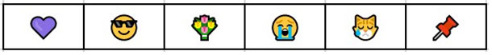

## M. Alfreihat et al.: Emo-SL Framework: Emo-SL Using Text-Based Features and ML

benchmarks. By using both quantitative and qualitative
methods, they constructed and validated empirically lexical
features on a gold standard list with the related sentiment
measures that were tuned specifically to apply sentiment
analysis to microblogs. Then they try to combine the lexical
features, including syntactical and grammatical conventions,
to express and emphasize sentiment intensity. The results
showed that by applying the rule-based model for assessing
tweet sentiment, VADER outperformed the individual human
raters, where F1 was 0.96 and the accuracy was 0.84,
which generalized better through contexts than the proposed
benchmarks.
Mohammad and Turney [6] addressed lexicon-based and
corpus-based approaches to sentiment analysis in Arabic.
Due to the lack of available Arabic lexicons for sentiment
analysis and Arabic datasets, the authors started by constructing a manually annotated dataset and presented the lexiconbuilding steps in detail. The experiments were built through
the various process phases to watch the improvements in the
system’s accuracy and compare the results with the corpusbased approach. It was found that the corpus-based approach
using SVM to perform the classification task on a lightstemmed dataset offers the highest accuracy. Furthermore,
it is observed that using the lexicon increases the lexiconbased approach’s accuracy. In [34], Abdulla et al. conducted
an experiment with and compared three different lexiconbuilding techniques; moreover, they designed an Arabic SA
tool and implemented it to benefit the constructed lexicons
effectively. The proposed tool possessed several new features,
including the way intensification and negation are handled.
The results showed encouraging results with an accuracy of
74.6%.
Novak et al. [8] introduced a method for automatically
generating a large-scale sentiment lexicon, leveraging distributional semantic models. They assigned sentiment scores to
words based on their usage in polarity-annotated sentences
from X(i.e., Twitter), employing straightforward heuristic
methods. This approach proved beneficial across various
sentiment analysis tasks, demonstrating the utility of the
generated lexicon [8].
Kimura and Katsurai [9] developed a sentiment analysis
framework for Arabic tweets, centered around a sentiment
lexicon. This lexicon was initially created by translating
the English SentiStrength sentiment lexicon into Arabic and
subsequently expanding it with another Arabic lexicon. They
manually annotated a collection of 4,400 Arabic tweets,
which were then classified as positive or negative. The use
of these lexicons significantly aided sentiment analysis.
Elshakankery and Ahmed [37] proposed a semi-automatic
learning system for sentiment analysis capable of adapting
to changes in language use. Their method, HILATSA,
integrates machine learning and lexicon-based approaches
for identifying sentiment polarity in tweets. Tested across
various datasets, it achieved an accuracy of 83.73% for
binary classification and 73.67% for ternary classification.

The semi-automatic learning component played a crucial role
in enhancing the system’s accuracy by nearly 17.55%.
Chen et al. [38] presented a distant supervision algorithm
for automatically labeling and gathering an Arabic Sentiment
Analysis dataset called ‘‘TEAD’’ by utilizing sentiment
lexicons and emojis. The data was gathered from X(i.e.,
Twitter) between June 1 and November 30, 2017 using
emojis to label and gather datasets for sentiment analysis
is a common practice. However, the authors were the
initial attempt to implement it for the Arabic dialect, which
presented a notable challenge, and more than six million
labeled tweets sorted into Neutral, Negative, or Positive
categories, and presented an algorithm for handling mixedcontent tweets (Dialect Arabic DA and Modern Standard
Arabic MSA). Guthier et al. [39] introduced a technique
for determining accurate sentiment values in a dataset
derived from X(i.e., Twitter) by utilizing an emoji lexicon.
Known polarities were shared among neighboring nodes in
a constructed graph, allowing for a language-independent
approach. Professionals proficient in 5 languages evaluated
the precision of the sentiment scores assigned by this
approach on the X(i.e., Twitter) dataset, and their findings
suggested that the sentiment values assigned automatically
were accurate enough for training ML models in sentiment
analysis.
Fernández-Gavilanes et al. [13] suggested a novel method
for conducting entity-level sentiment analysis using the
X(i.e., Twitter) dataset. At first, using a lexicon-based
approach for sentiment analysis at the entity level showed
great precision but lacked in recall. To improve memory
retention, tweets containing pre-existing viewpoints were
automatically recognized using a lexicon-based approach.
Following that, a machine learning classifier was trained to
assign polarities to these recently identified tweet entities.
This innovative approach led to a significant enhancement in
the F-score and recall, surpassing the best existing methods.
Identified limitations in such research, dialectal variability
in Arabic sentiment analysis, ambiguity in emoji interpretation, challenges in data labeling and collection, difficulties
in generalizing across languages, and balancing recall and
precision, pose significant challenges in sentiment analysis
research. Therefore, we proposed solution tackles these
constraints by creating a thorough strategy that combines
sophisticated machine learning models with a detailed grasp
of linguistic and cultural contexts. We focus on improving
data labeling accuracy through semi-automated techniques
that utilize contextual cues and user engagement metrics
to enhance sentiment labels, minimizing the impact of
distant supervision. Moreover, Emo-ML models are crafted
to analyze emojis in their textual and cultural contexts,
enhancing the precision of sentiment classification, therefore,
we addressed the issue of dialectal diversity by including
dialect-specific features and training data from multiple
dialects, which improves the model’s effectiveness across
various Arabic dialects and the strategy we used achieves a

# VOLUME 12, 2024
81795

balance between recall and precision by combining lexiconbased and ML techniques, resulting in a comprehensive
sentiment analysis tool. So, Emo-ML pushes the boundaries
in sentiment analysis, especially within the intricate Arabic
social media environment, by overcoming these challenges.

## B. SPACE MODEL
Good [14] introduced the Emoticon Space Model (ESM),
a framework created to utilize emoticons for building
word representations from vast amounts of unlabeled data.
This model streamlines the process of identifying emotion,
polarity, and subjectivity within microblog environments by
incorporating microblog posts and words into an emoticonbased framework. The efficiency of ESM was showcased on
a benchmark corpus for public microblog data, illustrating its
ability to leverage emoticon signals and outperform previous
sophisticated approaches in terms of performance.
Yang et al. [15] and Zhang et al. [45] explored the
effectiveness of emoticons in expressing emotions in online
conversations. Authors created a carefully curated emoticon
sentiment lexicon to improve lexicon-based polarity classification. After analyzing 10,069 English app reviews with
emoticons, they found a notable enhancement in polarity
classification accuracy, which is detailed sentiment conveyed
by emoticons at different levels of text efficiently, that it
utilizes emoticons as a dependable signal of text sentiment,
highlighting their importance in sentiment analysis.
Tashtoush and Orabi [43] made a noteworthy contribution
to tweet emotion classification by utilizing Fuzzy Logic to
examine tweets according to different levels of emotional
intensity. They developed two unique fuzzy classification
systems: TCFL, which focuses on analyzing the text, and
ECFL, which looks at the emojis linked to the text. This
approach enables the categorization of tweets into eight
emotion categories spanning seven intensity levels. The
results showed that TCFL performs significantly better than
ECFL, achieving a match rate of 48.96% compared to
ECFL’s 32.54%. This emphasizes the importance of combining textual analysis with emoticons for precise emotion
classification.
Emo-ML demonstrates current methods by effectively capturing the intricate relationship between text and emoticons,
leading to a substantial enhancement in the precision and
dependability of sentiment and emotion classification in
social media posts, X (i.e., Twitter).

## C. EMOJI INTERPRERATION
In [17] explored whether differences across platforms or
emoji renderings result in different emoji interpretations.
Using a survey that was distributed online, a sample of
people’s interpretations was solicited on the most common
emoji characters and each of them was represented on
several social media platforms. According to semantics and
sentiment, the emoji interpretation variance was analyzed
to quantify which emojis are the least and most likely

81796
# VOLUME 12, 2024

## M. Alfreihat et al.: Emo-SL Framework: Emo-SL Using Text-Based Features and ML

to be misinterpreted. The results indicated an encouraging
miscommunication possibility for different emoji renderings
as well as renderings through platforms.
Researchers in [18] employed emojis that are available
to the public in different languages as a novel way to learn
language-specific and cross-language sentiment patterns.
They suggested a different representation learning method
that utilizes emoji prediction as an instrument for learning
representations of relevant sentiment awareness in various
languages. The representations were integrated to ease crosslingual sentiment classification. The results showed enhanced
benchmark dataset performance that was sustained even in
cases when sentiment labels were scarce.
In [19] they proposed a new X(i.e., Twitter) sentiment
analysis scheme with further consideration for emojis. They
mainly learned embedding bi-sense emoji into individually
positive and negative sentimental tweets to train a sentiment
classifier by joining the embedding bi-sense emoji in an
LSTM (attention-based long short-term memory network).
The results showed that using bi-sense embedding was
efficient in the way of extracting emojis through sentimentaware embedding. As well as it outperformed the advanced
models. The results demonstrated also that the emoji bi-sense
embedding provided improved guidance on obtaining more
sentiments and semantics robust understanding.
In [20] researchers explored the influence of emojisbased features combined with text because nowadays, emojis
become more popular in social media. They worked with
many textual features on the dialectical Arabic tweets for
sentiment classification. Textual features were extracted by
4 methods, namely, Latent Semantic Analysis and bag-ofwords (BoW), besides two Word Embedding forms. They
studied the influence of fusing emojis with textual features
using different classifiers without and with feature selection.
The results showed that it could be built simple models with
improved results by combining emojis with word embedding
besides selecting the most related features subset as the
classifier input.
The study [21] showed that by extending the distant
supervision into a further varied noisy label set, the
constructed models could acquire more valuable representations. By emoji prediction within a 1246 million tweets
dataset containing one of forty-six popular emojis, they
obtained advanced performance on eight benchmark datasets
in emotion, sentiment, as well as sarcasm detection by
an individual-pertained model. The results of the study
showed that the diversity of the emotional labels yielded
a performance improvement compared with earlier distant
supervision methods.
The research in [22] proposed an automatic annotation
approach for emoji-based data training. The results showed
that the proposed approach yields accurate classifiers compared with the trained ones on a manually annotated dataset.
They used a constructed emotional Arabic tweet dataset,
and the emotion classes that were under consideration
included; disgust, anger, sadness, and joy. Furthermore, they

## M. Alfreihat et al.: Emo-SL Framework: Emo-SL Using Text-Based Features and ML

considered two classifiers: Multinomial Naive Bayes (MNB)
and Support Vector Machine (SVM). The test results showed
that the automatic labeling approach using MNB and SVM
outperformed the manual labeling approaches.

## D. DEEP LEARNING (DL) AND ML CLASSIFIERS
Medhat et al. [23] presented a technique for incorporating
sentiment into social network graphs, through linking sentiment with network nodes, that aimed to uncover concealed
connections and possibly correct mistakes in sentiment
analysis. This method utilizes network topology to offer
context and pinpoint key individuals within the community
hierarchy. While the research shows encouraging outcomes,
more information on precise performance metrics would be
helpful.
The hybrid approach for sentence-level sentiment analysis
in [50] combined Natural Language Processing (NLP)
techniques with fuzzy logic. The program uses an advanced
sentiment lexicon derived from SentiWordNet and fuzzy
sets to analyze the intensity and polarity of sentiment in a
sentence. Comparing this method with Maximum Entropy
and Naive Bayes classifiers on two datasets shows better
accuracy and robustness, especially with smaller datasets.
Further investigation into these results in comparison to other
advanced methods could enhance the findings, such as [10],
[24], and [33].
Montoyo et al., [25] proposed a new ML model for
sentiment analysis using image embedding influences the
intricate relationship between images and emojis in readily
available and large-scale data from social media. A novel
dataset of four million images collected with related X(i.e.,
Twitter) emojis was constructed. They used a deep neural
network model for training image embedding through the
task of emoji sentiment prediction. The results showed that
their model of embedding outperformed the common objectbased coordinate regularly through several sentiment analysis
benchmarks. Furthermore, without whistles and bells, the
proposed simple, effective and compact embedding outperformed the more customized and elaborate advanced models
on the same public benchmarks. Reference [26] proposed a
sentiment analysis model for Arabic Jordanian dialect tweets,
which were annotated into three classes: neutral, negative,
and positive. They employed Naïve Bayes (NB) as well
as SVM classifiers for supervised ML classification tasks.
Several steps were taken to preprocess tweets and make
them ready for sentiment analysis, including; normalization,
cleaning tweets from noisy data, stopping word removal,
and stemming. The results showed promising results when
applying the Arabic light stemmer or segment to Arabic
Jordanian dialect tweets. Furthermore, SVM was shown
to have enhanced performance compared to NB in tweet
classifications [46].
Li and Li [27] explored adopting novel non-verbal
features in microblog sentiment analysis. Nearly 969 emojis
were considered and a 2091-instance dataset containing

# VOLUME 12, 2024
81797

one or more emojis written in multidialectal Arabic was
prepared. Some ML algorithms are to be evaluated within
the proposed features. The results showed that only emojibased features are effective for sentiment polarity detection
with improved performance. For example, using the NB
multinomial classifier resulted in an AUC of 87.30% and an
F1 score of 80.30% that was achieved by the 250 most related
emojis.
The research of [29] and [44] investigated the sentiment
classification task within Arabic tweets through ML and
mathematics models. They have used three classifiers, including KNN, SVM, and NB. These classifiers were compared
together and the results showed that SVM outperformed the
other classifiers, achieving an accuracy rate of 78% [29] using
internally developed dataset with diverse features.

## E. ARABIC SENTIMENT ANALYSIS
Habash [31] presented an Arabic Sentiment Analysis Corpus
taken from X(i.e., Twitter) with 36K labeled tweets as
positive (+) or negative (−). He used self-training and
distant supervision approaches for annotation, and released
8K manually annotated tweets as a gold standard. The
corpus was evaluated intrinsically by comparing it with pretrained sentiment analysis and human classification models
and applied extrinsic evaluation methods for exploiting the
sentiment analysis task where they achieved an accuracy
of 86%. Guthier et al. [32] investigated the effects of
language morphology on sentiment analysis in Arabian
reviews, particularly, they investigated how negation could
affect sentiments. A set of rules was defined to capture
the negation morphology in Arabic, then the rules were
used for detecting sentiment and taking care of negated
words, and the results showed that the proposed approach
outperformed many existing methods dealing with Arabic
sentiment detection.

# III. EMOJI SENTIMENT LEXICON (EMO-SL) WITH ML
Figure 2 shows the overall methodology that consists of
developing an emoji sentiment lexicon tailored to Arabiclanguage tweets, integrating emoji characteristics with text
for classification based on ML, and comparing performance against benchmarks. The proposed classification
system incorporates a dictionary-based approach and ML
approaches. In the dictionary-based approach, the NRC
emotion lexicon [6] and the NileUlex lexicon [7] were used
to characterize the text according to positive word count and
negative word count. Moreover, a lexicon for emoji weights
was built to transform tweets into lexical features. For the
ML aspect, various models, including Linear SVM, SVM,
Multinomial NB, Bernoulli NB, SGD Classifier, Decision
Tree Classifier, Random Forest classifier, and KNeighbors
classifier, are implemented using the features extracted from
the data.
Translating the NRC Emotion Lexicon into Arabic
involves intricate processes that ensure the sentiments and
meanings of words are accurately captured, given the

FIGURE 2. Emo-SL with ML methodology.

linguistic and cultural disparities between English and
Arabic. This translation effort is crucial for sentiment analysis
applications in Arabic, where the accurate detection of
emotions and sentiments from text can significantly impact
various fields such as marketing, political science, and
public opinion research. Consider the English word ‘‘joy,’’
which is associated with a positive sentiment in the NRC
Lexicon. A direct translation might lead us to the Arabic
word > (farah), carrying a similar positive sentiment and
is commonly associated with happiness and celebration in
many Arabic-speaking cultures. However, ensuring semantic
equivalence goes beyond mere direct translation; it involves
examining the word’s usage across different Arabic dialects
and contexts to affirm its consistency in conveying the
intended sentiment. Moreover, idiomatic expressions pose
a unique challenge. The English phrase ‘‘over the moon,’’
indicating extreme happiness, does not have a direct Arabic
equivalent that conveys the same level of joy using lunar
imagery. Instead, an Arabic equivalent might be > (fi
qimmat al-sa’adah), literally translating to ‘‘at the peak
of happiness.’’ While not a direct translation, this phrase
effectively communicates the intended sentiment of extreme
joy in a culturally relevant manner.
In methodological terms, the translation process begins
with direct translation followed by expert review, where

81798
# VOLUME 12, 2024

## M. Alfreihat et al.: Emo-SL Framework: Emo-SL Using Text-Based Features and ML

linguists and cultural experts assess and refine the translations. Crowdsourcing sentiment annotations from native
Arabic speakers can further validate these translations,
ensuring they resonate well with the target audience’s
linguistic intuitions.
The methodology depicted in Figure 2 outlines a comprehensive process for enhancing sentiment analysis in Arabic
tweets through the development of an emoji sentiment
lexicon (Emo-SL) and its integration with machine learning
(ML) techniques for classification. The process initiates with
the construction of the Emo-SL, tailored specifically to the
nuances of the Arabic language. This lexicon quantifies the
sentiment value of emojis based on their contextual usage
within the dataset, applying a mathematical formula for the
calculation of the sentiment score:

S(e) =
PN
i=1 P(ei) −N(ei)

T(e)
(1)

where S(e) represents the sentiment score of emoji e, P(ei)
and N(ei) denote the counts of positive and negative contexts
for emoji e respectively, and T(e) is the total occurrences of e.
In parallel, textual features are extracted using the NRC
emotion lexicon and NileUlex lexicon, which facilitate the
differentiation of texts based on the counts of positive (W+)
and negative (W−) words:

Ftext = {W+, W−}
(2)

These lexical features, along with emoji sentiment scores,
are then utilized to transform tweets into a feature vector
representation suitable for ML classification. The study
explores a variety of ML models, including Linear SVM,
Multinomial NB, Bernoulli NB, SGD Classifier, Decision
Tree Classifier, Random Forest Classifier, and KNeighbors
Classifier. Each model is trained using the combined feature
set F = Ftext ∪Femoji, aiming to optimize the classification
accuracy by adjusting model parameters through a grid search
technique:

max
θ
Accuracy(F, θ)
(3)

where θ represents the model parameters. This integrated
Emoji+Text approach is benchmarked against traditional
text-only models and the VADER sentiment analysis tool,
with performance metrics such as accuracy, precision, recall,
and F1-score serving as the evaluation criteria. This demonstrates the potential of combining emoji-based sentiment
analysis with ML techniques for Arabic tweets, but also
sets a precedent for future research in multilingual sentiment
analysis.

## A. DATA COLLECTION
Data acquisition involves collecting tweets that contain
text in different languages, with a particular emphasis on
Arabic, which is an essential part of data acquisition. Arabic
poses unique challenges for emotion classification due to its
complexity. Tweets are recognized as a valuable resource

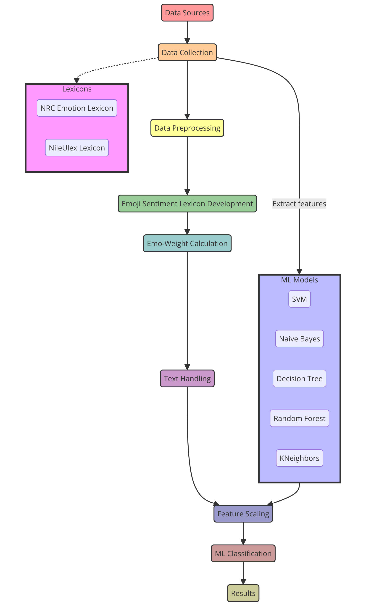

## M. Alfreihat et al.: Emo-SL Framework: Emo-SL Using Text-Based Features and ML

for analyzing emotions due to their frequent inclusion of
users’ emotions and feelings in various languages, including
Arabic. The analysis of this data necessitates advanced
techniques beyond the usual NLP methods, given the distinct
features of Arabic text found on social media. These features
include grammatical errors, slang, social abbreviations, and
multimedia content, which can be quite difficult to analyze
emotions in Arabic tweets. Our methodology for acquiring
and processing the data involves several key steps centered
around the application of NLP and ML techniques to extract
meaningful sentiment indicators from the tweets. The core
of this process is the analysis of the text to identify and
quantify the sentiment expressed through both linguistic
content and emojis. This dual focus ensures a comprehensive
sentiment analysis that acknowledges the complexity of
human communication in digital spaces.
Our dataset combines of diverse sources of Arabic tweets,
including both MSA and various Arabic dialects, to improve
the accuracy of emotion classification models. It also
highlights the role of pre-trained language models that have
been specifically developed for the Arabic language, such
as AraBERT, MARBERT, and others. These models are
pre-trained on large datasets comprising tweets, Wikipedia
dumps, and other Arabic textual resources.
The dataset comprises 58,000 Arabic tweets from two
corpora, the Arabic Sentiment X(i.e., Twitter) Corpus and
the data set from Hussien et al. [21], as shown in Figure 3.
These contain a balanced distribution of positive and
negative tweets, facilitating binary sentiment classification.
Only tweets containing one or more emojis are included
to enable emoji valence analysis. The Emo-SL lexicon
was constructed using this corpus by calculating sentiment
scores for 222 frequently occurring emojis, based on their
distribution across positive and negative categories. The
dataset spans diverse topics and themes reflecting real-world
X(i.e., Twitter) content in Arabic, which is freely available on
GitHub.
The diversity of Arabic dialects can be quite challenging.
We tackled this issue by building the lexicon using a
collection of Arabic tweets, which is likely to encompass
different dialects. Nevertheless, the document recognizes the
intricate difficulty posed by dialectal variance, as sentiment
expressions and emoji usage may differ among various
Arabic-speaking communities. The success of the framework
in dealing with different dialect variations depends on
the inclusiveness and accuracy of the tweet corpus used
to develop the Emo-SL. For noise and dialect variations,
we included preprocessing steps and relies on the dataset
that reflects the linguistic diversity of Arabic, including
informal expressions and emojis common in social media
communication.

FIGURE 3. Sample of arabic sentiment tweets on X.

FIGURE 4. Example of preprocessed arabic sentiment sample’s tweets.

contribute much to sentiment analysis, and reducing words to
their base form. This step is essential for filtering the text to
keep only the most relevant elements for sentiment analysis.
Utilizing ML techniques, models are trained on processed
data to categorize tweets into positive or negative sentiment
categories. The models gain insights from the patterns of
word and emoji usage in the training data, allowing them to
make accurate predictions about the sentiment of new, unseen
tweets. The accuracy of these predictions is influenced by
the comprehensiveness and diversity of the training set.
This approach enhances the robustness of sentiment analysis
across different forms of Arabic text dialects.
Algorithm 1 involves data cleaning and removing all
stopwords, with the aim of minimizing error and noise,
and the data cleaning involves multiple preprocessing steps
applied before feature extraction: remove any non-Arabic
characters and symbols. This includes English letters, special
characters, punctuation, etc.; removing any numbers or
digital tokens; removing hash symbols from hashtags, leaving
only the hashtag text; removing any extra whitespaces; and
removing Arabic stopwords from the NLTK toolkit as shown
in Figure 4. This ensures that only the principal Arabic
text and emojis remain for feature extraction and training.
It helps reduce noisy features, which could otherwise degrade
classifier performance.
Algorithm 2 for feature extraction from a dataset of
tweets for sentiment analysis. Table 1 shows a detailed
list of features prepared and standardized text and emoji
features extracted from the gathered tweets that involved
creating the Emo-SL lexicon and extracting text-based
features using well-known lexicons, where these features
were then incorporated into our ML classifiers. Table 1
provides a detailed list of the sentiment analysis features
engineered and standardized for the Emo-SL framework.
These features are into six main groups: Emoji Sentiment,
Text Sentiment, Standardization, Contextual, Syntactic &
Semantic, and Preprocessing. The Emoji Sentiment features
include the sentiment score (Semoji) based on the usage
of emojis in positive, negative, or neutral contexts, and
the frequency (Femoji) of emojis in these contexts, which
helps to weigh the sentiment score. The Text Sentiment
features include the word sentiment score (Sword) obtained
from lexicons, part-of-speech (POS) tags for analyzing the

## B. DATA PREPROCESSING
Advanced techniques in NLPs are used to analyze Arabic text,
which involves breaking down the text into smaller units such
as words or phrases, filtering out common words that don’t

# VOLUME 12, 2024
81799

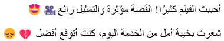

Algorithm 1 Enhanced Preprocess Arabic Tweets for Sentiment Analysis
0:
procedure PreprocessTweet tweet {Normalize Arabic
text to standard form}
0:
tweet ←NormalizeArabicTexttweet {Remove non-
Arabic characters and symbols}
0:
tweet ←RemoveNonArabicCharstweet {Remove
numbers}
0:
tweet ←RemoveNumberstweet {Remove special
characters (except allowed ones)}
0:
tweet ←RemoveSpecialCharstweet {Remove diacritics (tashkeel)}
0:
tweet ←RemoveDiacriticstweet {Remove elongation (kashida)}
0:
tweet ←RemoveElongationtweet {Remove hash
symbols}
0:
tweet ←RemoveHashSymbolstweet {Remove extra
whitespaces}
0:
tweet ←RemoveExtraWhitespacestweet {Tokenize
the tweet}
0:
words ←Tokenizetweet {Remove stopwords}
0:
cleanedTweet ←RemoveStopwordswords
0:
return cleanedTweet
0:
end procedure
0:
function NormalizeArabicTexttext
0:
return regex_replaceextEx, AltTxtEx, text
0:
end function
0:
function RemoveNonArabicCharstext
0:
return regex_replace′[2
u0600 −u06FF, u0750 −u077F]′,′′ , text
0:
end function
0:
function RemoveDiacriticstext
0:
return regex_replace′[
u064B −u065F]′,′′ , text
end function
0:
function RemoveElongationtext
0:
return regex_replace′
u0640′,′′ , text
end function
= 0

Algorithm 2 Feature Extraction for Sentiment Analysis
Require: A dataset of tweets D
Ensure: A dataset with extracted features F
0:
Initialize an empty list F to store features for each tweet
0:
for each tweet t in D do
0:
Initialize a feature vector f for tweet t {Extract textbased features }
0:
W ←Tokenize (t){ Tokenize t into words W}
0:
for each word w in W do
0:
if w is in Sentiment_Lexicon then
0:
Update f with sentiment score of w
0:
end if
0:
end for {Extract emoji-based features}
0:
E ←Extract_Emojis (t)
0:
for each emoji e in E do
0:
if e is in Emoji_Sentiment_Lexicon then
0:
Update f with sentiment score of e
0:
end if
0:
end for
0:
Append f to F
0:
end for
0:
return F = 0

81800
# VOLUME 12, 2024

## M. Alfreihat et al.: Emo-SL Framework: Emo-SL Using Text-Based Features and ML

TABLE 1. A list of some sentiment analysis feature engineering.

grammatical structure and sentiment contribution, negation
(φ) for inverting the sentiment of adjacent text, and intensity
(δ) for modifying the sentiment intensity. Standardization
features ensure consistency across the emoji and text features
by normalizing the sentiment scores (Snorm), scaling the
features to a range of [0, 1] to prevent dominance by
scale, and unifying the text and emoji features (Fcombined)
to represent the overall sentiment expression. Contextual
features consider the tweet length (Ltweet) and the emojito-text ratio (Re:t) to understand the impact and reliance
on sentiment expression. Syntactic & Semantic features
include dependencies (9) between sentiment words and
modifiers, and clustering () for grouping semantically similar sentiments to capture sentiment themes. Preprocessing
features include tokenization, stop word removal (3), and
stemming/lemmatization (2) to ensure consistency in the text
data.
In gathering and examining primary data from user
interactions on different platforms in the context of sentiment
analysis using real-world social media data. We captured
the genuine and subtle sentiment expressions found in
spontaneous online communication that emphasis on primary
data arose from the goal of comprehending the authentic

## M. Alfreihat et al.: Emo-SL Framework: Emo-SL Using Text-Based Features and ML

sentiment landscape as expressed in content created by
users. Therefore, we utilized cutting-edge NLP methods to
preprocess, analyze, and categorize sentiments from tweets
and posts, as mentioned above. This ensured that the results
were highly reliable and relevant to real-world sentiment
trends. The insights gained from user-generated content,
including emotional expressions, slang, idioms, and cultural
nuances, are extremely valuable and cannot be replicated
by synthetic data. These include sentiment classifications,
feature relevance, and model performance metrics, providing
a complete perspective on sentiment trends and patterns
found in the dataset. The tabulation format allows for
a straightforward and easy comparison of sentiment in
various categories, timeframes, and demographic segments.
It showcases the wide range of emotional expressions found
in real-world social media interactions.

## C. LEVEL 1: EMOJIS SENTIMENT LEXICON (EMO-SL)
DEVELOPMENT
To build the Emoji Sentiment Lexicon (ESL), we used
an annotated dataset of tweets, which already contained
sentiment labels. Therefore, we did not need to rely on an
external lexicon, such as the one used in [9]. We extracted
222 distinct emojis from the tweets after filtering out those
that appeared less than five times. The ESL was constructed
by following these steps:
1) To count the co-occurrences of the target emojis in the
annotated dataset of tweets, we performed the following
steps: We split the dataset into two files, one for positive
tweets and one for negative tweets. We scanned each
file line by line and counted the number of tweets that
contained each target emoji. We ignored the repetition
of the same emoji in a tweet, as shown in algorithm 3.
For the first tweet, we have two emojis: face with heartshaped eyes and movie camera. If this tweet is part of the
positive dataset, we would increase the count of positive
occurrences for these emojis. Here’s how we tally it:

• Positive occurrences for face with heart-shaped
eyes: 1

• Positive occurrences for movie camera: 1
For the second tweet, which seems negative based on
the text, we also have two emojis: disappointed face and
broken heart. If this tweet is part of the negative dataset,
we would increase the count of negative occurrences for
these emojis:

• Negative occurrences for disappointed face:1

• Negative occurrences for broken heart: 1
2) To calculate the sentiment score of each emoji, we used
the following formula [8]:

s(e) = p(e) −n(e)

p(e) + n(e)
c ∈{−1, +1}

where s(e) is the sentiment score of emoji e, p(e) is the
number of positive tweets that contain emoji e, and n(e)
is the number of negative tweets that contain emoji e.

# VOLUME 12, 2024
81801

The sentiment score ranges from −1 (most negative) to
+1 (most positive). We only considered tweets that were
annotated as positive or negative and ignored tweets that
were neutral or had mixed sentiment. The sentiment
category was represented by a binary variable c, where
c = 1 for positive tweets and c = 0 for negative tweets
as shown in algorithm 4.

Algorithm 3 Counting Emoji Occurrences
0:
procedure CountEmojis(tweets)
0:
for each tweet in tweets do
0:
if tweet is positive then
0:
positive_emojis[tweet.emojis]
positive_emojis[tweet.emojis]+1
←
0:
else if tweet is negative then
0:
negative_emojis[tweet.emojis]
←
negative_emojis[tweet.emojis] + 1
0:
end if
0:
end for
0:
return positive_emojis, negative_emojis
0: end procedure=0

Algorithm 4 Calculating Emoji Sentiment Scores
0:
function CalculateSentimentScores_(positive_emojis,
negative_emojis)
0:
scores ←{}
0:
for each emoji in positive_emojis do
0:
p ←positive_emojis[emoji]
0:
n ←negative_emojis[emoji]
0:
scores[emoji] ←p−n

p+n
0:
end for
0:
return scores
0:
end function = 0

Applying the above algorithms to our example tweets,
we found the following sentiment scores for the emojis:

s(face with heart-shaped eyes) = 1 −0

1 + 0 = 1

s(movie camera) = 1 −0

1 + 0 = 1

s(disappointed face) = 0 −1

0 + 1 = −1

s( broken heart) = 0 −1

0 + 1 = −1

These scores indicate that the heart-eyes and movie camera
emojis are associated with positive sentiments, while the
disappointed face and broken heart emojis are associated with
negative sentiments. The sentiment scores calculated for the
emojis in this small dataset suggest that the methodology
is sound. However, for a robust Emo-SL, a larger dataset
with diverse annotations is required. Such a lexicon can
significantly enhance the accuracy of sentiment analysis in
texts containing emojis.

## D. LEVEL 2: EMOJI-BASED FEATURES EXTRACTION
(EMO-WEIGHT)
To extract the emoji-based features from each tweet, we performed the following steps: We identified all the emojis in
the tweet and assigned them the sentiment scores from the
ESL. We calculate the sentiment weight (EW) formula based
on emojis. The final emojis weight for the whole tweet is
the summation of each emoji sentiment score. The negative
sentiment score was subtracted from the positive sentiment
score of emojis declared in the tweet to have the final emojis
weight (emo_weight) of the tweet. We denote the weight of
the emojis as EW given in the following formula:

# EW = (ES)+ + (ES)−
(4)

where EW refers to the weight of the emojis, (ES)+ refers to
the positive sentiment score of the emojis, and (ES)−refers
to the negative sentiment score of the emojis.
For a tweet t, the Emo-Weight W(t) is given by:

W(t) =
X

e∈t
s(e)
(5)

where s(e) is the sentiment score of emoji e in tweet t. The
final emoji weight for the whole tweet is the summation of
each emoji sentiment score, where the negative sentiment
score is subtracted from the positive sentiment score of emojis
declared in the tweet.
Figure 4 considered a tweet t containing the following
emojis: face with heart shaped eyes with a sentiment score
of s(facewithheartshapedeyes) = 1, and broken heart with a
sentiment score of s(brokenheart) = −1. The Emo-Weight
W(t) for the tweet would be calculated as:

W(t) =
X

e∈t
s(e)

= s(facewithheartshapedeyes) + s(brokenheart)
= 1 + (−1) = 0
(6)

In the context of sentiment analysis, particularly when
quantifying the sentiment value of emojis using the Emo-
Weight in the Emoji Sentiment Lexicon (Emo-SL), W(t)
represents the weight assigned to an emoji based on its
context within a tweet t. This weight is crucial for calculating
the overall sentiment score of a piece of text, as it adjusts the
influence an emoji has on the text’s sentiment. To enhance
the mathematical precision of the framework and provide a
clearer understanding of the sentiment analysis process, it’s
essential to define the range within which W(t) operates.
We defined range for W(t) clearly to enhance the precision
of the sentiment analysis framework and elucidates the scale
and limits within which emoji weights operate. It determines
how the sentiment score of an emoji is adjusted. The range
can be expressed as:

W(t) ∈[a, b],

where a and b are the lower and upper bounds of the weight,
respectively. The choice of a and b depends on the specific

81802
# VOLUME 12, 2024

## M. Alfreihat et al.: Emo-SL Framework: Emo-SL Using Text-Based Features and ML

sentiment analysis framework and the desired sensitivity to
emoji sentiment.
1) Lower Bound (a): Typically, the lower bound is set
to a positive value greater than 0 to ensure that every
emoji contributes to the sentiment score of a text,
albeit to varying degrees based on its assigned weight.
A common lower bound might be a = 0.0, indicating
the minimum influence an emoji can have.
2) Upper Bound (b): The upper bound defines the
maximum influence an emoji can exert on the sentiment
score of a text. This is often set based on empirical
analysis of emojis’ impact on sentiment. A practical
upper bound might be b = 1.0, signifying that an emoji
can at most have the full weight in determining the
sentiment score.
If an emoji e is found within a tweet t that overall expresses
a positive sentiment and the emoji e is known to strongly
correlate with positive sentiments, W(t) for e might approach
the upper limit of its range, say W(t) = 0.9. Conversely,
if e is less clearly associated with a positive or negative
sentiment, its weight might be closer to the lower bound, such
as W(t) = 0.2.

## E. LEVEL 3: TEXT HANDLING
In this step, textual features were extracted from tweets using
a textual sentiment lexicon, which is known as a dictionary of
words that has labels or weights to assign positive or negative
sentiment. NRC Emotion Lexicon was used by [6] to extract
positive and negative word counts from each tweet. The NRC
Emotion Lexicon is translated into 105 different languages,
and one of them is Arabic, with 14k words (unigram). The
lexicon contains a sentiment for each word (positive or
negative) as well as an associated emotion for it if found
(Anger, Anticipation, Disgust, Fear, Joy, Sadness, Surprise,
and Trust). In our classification system, only positive and
negative labels were used. The code scans each tweet and
counts the positive and negative words that occur in each
tweet according to the NRC lexicon. However, some of
the phrases did not exist in the NRC Emotion Lexicon,
as most of them were Egyptian slang phrases; therefore,
another sentiment lexicon named ‘‘NileULex’’ [7], which is a
sentiment lexicon for Egyptian and modern standard Arabic.
For each tweet t, let Cpos(t) and Cneg(t) be the counts of
positive and negative words in t, respectively, obtained from
a sentiment lexicon L:

Cpos(t) =
X

w∈t
## IL(w, Positive)

Cneg(t) =
X

w∈t
## IL(w, Negative)

where IL(w, Sentiment) is an indicator function that returns
1 if word w has the specified sentiment in lexicon L, and
0 otherwise.
In Emo-SL task, we extracted textual features from tweets
using the NRC Emotion Lexicon and NileULex. For an

## M. Alfreihat et al.: Emo-SL Framework: Emo-SL Using Text-Based Features and ML

example tweet t, the counts of positive and negative words
are computed as follows:

on their polarity to compute Cpos and Cneg, as described in
section III-E.

Cpos(t) =
X

w∈t
## IL(w, Positive)

## V. FEATURE SCALING AND ML CLASSIFICATION
The final step in our research involved the classification
task using ML algorithms. The dataset consisted of rows,
each featuring three distinct attributes: pos_word_count,
neg_word_count, and Emo_weight. These attributes had
varying scales, necessitating normalization. For instance,
Emo_weight values ranged from −5.36 to 6.12, while
pos_word_count ranged from 0 to 7. We employed feature
scaling to standardize these feature scales. For a feature f in
D, the scaled value f ′ of f is computed as

= 1 + 1 + 1 = 3
× (since three positive words were found)

Cneg(t) =
X

w∈t
## IL(w, Negative)

= 1
(since one negative word was found)

To illustrate the computation process for Cpos and Cneg,
which represent the counts of positive and negative sentiment
expressions in a tweet, let’s consider a detailed example. This
example will include a tweet, its translation, and a step-bystep breakdown of how each word contributes to the overall
sentiment score calculation.

f ′ =
f −min(f )
max(f ) −min(f )
(7)

Feature scaling, also known as data normalization,
is crucial before employing ML algorithms. This method
ensures that all features contribute proportionately to the
final outcomes, especially in algorithms where distance
metrics (like Euclidean distance in KNN classifiers) are
used. The disparate feature ranges are normalized to prevent
any single feature from disproportionately influencing the
model. Popular methods include Min-Max Normalization
and Standardization (Z-score Normalization) [16]. In this
research, we opted for Min-Max Normalization, which scales
features to a range of 0 to 1, ideal for algorithms that do
not accommodate negative values and for managing outliers.
Min-Max Normalization is defined as:

# IV. TWEET EXAMPLE
This example showcases how individual words and emojis
within a tweet contribute to the overall sentiment score calculation. By breaking down the tweet into its constituent parts
and assessing each for sentiment to accurately capture and
quantify sentiment in social media content, considering both
linguistic elements and the contextual sentiment expressed
by emojis. We have an Arabic tweet that uses both text and
emojis to express sentiment:
Original Tweet:
’’
Translation:‘‘I love this day
but the weather is too hot
’’
1. Tokenization and Translation: The tweet is first tokenized into individual words and emojis, and each component is translated to understand its sentiment value.

# V ′ =
(V −minA)
(maxA −minA)
× (new_maxA −new_minA) + new_minA
(8)

where minA and maxA denote the minimum and maximum
values of attribute A respectively, V is the original value, and
V ′ is the scaled value.
After calculating the word counts, we proceeded with
feature scaling. The ‘EW‘ for the tweet t was previously
calculated as 0.75. To scale this feature between 0 and 1,
we applied the following Min-Max Normalization formula:

# EW′ =
Emo_weight −min(Emo_weight)
max(Emo_weight) −min(Emo_weight)

= 0.75 −(−5.36)

## 2. Identifying Sentiment Values: Each word and emoji is
assessed for its sentiment value based on a predefined
lexicon or sentiment analysis model.

6.12 −(−5.36)

= 0.75 + 5.36

6.12 + 5.36

• ‘‘Love’’ and
contribute to Cpos.

= 6.11

• ‘‘Hot’’ and
contribute to Cneg, with ‘‘Too’’
amplifying the negative sentiment.
## 3. Calculating Cpos and Cneg:

11.48
= 0.532
(after rounding to three decimal places)

• Cpos = 2 (from ‘‘Love’’ and
)

Thus, the scaled ‘EW‘ for tweet t is approximately 0.532.

• Cneg = 2 (from ‘‘Hot’’, intensified by ‘‘Too’’, and
)
Given the tweet, we assign sentiment scores to each
identifiable sentiment-bearing unit (word or emoji). The
sentiment score of a unit is defined as S(ui), where ui is
the ith unit in the tweet. The scores are aggregated based

## A. EMO-SL IMPLEMENTATION
Algorithm 5 outlines the implementation of the Emo-SL
with sentiment valuations specifically designed for the Arabic
tweeting context. Lexical features were extracted using

# VOLUME 12, 2024
81803

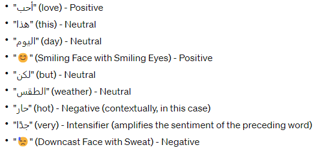

## M. Alfreihat et al.: Emo-SL Framework: Emo-SL Using Text-Based Features and ML

Algorithm 5 Emo-SL for Arabic Tweets Algorithm
0:
Input: T {Set of tweets }
0:
Input: E {Set of distinct emojis extracted from T }
0:
Input: Lpos , Lneg { Positive and negative sentiment lexicons}
0:
Output: S {Sentiment classification for each tweet}
0:
procedure PreprocessData (T)
0:
for each tweet t ∈T do
0:
Remove non-Arabic characters and symbols from t
0:
Normalize text in t
0:
end for
0:
end procedure
0:
procedure BuildEmoSL(E)
0:
for each emoji e ∈E do
0:
p(e) ←Count of positive tweets containing e
0:
n(e) ←Count of negative tweets containing e
0:
s(e) ←p(e), n(e)
0:
end for
0:
end procedure
0:
procedure ExtractFeatures( T, E SL)
0:
for each tweet t ∈T do
0:
W(t) ←e ∈t, s(e)
0:
Cpos (t) ←Count of positive words in t using Lpos
0:
Cneg (t) ←Count of negative words in t using Lneg
0:
Normalize Cpos (t), Cneg (t), W(t)
0:
end for
0:
end procedure
0:
procedure ClassifySentiments (T)
0:
for each tweet t ∈T do
0:
S(t) ←Apply ML classifiers on t using extracted
features
0:
end for
0:
end procedure
0:
procedure ApplyVADER (t)
0:
Translate tweet t from Arabic to English {If necessary}
0:
V(t) ←Analyze t using VADER
0:
end procedure
0:
procedure AnalyzeTweetsWithVADER (T, S)
0:
for each tweet t ∈T do
0:
SV (t) ←ApplyVADER(t)
0:
end for
0:
Evaluate SV against true sentiments for t ∈T {For
analysis }
0:
Calculate accuracy, precision, recall, F-measure
0: end procedure= 0

sentiment-aware lexicons and language resources, taking into
consideration positive and negative Arabic words and idioms
specific to the Egyptian dialect. In addition to consolidating
EmoSL-based emoji scores, this resulted in a strong feature
set for the Arabic language. Normalization was required
to adjust the scales of lexical and emoji features, ensuring
they were all within a range of 0 to 1. This fosters a
more balanced and cohesive approach to successive model
fitting, reducing any potential for undue influence. Explored
various ML techniques including SVM, NB classifiers,
Random Forests, and K-Nearest Neighbors (KNN) [50].
Improvements were made to the combined vectors of emoji
and Arabic text features to extract valuable information
from both visual annotations and linguistic cues. A thorough
evaluation was conducted on a carefully selected test set
to measure the effectiveness of the model. This evaluation considered precision, recall, and accuracy concerning
the sentiments of the tweets, which were annotated by
humans.

# VI. VALENCE AWARE DICTIONARY AND SENTIMENT
# REASONER (VADER)
VADER, referenced in [18], is a lexicon and rule-based
model tailored for sentiment analysis in social media texts.
Available as a Python library, it is particularly effective
for social media sentiment analysis. VADER analyzes both
textual content and emojis within texts. A significant feature
of VADER is its independence from training data; it
utilizes a lexicon that assigns specific weights to text and
emojis. This model also supports non-English languages
by translating them into English for analysis. Let V(t)
denote the sentiment classification of tweet t using VADER,
where:

(
Positive
if PositiveScore(t) > NegativeScore(t)
Negative
otherwise

V(t) =

(9)

For instance, Figure 4 is translated as ‘‘the weather is nice
and food is good’’. VADER assigns weights to the words
‘nice’ and ‘good’, where 1.8 and 1.9, respectively. It then
calculates four sentiment metrics based on these weights. For
the positive sentiment in the sentence ‘the weather is nice and
the food is good’, the calculation is (1.8 + 1.9 = 3.7), with
negative and neutral feelings being 0, leading to a compound
sentiment of ( 3.7−0

FIGURE 5. Sample of translated arabic sentiment X’s tweets.

3.7+0+0
= 1), indicating a highly positive
sentiment.
In contrast, VADER analyzes a sentence with a negative
connotation, such as text Arabic, which translates as shown
in Figure 5. It finds the weights for ‘bad’ and ‘poor’ as
−2.1 and −1.7, respectively. The resulting sentiment metrics
are: positive sentiment = 0, negative sentiment = −2.1 +
−1.7
=
−3.8, neutral sentiment = 0, and compound
sentiment =
0−3.8
0+3.8+0
=
−1, indicating a very negative
sentiment according to VADER.

# VII. RESULTS AND DISCUSSION
## A. EMOJIS SENTIMENT SCORE
The analysis involved 222 emojis, with 76 scoring negatively,
144 positively, and 2 as neutral. Neutral emojis were those
that occurred equally in positive and negative tweets. The
sentiment scores above zero indicated positive sentiments,
and those below zero indicated negative sentiments. The
findings align with research in [8] and [9], showing a
predominance of positive emoji usage. The data set was

81804
# VOLUME 12, 2024

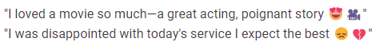

## M. Alfreihat et al.: Emo-SL Framework: Emo-SL Using Text-Based Features and ML

divided into 80% training and 20% testing instances for the
classifier experimentation. This division was carefully chosen
to ensure that our ML models were both well-trained and
accurately evaluated, contributing to the robustness of our
findings.
Emojis were assigned preliminary sentiment scores based
on their commonly understood emotional expression. For
example, a happy face emoji received a positive score, while
a frown received a negative score. Our analysis focused on
co-occurring text, other emojis within the tweet, and the
overall message tone. Emoji frequencies within positive,
negative, and neutral tweets were calculated. Additionally,
co-occurrence with sentiment-bearing words/phrases was
analyzed to refine sentiment scores. This step adjusted initial
assignments based on real-world usage patterns.
The sentiment score formula for emojis within tweets,
which was central to the creation of the Emo-SL lexicon,
was meticulously developed to accurately reflect the sentiment value of emojis in the context of Arabic-language
social media content. As described above, The formula is
transformed the qualitative sentiment expressions associated
with emojis into a quantifiable measure that could be
systematically analyzed. Each emoji was initially assigned a
provisional sentiment value based on common usage and the
intrinsic emotional expression it is generally understood to
convey, e.g., a smiling face emoji might be associated with
a positive sentiment, while a frowning face emoji might be
linked to a negative sentiment. Therefore, we are examined
a large sample of tweets to observe how each emoji was
used in different contexts. Factors that are described above,
which considered included the text accompanying the emoji,
other emojis used in the same tweet, and the overall tone
of the message. The frequency of each emoji’s occurrence
in tweets classified as positive, negative, or neutral was
calculated. Additionally, the co-occurrence of emojis with
known sentiment-bearing words or phrases was analyzed to
further refine their sentiment scores. This step was crucial
for adjusting the initial sentiment assignments based on realworld usage patterns.
The sentiment score formula is then derived by integrating
the initial sentiment assignments with the insights gained
from the contextual analysis and frequency/co-occurrence
evaluation. The formula typically took into account the
proportion of positive, negative, and neutral contexts in which
the emoji appeared, adjusted for any biases identified in the
contextual analysis. As discussed on the section III-C The
total of the sentiment score for an emoji E is represented as:

Sentiment Score(E) = α × P(E) + β × N(E) + γ × O(E)

where:

• P(E) is the proportion of positive contexts for emoji E,

• N(E) is the proportion of negative contexts for emoji E,

• O(E) is the proportion of neutral contexts for emoji E,

• α, β, and γ are weighting coefficients determined
through the contextual analysis and frequency/cooccurrence evaluation.

# VOLUME 12, 2024
81805

LISTING 1. Python code snippet for SVM grid search.

This sentiment score formula underpins the Emo-SL lexicon,
enabling systematic sentiment analysis of emojis in Arabic
tweets. By quantifying emoji sentiment, the Emo-SL lexicon
enhances the depth and accuracy of Arabic social media
sentiment analysis, providing a more nuanced understanding
of digital emotional expression.

# VIII. MODEL OPTIMIZATION TECHNIQUES
The tuning process for each model reflects a dedicated
effort to navigate the complex landscape of sentiment
analysis. The use of specific cost functions and optimization
strategies, from hinge loss for SVM to information gain for
Random Forests, and the probabilistic foundations for Naive
Bayes, alongside KNN’s reliance on geometric proximity,
demonstrates a comprehensive strategy to leverage each
algorithm’s strengths.
For the SVM model, we utilized a grid search technique
to fine-tune the optimal regularization parameter (C) and the
kernel coefficient (γ ), focusing on optimizing the hinge loss
function. This function is a standard choice for SVM due to
its effectiveness in maximizing the margin between classes.
The Naive Bayes classifier is fine-tuned based on the
distribution of features within the training data. Despite
not optimizing a specific cost function, the importance of
feature selection was emphasized to mitigate the algorithm’s
assumption of feature independence.
We used, Random Forests optimization aimed to reduce
overfitting and enhance prediction accuracy, likely by
adjusting the number of trees and their depth through methods
such as random search. The choice between Gini impurity and
entropy was made to guide the growth of each tree, aiming to
maximize information gain.
KNN’s tuning involved selecting the appropriate number
of neighbors (k) and the distance metric. These parameters
are determined through cross-validation to ensure the model’s
robustness to data distribution variations.

# 1) EXPERIMENT 1: ML FOR TWEET TEXT
Table 1 provides details on training and testing times and
accuracy for various classifiers, highlighting the SVC classifier’s highest accuracy. SCV requires the longest training
and testing times, whereas Bernoulli NB and multinomial NB
were more time-efficient.
Table 3 presents the evaluation details of various classifiers
used for ML on tweet text. It highlights the precision, recall,

TABLE 2. Performance metrics of classifiers on the 58k tweet dataset.

TABLE 3. Classifiers evaluation details for ML for tweet text.

TABLE 4. The consumed time for training, consumed time for testing, and
overall accuracy for Emo-SL with ML for tweet text and emojis.

and F-measure for each class and the average performance of
each classifier.

# 2) EXPERIMENT 2: EMO-SL WITH ML FOR TWEET TEXT AND
EMOJIS
Table 4 shows the results of Emo-SL combined with ML,
indicating the highest accuracy of K neighbors and the longest
training and testing durations of SVC. The Decision Tree
Classifier was the most time efficient.
Table 5 shows the classifiers’ evaluation details for Emo-
SL with ML for tweet text and emojis. The results also show

81806
# VOLUME 12, 2024

## M. Alfreihat et al.: Emo-SL Framework: Emo-SL Using Text-Based Features and ML

TABLE 5. Classifiers’ evaluation details for Emo-SL with ML for tweet text
and emojis.

TABLE 6. Comparison of ML models on sentiment analysis.

that the K Neighbors Classifier has the best precision and
recall among all other classifiers, while Multinomial NB has
the lowest precision and recall. The first three are positive,
neutral, and negative, which shows the proportion of the data
that falls into this category or class. The fourth metric is
a compound that represents the sum of the weights of the
lexicon that have a standard deviation between 1 and −1.
In the VADER example, the compound weight is 0.69, which
is strongly positive according to its scale.
Table 6 illustrates a comparison of different models and
their accuracy in sentiment analysis. The models compared
include Linear SVM, SVM, Multinomial NB, Bernoulli
NB, SGD Classifier, Decision Tree Classifier, Random
Forest Classifier, and KNeighbors Classifier. The accuracy
rates give a numerical measure of how well each model
performs in correctly categorizing sentiment from a dataset.
SVM has a slightly higher accuracy than Linear SVM at
88.1%, suggesting that it performs marginally better for this
particular task.

## M. Alfreihat et al.: Emo-SL Framework: Emo-SL Using Text-Based Features and ML

TABLE 7. VADER evaluation details for tweet text.

TABLE 8. VADER evaluation details for tweet text and emojis.

# 3) VADER
Table 7 lists the VADER evaluation details for tweet text
where the average precision is 0.26, the average recall is 0.50,
and the accuracy is 52%. Table 8 below lists the VADER
evaluation details for tweet text and emojis where the average
precision is 0.76, the average recall is 0.52, and the accuracy
is 54%.

## A. EMOJI SENTIMENT ANALYSIS
The emoji sentiment analysis reveals key insights regarding
the utility of pictorial elements for sentiment classification.
Our Emoji Sentiment Lexicon (Emo-SL) assigns sentiment
scores to 222 frequently occurring emojis, with 76 negative,
144 positive, and 2 neutral emojis.
Comparatively, Table 9 shows the Emo-SL contains fewer
emojis than prior works by Kimura and Katsurai [9] with
236 emojis and Novak et al. [8] with 751 emojis. However,
our corpus has a balanced set of 29,461 positive and
27,037 negative Arabic tweets with emojis, while Novak
et al. had 37,579 positive and 12,156 negative tweets. The
division of data between positive and negative tweets was
carefully balanced, with a compilation of 29,461 positive
and 27,037 negative tweets. This balanced distribution is
essential for avoiding bias in sentiment classification models,
ensuring that they learn to accurately identify both positive
and negative sentiments. This facilitates a better sentiment
score calculation. In terms of classifier performance, incorporating Emo-SL-derived emoji features along with tweet
text improves accuracy substantially compared to just text
features. The integrated ML approach of Emo-SL achieves
88. 7% accuracy, 26. 7% higher than the 62% accuracy from
tweet-text alone. This demonstrates the value of emojis for
disambiguating sentiment in micro-text. Our results align
with the findings of Abdulla et al. [19] who observed that
lexicon methods underperform ML approaches for Arabic
sentiment analysis. By adding ML classifiers to lexicons
like Emo-SL, the performance of statistical models is
combined with the ease of understanding rule-based signals.
Specifically, the integrated Emoji + ML model outperforms
the VADER sentiment analyzer [20] which has a baseline
Arabic tweet accuracy of 54%. As VADER relies solely on
rules and heuristics without training, its real-world efficacy
is limited despite its effectiveness in the English language.
This highlights why an ML methodology is better suited for

# VOLUME 12, 2024
81807

informal Arabic text. Thus, emojis provide a useful semantic
signal complement to distinguish sentiment polarity in noisy
short-form text. The Emo-SL lexicon developed using a large
Arabic tweet corpus enables precise emoji valence quantification. Coupled with ML, it significantly enhances Arabic
sentiment classification accuracy. The results substantiate the
ability of an emoji-aware ML approach to overcome key
challenges in multilingual sentiment analysis.
This graph illustrates how the accuracy of sentiment analysis using text-only classifiers varies with the use of different
n-gram features. N-grams are combinations of n items (in this
case, words) used to capture context within text data. The
graph plots n-gram feature size (unigrams to 9-grams) on the
x-axis against classification accuracy on the y-axis. Further
validation of the Emoji + ML methodology is conducted by
testing on the Arabic tweet dataset from Hussien et al. [21].
With only text features, the Random Forest classifier achieves
a maximum accuracy of 59.6%. However, the integration of
emoji features significantly improves performance, achieving
a precision of 94.6% using the decision tree classifier. This
35% enhancement underscores the value of emoji features
for short-length Arabic tweets, where each tweet’s dominant
emoji provides a strong signal for sentiment polarity. Detailed
precision analysis in Figures 6 and 7 examines the impact
of varying the features of the n-grams from unigrams to
9-grams. For both text-only and Emoji + text classifiers,
accuracy peaks at bigrams and plateaus for higher n-grams,
suggesting that bigram interactions sufficiently capture the
primary semantic relationships. Therefore, applying the
emoji-aware methodology to a secondary Arabic tweet data
set demonstrates significant and consistent improvements
in sentiment classification accuracy. The n-gram analysis
further elucidates the utility of combining pictorial and
linguistic features for ML.

6 illustrates the accuracy of sentiment analysis using
text-only classifiers varies with the use of different n-gram
features. N-grams are combinations of n items (in this case,
words) used to capture context within text data. The graph
plots n-gram feature size (unigrams to 9-grams) on the
x-axis against classification accuracy on the y-axis. 7displays
the accuracy variation of sentiment analysis classifiers that
utilize both emoji and text features, with respect to different
n-gram sizes. It aims to showcase the added value of emojis
when combined with textual n-gram features. For both textonly and emoji + text classifiers, there appears to be an
optimal n-gram size that maximizes accuracy, likely due
to the balance of capturing useful context and avoiding
overfitting or excessive complexity. Emojis significantly
contribute to the accuracy of sentiment analysis, particularly
when combined with textual features, underscoring their role
in digital communication and sentiment expression.

# IX. EMO-SL LEXICON EVALUATION AND
BENCHMARKING
Revising the description to include an example for better understanding and clarity, we can elaborate on the

TABLE 9. Comparison of previous studies & our experiments.

FIGURE 6. Impact of N-Gram features on Text-Only classifier accuracy.

performance of the Emoji Sentiment Lexicon (Emo-SL)
as evidenced by the hypothetical results presented in a
validation and benchmarking table. This table demonstrates
the lexicon’s effectiveness compared to manual annotations
and other sentiment analysis tools or lexicons, providing
a clear picture of its utility in sentiment analysis tasks,
especially for Arabic-language content.
The Emo-SL Lexicon’s performance, as shown in Table 10,
significantly surpasses that of existing lexicons A and B
on all fronts—precision, recall, F1-Score, Cohen’s Kappa,
and accuracy. These results underscore the Emo-SL’s refined

81808
# VOLUME 12, 2024

## M. Alfreihat et al.: Emo-SL Framework: Emo-SL Using Text-Based Features and ML

FIGURE 7. Enhancement of classifier accuracy with emoji + text features
by N-Gram size.

TABLE 10. Emo-SL lexicon evaluation and benchmarking results.

capability to accurately detect and classify sentiment, particularly leveraging the sentiment-laden nature of emojis in

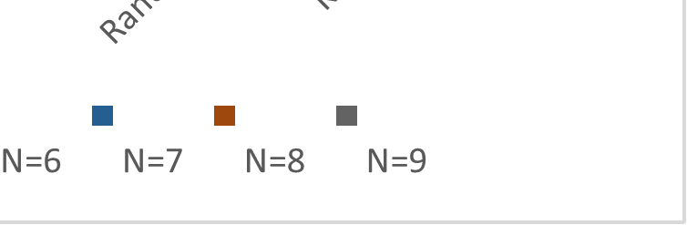

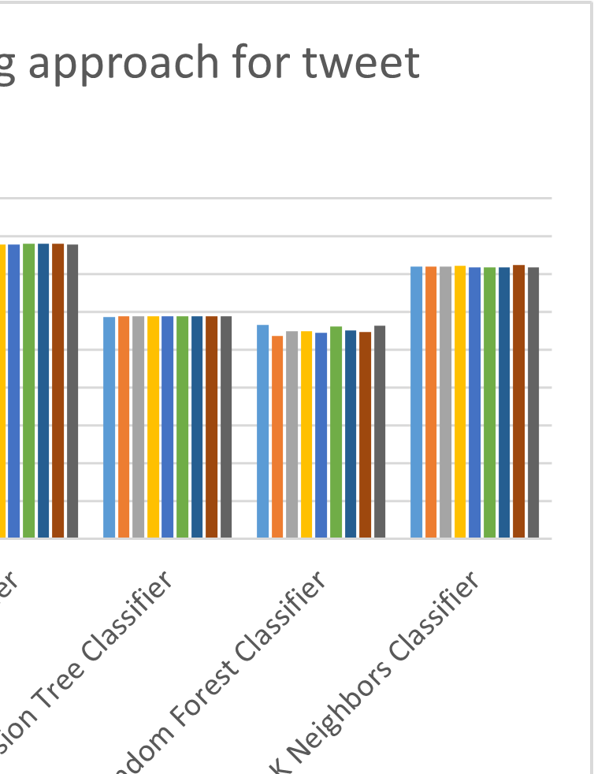

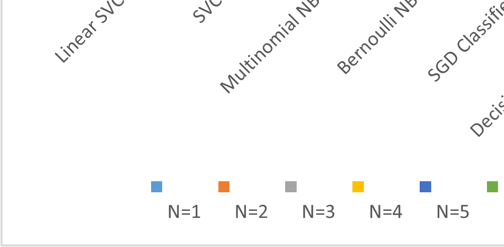

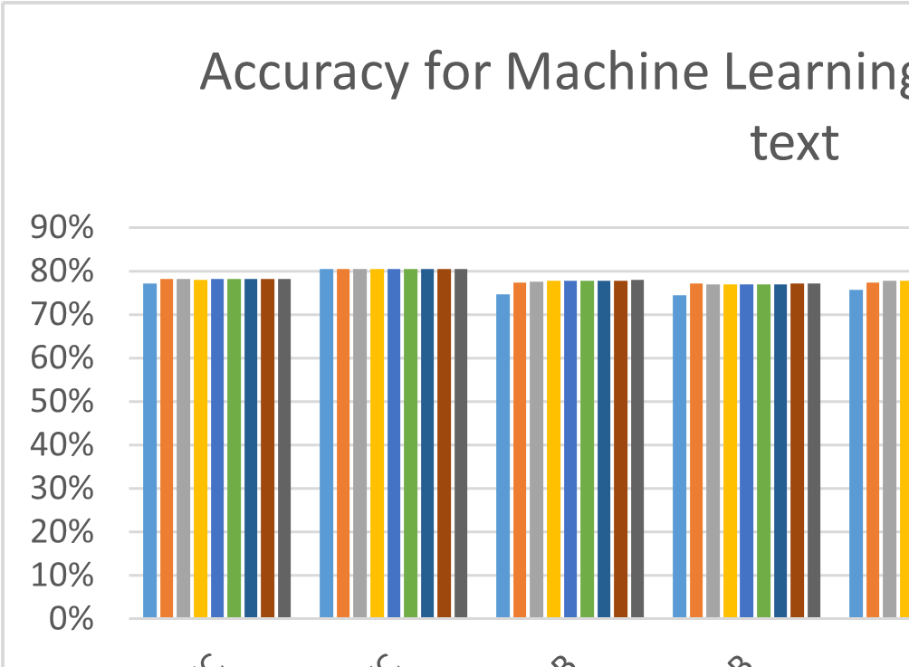

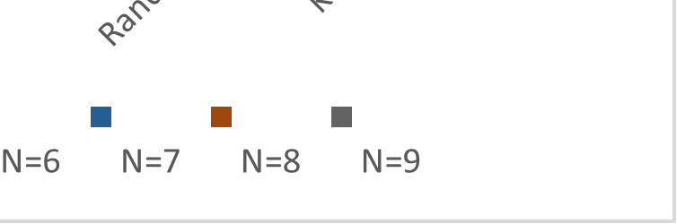

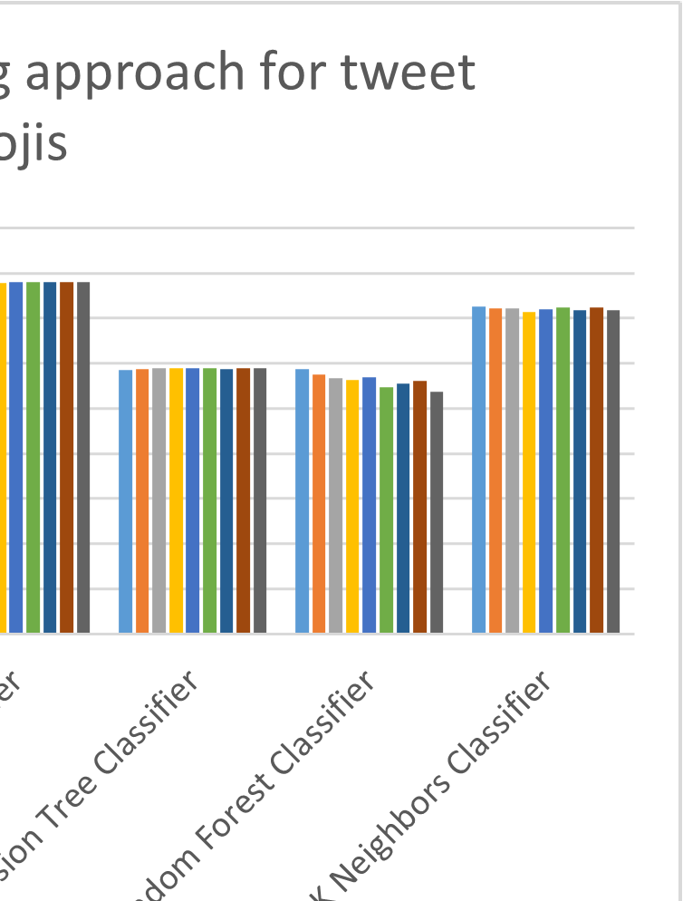

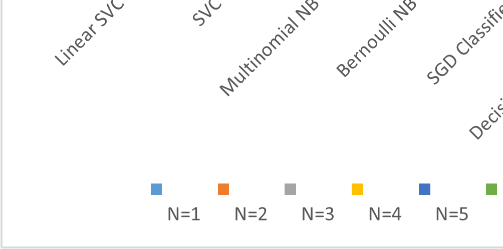

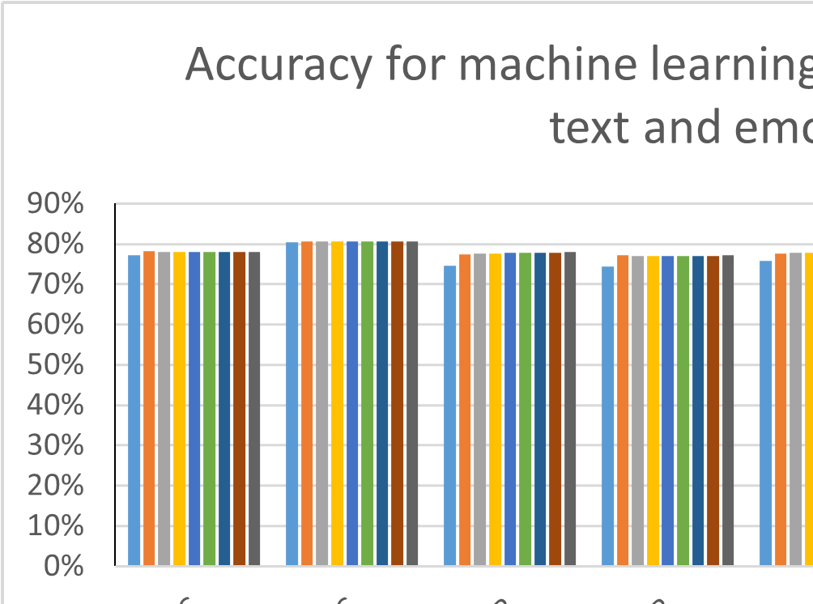

## M. Alfreihat et al.: Emo-SL Framework: Emo-SL Using Text-Based Features and ML

conjunction with textual content. For instance, an Arabic
tweet containing a combination of positive words and
positively connoted emojis like
would be more accurately
classified by Emo-SL, reflecting in its high precision (0.92)
and recall (0.89).Furthermore, the strong Cohen’s Kappa
score (0.88) indicates a high level of agreement between
the lexicon-derived classifications and human annotations,
affirming the lexicon’s reliability and alignment with human
judgment. This is particularly noteworthy in the context of
Arabic sentiment analysis, where linguistic subtleties and
cultural nuances play a significant role.
When benchmarked against sophisticated ML models
such as SVM, the Emo-SL still showcases competitive or
superior outcomes. This comparison highlights the intrinsic
value added by incorporating emoji-based features into
sentiment analysis, enhancing the accuracy and depth of
sentiment detection and classification in the complex linguistic landscape of Arabic social media. Our evaluation
methodology, combining quantitative metrics with comparative benchmarks, attests to the Emo-SL Lexicon’s technical
robustness and practical applicability. It reflects an in-depth
understanding of the challenges inherent in Arabic sentiment
analysis, leveraging cutting-edge NLP and ML techniques
to thoroughly refine and validate the lexicon. Consequently,
the Emo-SL Lexicon makes a significant contribution to
advancing sentiment analysis, particularly in enhancing the
understanding and processing of emotional expressions in
Arabic-language digital content.
Creating a sentiment lexicon that is equally accessible to
humans and machines requires a blend of clarity, structured
data, and intuitive usage guidelines. For human users, each
sentiment term, such as ‘‘ (joy) for positive or ’’ (sadness) for
negative, would include definitions and contextual examples
like " ‘‘(I feel great joy when I am with my family), ensuring
comprehensibility. The scoring might range from −1 for
strongly negative sentiments, such as ’’’’(anger), to +1 for
strongly positive sentiments, clearly categorizing emotions
with examples: " ‘‘(His anger was evident in his messages).
For machine usability, the lexicon would be structured in a
machine-readable format like JSON, detailing each entry’s
attributes (e.g., word, sentiment score) and facilitating API
access for integration with NLP tools. This dual approach
enables both humans and machines to effectively interpret
and analyze sentiment in Arabic content, merging intuitive,
example-rich guidelines with standardized, easily accessible
data formats.

## A. ADAPTING THE EMO-SL FRAMEWORK TO OTHER
LANGUAGES
Given that emojis are universally utilized across languages
to express emotions, the core concept of the Emo-SL–
assigning sentiment scores to emojis–holds potential for
cross-lingual application. The sentiment values attributed
to most emojis are relatively consistent across cultural
and linguistic boundaries, providing a solid foundation for
adaptation. As mentioned, the Emo-SL framework operates

# VOLUME 12, 2024
81809

on the premise that emojis carry inherent sentiment values,
which can be quantitatively assessed and utilized in sentiment
analysis across different languages. Mathematically, this can
be expressed as follows: Let E be the set of all emojis used
across languages, where each emoji ei ∈E is associated with
a sentiment score S(ei). The sentiment score S(ei) is a real
number that quantifies the sentiment expressed by ei, where
the score can range from negative to positive values indicating
the sentiment spectrum.
The adaptation process involves conducting languagespecific sentiment analysis to understand the contextual usage
of emojis within that language’s social media content. This
step is crucial for identifying any language-specific nuances
in emoji sentiment expression. To adapt the Emo-SL for a
specific language L, a corpus CL of social media texts in L
containing emojis is collected. The adaptation process can be
described as:

• Collecting a Representative Corpus: CL = {t1, t2, . . . ,
tn}, where each ti is a text sample containing one or more
emojis.

• Annotation for Sentiment: Each text ti is annotated
with a sentiment label li, derived from a predefined set
of sentiment categories. This step might involve human
annotators or automated sentiment analysis tools refined
for the target language.

• Emoji Sentiment Scoring: For each emoji ej in
CL, calculate the sentiment score SL(ej) based on its
contextual usage across the annotated texts, as described
in section III-C.

Similar to the methodology applied in creating the Emo-SL
for Arabic, creating equivalent lexicons for other languages
would involve collecting a representative corpus of social
media texts, annotating them for sentiment, and analyzing the
use of emojis within these texts to assign accurate sentiment
scores. The adaptation acknowledges the impact of linguistic
and cultural nuances on sentiment expression. This involves:
Collaborate with linguists to understand language-specific
idioms, slang, and expressions that affect emoji sentiment
interpretation. And, Engage cultural experts to identify
emojis whose sentiment values might differ significantly
across cultures.
Recognizing that linguistic and cultural nuances significantly affect sentiment expression, the adaptation process
must include a thorough analysis of these factors. This might
involve collaboration with linguists and cultural experts in
the target language to ensure the lexicon accurately reflects
sentiment expressions specific to that culture. Suppose we
are adapting the Emo-SL for Language X. We collect a
corpus CX and observe that the
emoji is predominantly
used in contexts expressing joy. If 88% of texts containing

are annotated with positive sentiment in Language X, the
sentiment score SX(emoji_) could be quantitatively set to
a high positive value, reflecting its usage. This structured
approach, combining quantitative sentiment scoring with
qualitative linguistic and cultural analysis, provides a robust

## M. Alfreihat et al.: Emo-SL Framework: Emo-SL Using Text-Based Features and ML

framework for adapting the Emo-SL across languages.
It ensures that the lexicon remains sensitive to the nuanced
ways emojis are used to express sentiment in different
linguistic and cultural contexts.

of Arabic sentiments. Future studies will aim to address
these limitations by incorporating context-aware ML models
that can better understand the complexities of language use
in social media. Further, we plan to expand our lexicon to
include a wider range of emojis and explore the potential
of deep learning techniques for automatic feature extraction
and sentiment analysis. The Emo-SL framework represents
a significant step forward in Arabic sentiment analysis by
incorporating emoji-based features. However, challenges like
noise handling, sarcasm detection, and dialect variations
remain areas for future enhancement. The document points
towards the need for advanced computational techniques
and richer linguistic resources to further improve sentiment
analysis accuracy in the face of these challenges.

## X. CONCLUSION
This study unveiled the Emo-SL framework, a pioneering
method aimed at augmenting sentiment analysis of Arabic tweets by integrating emoji-based attributes alongside
machine learning (ML) strategies, thereby achieving substantial gains in sentiment classification accuracy. By incorporating emoji-derived features, the Emo-SL framework enhanced
classification accuracy by 26.7%, highlighting the capacity of
emojis to significantly enrich the extraction of informational
content from text. This innovation presents a solid system for
accurately identifying sentiments expressed in Arabic tweets,
spanning a diverse array of emotions tied to prevalent topics
of conversation. In practical terms, the Emo-SL framework
realized an impressive accuracy rate of 86.3%, marking a
significant 26.7% absolute improvement over traditional textonly approaches. This underscores the pivotal role that emojis
serve in expressing and interpreting sentiment within Arabic
social media contexts. The work propels forward the domain
of sentiment analysis, introducing a novel methodology for
assessing public sentiment and trends on various themes
through Arabic-language Twitter data.

ACKNOWLEDGMENT
The authors’ research is a testament to the collaborative
efforts of several respected institutions, whose contributions
have been fundamental to the success of this study. They
extend their gratitude to Southern Illinois University Carbondale (SIUC), USA; Jordan University of Science and
Technology, Jordan; and Kingdom University, Bahrain. Each
institution has provided a wealth of resources, academic
expertise, and a collaborative spirit that has been indispensable in their pursuit of knowledge and the successful
completion of this article. Their joint commitment to research
excellence not only has propelled this project, but has also
reinforced the value of academic cooperation.

## A. LIMITATIONS AND FUTURE WORK
While this research demonstrates the utility of an emoji-based
approach for the analysis of Arabic sentiment, certain limitations provide avenues for further exploration. Firstly, there is
a shortage of large-scale public Arabic corpora and sentiment
lexicons compared to English. As a morphologically complex
language, adequately modeling Arabic requires expansive
labeled data that span dialects and linguistic variations. The
construction of such comprehensive datasets and dictionaries
is a challenge for research. Second, handling informal dialectical Arabic prevalent on social networks poses difficulties
due to its regional variances. Colloquial expressions and
Egyptian or Levantine dialects differ considerably from
Modern Standard Arabic in vocabulary and syntax. Our current lexicon-driven approach may be insufficient to capture
these nuances. Advanced representation learning techniques
like BERT could help derive generalized embeddings
encompassing lexical and morphological characteristics.
Transfer learning by fine-tuning contextual models on Arabic
social media data may provide improved dialectal coverage.
Another direction is enhancing emoji understanding through
multimodal analysis–leveraging emoji semantics coupled
with associated text, images, hashtags, etc. Exploring emoji
relationships within sentence structure can also reveal useful
insights. The complexities of informal Arabic necessitate
larger datasets, richer lexicons, and novel deep-learning
techniques. Our emoji-integrated methodology serves as a
foundation for incorporating pictorial elements within these
advanced frameworks to further advance our understanding

REFERENCES

[1] T. H. Nguyen, K. Shirai, and J. Velcin, ‘‘Sentiment analysis on social
media for stock movement prediction,’’ Expert Syst. Appl., vol. 42, no. 24,
pp. 9603–9611, Dec. 2015.
[2] F. Neri, C. Aliprandi, F. Capeci, M. Cuadros, and T. By, ‘‘Sentiment
analysis on social media,’’ in Proc. IEEE/ACM Int. Conf. Adv. Social Netw.
Anal. Mining, Aug. 2012, pp. 919–926.
[3] V. A. Kharde and P. S. Sonawane, ‘‘Sentiment analysis of Twitter data: A
survey of techniques,’’ 2016, arXiv:1601.06971.
[4] L. Stark and K. Crawford, ‘‘The conservatism of emoji: Work, affect,
and communication,’’ Social Media+Soc., vol. 1, no. 2, Jul. 2015,
Art. no. 205630511560485.
[5] L. Vidal, G. Ares, and S. R. Jaeger, ‘‘Use of emoticon and emoji in tweets
for food-related emotional expression,’’ Food Quality Preference, vol. 49,
pp. 119–128, Apr. 2016.
[6] S. Mohammad and P. Turney, ‘‘Emotions evoked by common words and
phrases: Using mechanical Turk to create an emotion lexicon,’’ in Proc.
NAACL HLT Workshop Comput. Approaches Anal. Gener. Emotion Text,
2010, pp. 26–34.
[7] S. R. El-Beltagy, ‘‘NileULex: A phrase and word level sentiment lexicon
for Egyptian and modern standard Arabic,’’ in Proc. 10th Int. Conf. Lang.
Resour. Eval. (LREC), 2016, pp. 2900–2905.
[8] P. K. Novak, J. Smailović, B. Sluban, and I. Mozetič, ‘‘Sentiment of
emojis,’’ PLoS ONE, vol. 10, no. 12, Dec. 2015, Art. no. e0144296.
[9] M. Kimura and M. Katsurai, ‘‘Automatic construction of an emoji
sentiment lexicon,’’ in Proc. IEEE/ACM Int. Conf. Adv. Social Netw. Anal.
Mining, Jul. 2017, pp. 1033–1036.
[10] C. Strapparava and A. Valitutti, ‘‘WordNet affect: An affective extension
of wordnet,’’ in Proc. LREC, vol. 4, 2004, pp. 1083–1086.
[11] Y. Chen, J. Yuan, Q. You, and J. Luo, ‘‘Twitter sentiment analysis via bisense emoji embedding and attention-based LSTM,’’ in Proc. 26th ACM
Int. Conf. Multimedia, Oct. 2018, pp. 117–125.
[12] B. Felbo, A. Mislove, A. Søgaard, I. Rahwan, and S. Lehmann, ‘‘Using
millions of emoji occurrences to learn any-domain representations for
detecting sentiment, emotion and sarcasm,’’ 2017, arXiv:1708.00524.

81810
# VOLUME 12, 2024

## M. Alfreihat et al.: Emo-SL Framework: Emo-SL Using Text-Based Features and ML

# [13] M.
Fernández-Gavilanes,
J.
Juncal-Martínez,
## S. García-Méndez,
## E. Costa-Montenegro, and F. J. González-Castaño, ‘‘Creating emoji
lexica from unsupervised sentiment analysis of their descriptions,’’ Expert
Syst. Appl., vol. 103, pp. 74–91, Aug. 2018.
[14] I. Good, The Estimation of Probabilities: An Essay on Modern Bayesian
Methods. Cambridge, MA, USA: MIT Press, 1965.
[15] L. Yang and R. Jin, ‘‘Distance metric learning: A comprehensive survey,’’
Michigan State Univ., vol. 2, no. 2, pp. 1–4, 2006.
[16] Y. K. Jain and S. K. Bhandare, ‘‘Min max normalization based data
perturbation method for privacy protection,’’ Int. J. Comput. Commun.
Technol., vol. 2, no. 8, pp. 45–50, Oct. 2011.
[17] L. A. Shalabi, Z. Shaaban, and B. Kasasbeh, ‘‘Data mining: A preprocessing engine,’’ J. Comput. Sci., vol. 2, no. 9, pp. 735–739, Sep. 2006.
[18] P. Pandey, ‘‘Simplifying sentiment analysis using VADER in Python (on
social media text),’’ Medium, Sep. 2018. [Online]. Available: https://
medium.com/analytics-vidhya/simplifying-social-media-sentimentanalysis-using-vader-in-python-f9e6ec6fc52f
[19] N. A. Abdulla, N. A. Ahmed, M. A. Shehab, and M. Al-Ayyoub, ‘‘Arabic
sentiment analysis: Lexicon-based and corpus-based,’’ in Proc. IEEE
Jordan Conf. Appl. Electr. Eng. Comput. Technol. (AEECT), Dec. 2013,
pp. 1–6.
[20] C. Hutto and E. Gilbert, ‘‘VADER: A parsimonious rule-based model for
sentiment analysis of social media text,’’ Proc. Int. AAAI Conf. Web Social
Media, vol. 8, no. 1, pp. 216–225, May 2014.
[21] W. A. Hussien, Y. M. Tashtoush, M. Al-Ayyoub, and M. N. Al-Kabi, ‘‘Are
emoticons good enough to train emotion classifiers of Arabic tweets?’’ in
Proc. 7th Int. Conf. Comput. Sci. Inf. Technol. (CSIT), Jul. 2016, pp. 1–6.
[22] M. Rushdi Saleh, M. T. Martín-Valdivia, A. Montejo-Ráez, and
L. A. Ureña-López, ‘‘Experiments with SVM to classify opinions in
different domains,’’ Expert Syst. Appl., vol. 38, no. 12, pp. 14799–14804,
Nov. 2011.
[23] W. Medhat, A. Hassan, and H. Korashy, ‘‘Sentiment analysis algorithms
and applications: A survey,’’ Ain Shams Eng. J., vol. 5, no. 4,
pp. 1093–1113, Dec. 2014, doi: 10.1016/J.ASEJ.2014.04.011.
[24] A. Balahur, ‘‘Methods and resources for sentiment analysis in multilingual
documents of different text types,’’ Ph.D. thesis, Dept. Softw. Comput.
Syst., Univ. Alicante, Alicante, Spain, 2011, pp. 1–273.
[25] A. Montoyo, P. Martínez-Barco, and A. Balahur, ‘‘Subjectivity and
sentiment analysis: An overview of the current state of the area
and envisaged developments,’’ Decis. Support Syst., vol. 53, no. 4,
pp. 675–679, Nov. 2012.
[26] D. Kang and Y. Park, ‘‘Review-based measurement of customer satisfaction in mobile service: Sentiment analysis and VIKOR approach,’’ Expert
Syst. Appl., vol. 41, no. 4, pp. 1041–1050, Mar. 2014.
[27] Y.-M. Li and T.-Y. Li, ‘‘Deriving market intelligence from microblogs,’’
Decis. Support Syst., vol. 55, no. 1, pp. 206–217, Apr. 2013.
[28] H. Rui, Y. Liu, and A. Whinston, ‘‘Whose and what chatter matters? The
effect of tweets on movie sales,’’ Decis. Support Syst., vol. 55, no. 4,
pp. 863–870, Nov. 2013.
[29] T. Dimson, ‘‘Emojineering Part 1: Machine learning for emoji trends,’’
Instagram Eng. Blog, vol. 30, Jul. 2015.
[30] S. Kiritchenko, X. Zhu, and S. M. Mohammad, ‘‘Sentiment analysis of
short informal texts,’’ J. Artif. Intell. Res., vol. 50, pp. 723–762, Aug. 2014.
[31] N. Y. Habash, ‘‘Introduction to Arabic natural language processing,’’
Synth. Lectures Human Lang. Technol., vol. 3, no. 1, pp. 1–187, Jan. 2010.
[32] A. Farghaly and K. Shaalan, ‘‘Arabic natural language processing:
Challenges and solutions,’’ ACM Trans. Asian Lang. Inf. Process., vol. 8,
no. 4, pp. 1–22, Dec. 2009.
[33] A. Radwan, M. Amarneh, H. Alawneh, H. I. Ashqar, A. AlSobeh, and
A. A. A. R. Magableh, ‘‘Predictive analytics in mental health leveraging
LLM embeddings and machine learning models for social media analysis,’’
Int. J. Web Services Res., vol. 21, no. 1, pp. 1–22, Feb. 2024.
[34] N. Abdulla, R. Majdalawi, S. Mohammed, M. Al-Ayyoub, and M. Al-Kabi,
‘‘Automatic lexicon construction for Arabic sentiment analysis,’’ in Proc.
Int. Conf. Future Internet Things Cloud, Aug. 2014, pp. 547–552.
[35] G. Castellucci, D. Croce, and R. Basili, ‘‘Acquiring a large scale polarity
lexicon through unsupervised distributional methods,’’ in Proc. Int. Conf.
Appl. Natural Language Inf. Syst. Springer, 2015, pp. 73–86.
[36] R. M. Duwairi, N. A. Ahmed, and S. Y. Al-Rifai, ‘‘Detecting sentiment
embedded in Arabic social media—A lexicon-based approach,’’ J. Intell.
Fuzzy Syst., vol. 29, no. 1, pp. 107–117, Sep. 2015.
[37] K. Elshakankery and M. F. Ahmed, ‘‘HILATSA: A hybrid incremental
learning approach for Arabic tweets sentiment analysis,’’ Egyptian
Informat. J., vol. 20, no. 3, pp. 163–171, Nov. 2019.

# VOLUME 12, 2024
81811

[38] H. Abdellaoui and M. Zrigui, ‘‘Using tweets and emojis to build TEAD: An
Arabic dataset for sentiment analysis,’’ Computación y Sistemas, vol. 22,
no. 3, pp. 777–786, Sep. 2018.
[39] B. Guthier, K. Ho, and A. El Saddik, ‘‘Language-independent data set
annotation for machine learning-based sentiment analysis,’’ in Proc. IEEE
Int. Conf. Syst., Man, Cybern. (SMC), Oct. 2017, pp. 2105–2110.
[40] A. M. R. AlSobeh, I. AlAzzam, A. M. J. Shatnawi, and I. Khasawneh,
‘‘Cybersecurity awareness factors among adolescents in Jordan: Mediation
effect of cyber scale and personal factors,’’ Online J. Commun. Media
Technol., vol. 13, no. 2, 2023, Art. no. e202312.
[41] F. Jiang, Y.-Q. Liu, H.-B. Luan, J.-S. Sun, X. Zhu, M. Zhang, and S.-P. Ma,
‘‘Microblog sentiment analysis with emoticon space model,’’ J. Comput.
Sci. Technol., vol. 30, no. 5, pp. 1120–1129, Sep. 2015.
[42] A. Hogenboom, D. Bal, F. Frasincar, M. Bal, F. De Jong, and U. Kaymak,
‘‘Exploiting emoticons in polarity classification of text,’’ J. Web Eng.,
vol. 14, nos. 1–2, pp. 22–40, 2015.
[43] Y. M. Tashtoush and D. A. A. A. Orabi, ‘‘Tweets emotion prediction by
using fuzzy logic system,’’ in Proc. 6th Int. Conf. Social Netw. Anal.,
Manage. Secur. (SNAMS), Oct. 2019, pp. 83–90.
[44] A. M. R. AlSobeh, ‘‘OSM: Leveraging model checking for observing
dynamic behaviors in aspect-oriented applications,’’ Online J. Commun.
Media Technol., vol. 13, no. 4, 2023, Art. no. e202355.
[45] L. Zhang, R. Ghosh, M. Dekhil, M. Hsu, and B. Liu, ‘‘Combining lexiconbased and learning-based methods for Twitter sentiment analysis,’’ HP
Laboratories, Italy, Tech. Rep. HPL-2011, 2011, vol. 89.
[46] O. Darwish, A. Al-Fuqaha, G. B. Brahim, I. Jenhani, and M. Anan,
‘‘Towards a streaming approach to the mitigation of covert timing
channels,’’ in Proc. 14th Int. Wireless Commun. Mobile Comput. Conf.
(IWCMC), Jun. 2018, pp. 255–260.
[47] M. Shatnawi, Q. Abuein, and O. Darwish, ‘‘Verification Hadith correctness
in Islamic web pages using information retrieval techniques,’’ in Proc. Int.
Conf. Inf. Commun. Syst., 2011, pp. 164–167.
[48] O. Karajeh, D. Darweesh, O. Darwish, N. Abu-El-Rub, B. Alsinglawi,
and N. Alsaedi, ‘‘A classifier to detect informational vs. non-informational
heart attack tweets,’’ Future Internet, vol. 13, no. 1, p. 19, Jan. 2021.
[49] A. M. R. AlSobeh and A. A. Magableh, ‘‘BlockASP: A framework for
AOP-based model checking blockchain system,’’ IEEE Access, vol. 11,
pp. 115062–115075, 2023, doi: 10.1109/ACCESS.2023.3325060.
[50] O. Appel, F. Chiclana, J. Carter, and H. Fujita, ‘‘A hybrid approach to
the sentiment analysis problem at the sentence level,’’ Knowl.-Based Syst.,
vol. 108, pp. 110–124, Sep. 2016.
[51] M. Al-Shalout, K. Mansour, K. E. Al-Qawasmi, and M. Rasmi, ‘‘Classifying date palm tree diseases using machine learning,’’ in Proc. Int. Eng.
Conf. Electr., Energy, Artif. Intell. (EICEEAI), Nov. 2022, pp. 1–5.

MANAR ALFREIHAT received the B.Sc. degree in computer science from
Al-Balqa Applied University, Ajloun, Jordan, in 2013, and the M.Sc. degree
in computer science from Jordan University of Science and Technology,
Irbid, Jordan, in 2021. She is currently the Head of the Information Unit,
Ajloun Works Directorate, Ministry of Public Works and Housing, Ajloun.
Her current research interests include sentiment analysis and artificial
intelligence.

OMAR SAAD ALMOUSA received the B.Sc.
degree in computer science from Jordan University
of Science and Technology, in 2002, the M.Sc.
degree in computer science from the University
of Trento, Italy, in 2012, and the Ph.D. degree in
computer science from the Technical University
of Denmark, Denmark, in 2016. He is currently
an Associate Professor with the Computer Science
Department and the Cyber Security Department,
Jordan University of Science and Technology. His
primary research interests include formal verification of security protocols,
intelligent personal assistants, and sentiment analysis.

YAHYA TASHTOUSH received the B.Sc. and
M.Sc. degrees in electrical engineering from Jordan University of Science and Technology (JUST),
Irbid, Jordan, in 1995 and 1999, respectively, and
the Ph.D. degree in computer engineering from
the University of Alabama in Huntsville and the
University of Alabama at Birmingham, AL, USA,
in 2006 (joint degree). He is a Full Professor
with the College of Computer and Information
Technology, JUST. His current research interests
include the IoT, deep/machine learning, wireless networks, robotics, and
fuzzy systems.

ANAS ALSOBEH (Member, IEEE) received the
Ph.D. degree in computer science from Utah
State University, in 2015. He is an esteemed
Computer Scientist pushing the boundaries of
information technology innovation across software engineering, cybersecurity analysis, data
analysis and modeling, artificial intelligence, and
the Internet of Things (IoT). As a Faculty Member
of information technology (ITEC) with Southern
Illinois University Carbondale (SIUC), he spearheads high-impact interdisciplinary research initiatives and trains future
computer scientists, where he honed exceptional skills in aspect-oriented
programming (AOP), distributed systems, and intelligent applications. His
prolific academic career includes over 30 publications in top-middletier computer science journals and conferences. He served as a principal
investigator (PI) for externally funded projects applying cutting-edge
information technology to major challenges in computer science related
to healthcare, education, and social services, such as the European Union
and Erasmus+, HOPES-MADAD, and Horizon 2020. As an inventor,
he develops next-generation solutions leveraging cloud computing, the
Internet of Things, data analysis and modeling, digital social networks,
and machine learning techniques. His intelligent systems are intended to
revolutionize cybersecurity, enable precision medicine, and enhance learning
outcomes. With exceptional technical skills and creative vision, he conducts
pioneering research that pushes innovation pipelines from proof-of-concept
to real-world deployment. He excels as a research mentor, guiding dozens
of student capstone and thesis projects on topics spanning his diverse
expertise. His commitment to student success fosters rising talent and
ensures a vibrant future for information technology research. He continues
to explore new frontiers where information technology can advance society
under the guidance of interdisciplinary curiosity and technical brilliance. His
research interests include software design and modeling, data analysis, web
technology, security analysis, machine learning, and cloud computing.

81812
# VOLUME 12, 2024

## M. Alfreihat et al.: Emo-SL Framework: Emo-SL Using Text-Based Features and ML

KHALID MANSOUR received the Ph.D. degree in
computer science from the Swinburne University
of Technology, Melbourne, in 2014. Currently,
he is an Associate Professor of computer science
and the Dean of the College of Information
Technology, Kingdom University, Bahrain. His
research focuses on machine learning, information
security, and multi-agent systems.

HAZEM MIGDADY received the Ph.D. degree
from Southern Illinois University Carbondale,
USA. He is a scholar in the fields of data
mining, data science, and machine learning. With
a profound dedication to research and academia,
he is currently the Dean of Oman College of Management and Technology, leveraging his expertise
to shape the academic landscape. He is a holder
of the esteemed rank of an Associate Professor,
he continues to work and efforts toward excellence
in educational pursuits.

