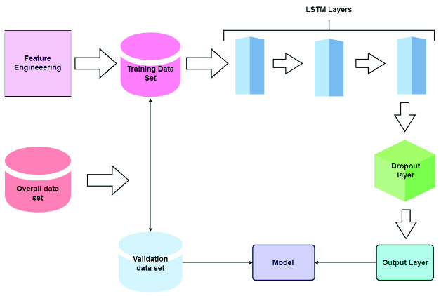
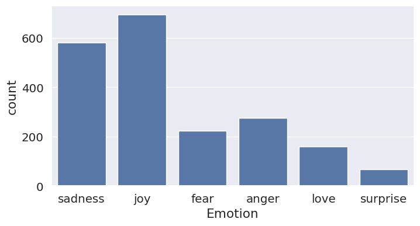
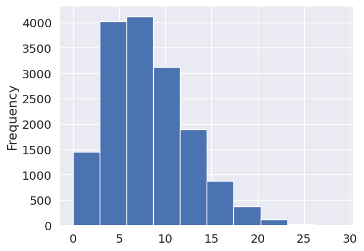
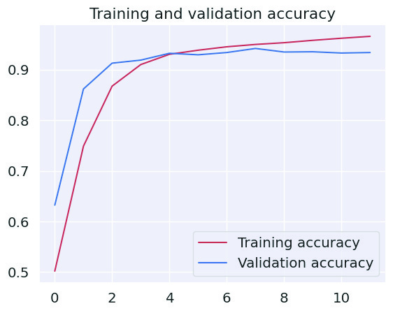
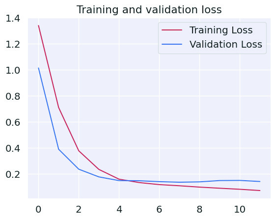
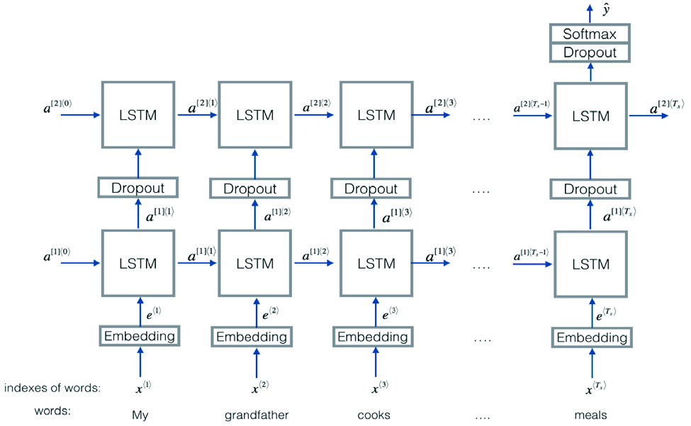
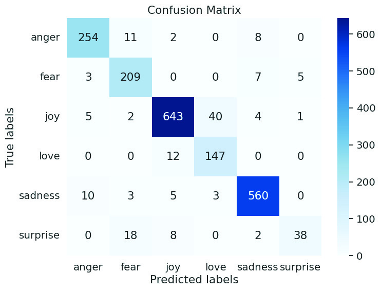

# Emotion Detection Based on Text and Emojis

2024 IEEE International Conference on Information Technology, Electronics and Intelligent Communication Systems (ICITEICS)
## Karnataka, India. Jun 28-29, 2024

## Emotion Detection based on Text and Emojis

2024 IEEE International Conference on Information Technology, Electronics and Intelligent Communication Systems (ICITEICS) | 979-8-3503-8269-3/24/$31.00 ©2024 IEEE | DOI: 10.1109/ICITEICS61368.2024.10625102

Anushka Joseph
Dept. of Computer Engineering
Don Bosco Institute of Technology
Mumbai-400 070, India
221emily0008@dbit.in

Nicole Saldanha
Dept. of Computer Engineering
Don Bosco Institute of Technology
Mumbai-400 070, India
221nicole0006@dbit.in

Shanaya Carvalho
Dept. of Computer Engineering
Don Bosco Institute of Technology
Mumbai-400 070, India
221shanaya0017@dbit.in

Dr. Phiroj Shaikh
Dept. of Computer Engineering
Don Bosco Institute of Technology
Mumbai-400 070, India
phiroj@dbit.in

that combines text as well as emoji data, which increases the
accuracy in emotion recognition. This innovative model is
used in diverse domains such as sentiment analysis in social
media, feedback analysis in product review and mental health
monitoring applications.

Abstract— Opinion mining has become increasingly vital in
today’s digital world for making strategic decisions. With the
volume of information increasing daily at a fast pace it becomes
necessary to refine the information to efficiently analyze
important and very vital data. Analysis of text to extract the
emotions that are conveyed is a very important task, as analysis
of text manually is time-consuming as well as may contain errors.
Emojis have played a significant role in the digital world for
communication and conveying various opinions.

This research method combines various important steps.
The initial step of this creation of a dataset that contains textbased content, that is meticulously labelled with detailed
labels that can be easily identified by the model. The
preprocessing phase involves essential tasks like tokenization,
text normalization, etc which is extremely necessary to ready
the data for analysis. In this model various features are
engineered by analysing the data and techniques like word
embeddings and emoji representations to efficiently capture
the emotions in the input data provided. The model is a
recurrent neural network designed to handle text input, which
is trained using a multi-label classification approach to predict
the most appropriate emotion from the categories for the input
set. For the emoji interpretation, the emojis are extracted from
the input and are converted to their text-based description,
which is further sent to the model for further classification.

To solve these challenges an emotion detection model is
introduced, that aims to address the issues related to accuracy
of recognizing emotions by combining textual data and emojis.
This model aids in various fields like sentiment analysis, mental
health monitoring, feedback assessment.

This research begins its journey by the creation of a diverse
data set that contains text-based content that are meticulously
labeled. To prepare the content in the data various
preprocessing tasks are undertaken such as tokenization,
removal of stopwords, normalization of text. The model is built
in a recurrent neural network that is designed for managing
multimodal input and trained through multi-label classification
to predict the appropriate emotion category.

The results obtained from the experimental testing
displays proof of the model’s effectiveness. This particular
model surpasses various text-only models of emotion
detection as well as emoji-only sentimental analysis models,
particularly in identifying emotions such as sarcasm that
heavily rely on emojis.

Empirical formulas are referred to validate the model’s
effectiveness, which help in comparing the results obtained from
text-only models in emotion recognition and emojis related
sentiments. The aspects that set this model apart from the other
models is its ability to adapt across platforms and languages, by
recognizing the changing digital communication nature.

In accordance with its implementation the model gives a
notable achievement of accuracy rate of 94.19%. This
accuracy is achieved by combining both text and emoji with
text preprocessing being a vital step. This model
implementation is developed using the Python programming
language that is highly sort after in works like machine
learning, deep learning, natural language processing, etc. with
inclusion of an emoji database that further improves the
model’s ability to interpret emotions accurately. To train and
evaluate the model datasets like training dataset that are
typically used for model training and a validation dataset for
evaluating its performance and generalization.

As the nature of digital communication keeps on evolving it
is necessary that various analytical tools are also evolved in
parallel to address the changes as they come.

Keywords— Emotion Detection, Text, Emoji, LSTM, RNN.

I.
INTRODUCTION
Opinion mining is a critical study that involves the
extraction of key aspects from a vast sea of content, and plays
a key role in supporting decision-making. This makes it
important to automate and streamline the data efficiently from
the information that is online. The most important objective of
this research is understanding the various emotions that are
being conveyed through text, when analysis of the large text
is done manually the accuracy of the result being error free is
less and time-consuming.

Hence, we get a more significant model for sentiment
analysis and human-computer interaction by integrating the
text and emojis in emotion detection. When both modalities
are combinedly used the model displays a comprehensive
understanding of the emotions in the digital content, that
creates a positive environment for the users, mental health
support and the overall quality of digital communication. As
technology enriches digital communication and evolves with

Emojis play a significant role as they help to decipher the
often-elusive emotions expressed in sarcastic text. To address
these challenges an emotion detection model is introduced,

979-8-3503-8269-3/24/$31.00 ©2024 IEEE
1

Authorized licensed use limited to: University of Auckland. Downloaded on April 12,2026 at 00:48:54 UTC from IEEE Xplore.  Restrictions apply.

respect to the changes, analytical tools like this must also be
able to adapt changes in order to meet the growing needs of
the users.

II.
# LITERATURE REVIEW

Analyzing the already existing systems based on sentiment
analysis and emotion detection has made various noteworthy
strides in unraveling the intricate patterns of emotions within
textual data that are particularly prevalent in social media
platforms. However despite the noteworthy work, one cannot
ignore the gaps that are present in the current literature. In
some studies there are integration of emojis in sentiment
analysis underscored, they often fall short to elaborate a
notable evaluation of model performance and good
classification.

Furthermore, some studies describing contextual emotion
detection overlook the aspects that emoji can offer in
understanding the emotions of textual data. While, despite
mentions of integrating text and emoji features in opinion
mining, there has not been any considerable mentions of
adaptability across languages and other aspects. Similarly in
some research papers emotion detection within contextual
conversations misses the chances to extract emojis for
capturing various subtle emotions, particularly given the
variations in emoji usage and interpretation across different
linguistic and cultural groups.

In order to solve these issues the proposed research aims
to develop and deploy a novel model of emotion detection that
integrates emojis in sentiment analysis efficiency. By
leveraging cutting edge methods in deep learning and natural
language processing, this project will help to convey the
emotions conveyed through textual data that are precisely in
context where emojis play a significant role.

# III. METHODOLOGY

## A. Sentiment and Emotion
Sentiment and emotion are both terms related to human
subjectivity, so they are sometimes used interchangeably in
research without sufficient differentiation, which may lead to
poor apprehension and confusion [1, 2]. As this study involves
both sentiment and emotion, we need to clearly distinguish
them[1].

Sentiment refers to an attitude, thought, or judgement
prompted by a feeling [1, 2]. Usually, in NLP community,
sentiment is considered to have three polarities, i.e., positive,
negative, and neutral [1, 3]. Emotion refers to a conscious
mental reaction subjectively experienced as strong feelings [1,
2]. Different from sentiment, emotion is more sophisticated.
So far, there has not been one standard theory on categorizing
emotions[1].

## B. Design
In order to deliver precise sentiment analysis and
emotional insights, the suggested emotion recognition
algorithm is made to examine textual and emoji-based
information. The system has a simple architecture designed to
efficiently process input data. First, a varied dataset with textbased content that has been painstakingly annotated with
precise emotional classifications is needed for the model.

## Fig. 1. Overall working of the system

The input data consists of both text as well as emojis. The
emojis are extracted from the input data and is then converted
to its associated text-based description. This text description
is used as the input in the model. Tokenization, text
normalisation, emoji extraction, etc are some of preprocessing
procedures that make sure the data is ready for analysis. Next,
word
embeddings
for
textual
material
and
emoji
representations are used to engineer features. The subtle
emotional undertones in the supplied data are captured by
these features. A recurrent neural network with multimodal
input handling capabilities is used in the model architecture.

To anticipate which emotional category is most
appropriate for a particular input, the network is trained using
a multi-label classification technique. Overfitting is prevented
by the use of regularisation techniques, and grid search
methods are employed to optimise the hyperparameters.
TensorFlow and PyTorch, two well-known deep learning
libraries, are used in the implementation's development, which
makes training and assessment more effective. The system's
capacity to adjust to many languages and platforms guarantees
its efficacy in examining the varied terrain of digital
communication.

## C. Data Analysis

The training dataset comprises of 16,000 sentences, while
the testing dataset consists of 2000 sentences. The training
dataset, which comprised 16,000 phrases with corresponding
emotion labels labelled on them, was thoroughly examined
during the data analysis phase of this study project. Six main
emotional categories are covered by the dataset: fear, love,
surprise, anger, sadness, and joy. In order to learn more about
the variety and frequency of emotional responses, the dataset's
emotional distribution was carefully examined.

The basis for additional study was the counts of each class
of emotions, which gave an overview of the relative frequency
of each emotion group.

Emotion
Training
Validation
Joy
5362
704
Sadness
4666
550
Anger
2159
275
Fear
1937
212
Love
1304
178
Surprise
572
81

Fig. 2. Table showing counts of each emotion classes in each dataset

2
Authorized licensed use limited to: University of Auckland. Downloaded on April 12,2026 at 00:48:54 UTC from IEEE Xplore.  Restrictions apply.

| Emotion | Training | Validation |
| --- | --- | --- |
| Joy | 5362 | 704 |
| Sadness | 4666 | 550 |
| Anger | 2159 | 275 |
| Fear | 1937 | 212 |
| Love | 1304 | 178 |
| Surprise | 572 | 81 |

Descriptive statistics were employed to summarize the
distribution of emotions within the dataset. Frequency counts
were calculated for each emotion category, revealing the
following distribution: joy (5362), sadness (4666), anger
(2159), fear (1937), love (1304), and surprise (572). These
counts provided an overview of the relative frequency of each
emotion category and served as the basis for further analysis.

Fig. 3. Bar graph showing frequencies of stopwords in the dataset

A bar chart was created to show the count of each
frequency in the dataset in order to visualise the distribution
of stopwords throughout it. The bar chart gave a clear visual
depiction of the distribution by highlighting the different
stopword frequencies across the sample.

Fig. 4. Bar graph showing count of emotion labels in validation dataset

The distribution of the sentences throughout the emotion
class in validation dataset was also shown as a bar graph in
addition to a frequency analysis of the stopwords across the
dataset. The bar chart provided a clear visual depiction of the
distribution in the validation set by highlighting the different
count of each emotion class labels over the dataset.

Additionally, measurements like range and standard
deviation were used to look at the variety and distribution of
emotions. These metrics provided information about the range
of emotional variability recorded by the annotations, as well
as the diversity and intensity of emotional expressions found
in the dataset.

To investigate potential correlations between certain
emotions or linkages with other variables in the dataset,
inferential statistical studies were also carried out.

In general, the data analysis stage gave us a thorough grasp
of the emotion of the content in the dataset, allowing us to spot
trends, patterns, and possible correlations that influenced the
creation of emotion detection models and advanced the fields
of sentiment analysis and human-computer interaction.

## D. Emoji Extraction
On receiving user input, the input data is segregated into
text and emojis. These emojis are translated to their textual
equivalents. In order to do so, the demojize() function in
Python’s Emoji package is used. The demojize() function
converts the emoji unicode to the Unicode Common Locale
Data Repository (CLDR) names. The input is then modified
with the addition of this new emoji representation (CLDR
name) and then fed into the model for further text
preprocessing.

## E. Text Preprocessing
To begin, we first send the text through text
preprocessing, which is necessary to ensure that the text is
cleaned and normalized for analysis which is more accurate.
The first step was removing duplicated text. The repeated
texts were identified and dropped. The next method was
lemmatization. Removal of numbers, punctuations, URLs,
etc from the texts was carried out. Sentences with less than
three words was also dropped. The text was then converted to
lowercase. In this way, the sentences were converted to
normalized sentences. The emotion classes are also labelled
in this stage. This preprocessing stage is crucial for preparing
the data for further analysis.

## F. Word Embedding

One method for converting text data into numerical
representations is GloVe word embedding. To mitigate the
discrete nature of words, word embedding approaches like
GloVe (Global Vectors for Word Representation) are offered
in natural language processing (NLP) to encode each word
into a continuous vector space. GloVe uses a global 200dimensional word-word co-occurrence matrix, which records
the frequency of word co-occurrences in a particular corpus,
to learn word embeddings. There are in all 4,00,000 word
vectors in the GloVe embeddings used for this project. Of
which, 13,243 words were converted and 1081 words were
unable to be embedded as the vectors were unavailable. This
approach allows words that frequently appear together in
similar contexts to be represented as similar vectors, thereby
capturing the semantic relationships among words. GloVe
uses the total co-occurrence statistics of words in the corpus
to forecast surrounding words, in contrast to the skip-gram
technique, which looks at individual samples in the corpus to
make this prediction. By capturing the semantic linkages
between words, this strategy improves the model's
comprehension and analysis of textual information.

## G. Long Short-Term Memory
Recurrent neural network (RNN) [1, 4] is a kind of neural
network specialized for processing sequential data such as
texts. It can leverage knowledge from both the past and the
current step to predict outcomes[1]. At each time step t, the
unit takes both the current input and its hidden state from the
previous time step as the input[1]. Formally, given a sequence
of word vectors [x1, x2,..., xL], at time step t, the output h(t) (i.e.,
the hidden state at time step t + 1) of the RNN can be computed
as[1]:

݄(௧) = ݂൫݄(௧ିଵ), ݔ௧൯

Due to the recurrent nature, RNN is able to capture the
sequential information, which is important for NLP tasks [1].

3
Authorized licensed use limited to: University of Auckland. Downloaded on April 12,2026 at 00:48:54 UTC from IEEE Xplore.  Restrictions apply.

However, due to the well-known gradient vanishing problem,
vanilla RNNs are difficult to train to capture long-term
dependency for sequential texts[1]. To address this problem,
LSTM [5] introduces a gating mechanism to determine when
and how the states of hidden layers can be updated [1]. Each
LSTM unit contains a memory cell, an input gate, a forget gate,
and an output gate [1]. The input gate controls the input
activations into the memory cell, and the output gate controls
the output flow of cell activations into the rest of the network
[1]. The memory cells in LSTM store the sequential states of
the network, and each memory cell has a self-loop whose
weight is controlled by the forget gate [1]. Formally, given the
input x = [x1, x2,...,xL], at time step t, LSTM computes unit
states of the network as follows[1]:

݅(௧) = ɐ൫ܷ௜ݔ௧+ ܹ௜݄(௧ିଵ) + ܾ௜൯,

݂(௧) = ɐ൫ܷ௙ݔ௧+ ܹ௙݄(௧ିଵ) + ܾ௙൯,

݋(௧) = ɐ൫ܷ௢ݔ௧+ ܹ௢݄(௧ିଵ) + ܾ௢൯,

ܿ(௧) = ݂௧ᢾܿ(௧ିଵ) + ݅(௧)ᢾtanh൫ܷ௖݀௧+ ܹ௖݄(௧ିଵ) + ܾ௖൯,

݄(௧) = ݋(௧) ᢾtanh൫ܿ(௧)൯,

where i(t), f (t), o(t), c(t), and h(t) denote the states of the input
gate, forget gate, output gate, memory cell, and hidden layer
at time step t; ıand tanh denote sigmod and tanh activation
functions that crop/normalize activation values; W, U, b, and
ᢾ denote the recurrent weights, input weights, biases, and
element-wise product, respectively [1].

## Fig. 5. Working of an LSTM model

The model first associates each word with its word
embedding. The words that are not found in the GloVe
embeddings are denoted as zeroes. It is then converted to a
one-hot binary encoded version, wherein according to the
order of importance of the word, the position is indexed in the
array. The maximum size array of the array is 229, based on
the length of the longest input text sentence. The RNN is
created based on this length. Based on this array, the network
is created with respect to the contextual relationship between
the words using the previously mentioned formulae.

Ultimately, this methodology helped us create and put into
use a text- and emoji-based system that recognises users'
emotions and feelings during communication or feedbackgiving.

IV.
RESULTS

The model is fit according to a batch size of 256. Hence
the training dataset has a total of 63 in each epoch. There are
a total 30 epochs that the model trains in. In case of increase

in losses, the model uses a callback function and stops the
training. The validation results show a loss of 0.1353 and an
accuracy of 94.19%, showing that the model performs well
and can generalize to previously unknown data. In contrast,
after training, the model obtained a little larger loss of 0.1695
while maintaining an accuracy of 92.85%. This shows that,
aside from working well on training data, the model
successfully generalizes to new cases, as seen by the reduced
loss and improved accuracy on the validation set.

In fig. 6, the graph of validation and testing accuracy
displays an increase over epochs, demonstrating that the
model's performance increases with each training iteration.
There may be some oscillations at first, but there is a definite
increasing pattern that indicates the model's learning process.

In contrast, in fig. 7, the graph illustrating validation and
testing losses shows a decreasing pattern across epochs,
indicating that the model's loss function decreases as training
improves. This graph demonstrates that the model's
predictive ability increases continuously, as seen by
decreasing loss values.

## Fig. 6. Graph of Validation and Testing Accuracy

## Fig. 7. Graph of Validation and Testing Losses

As shown in Fig. 8, the model's overall accuracy has been
determined at 93% based on a testing dataset of 2000 cases.
Furthermore, the macro average F1-score, which examines
the average efficiency across all classes without regard for
class imbalance, is 0.88. The weighted average F1-score,
which indicates the percentage of each class in the dataset, is

4
Authorized licensed use limited to: University of Auckland. Downloaded on April 12,2026 at 00:48:54 UTC from IEEE Xplore.  Restrictions apply.

similarly 0.93. These findings show that the model works
well in properly identifying emotions across multiple classes,
with specifically good accuracy and recall scores for most
emotions. However, it works rather poorly in identifying
surprise, as seen by lower accuracy, recall, and F1-score
values for this emotion. Overall, the model performs well in
emotion identification, showing possible applications in
advanced sentiment analysis.

Precision
Recall
F1-Score
Support
0
0.91
0.96
0.93
275
1
0.92
0.90
0.91
224
2
0.93
0.96
0.94
695
3
0.85
0.79
0.82
159
4
0.97
0.96
0.96
581
5
0.85
0.62
0.72
66
Accuracy
0.93
0.87
0.93
2000
Macro
Average
0.90
0.86
0.88
2000

Weighted
Average
0.93
0.93
0.93
2000

## Fig. 8. Table depicting classification report

The confusion matrix of the model’s performance on the
testing dataset is as follows:

## Fig. 9. Confusion Matrix of the LSTM model

For comparing the LSTM model’s performance with
other models, a few predefined models were used to run over
the training and testing dataset. The models used are Random
Forest, Logistic Regression, Support Vector Machine and
Decision Tree. The models gave an accuracy as follows:

Model
Accuracy (%)
Random Forest
89
Logistic Regression
87
Support Vector Machine
87
Decision Tree
86

## Fig. 10. Comparison of other models’ performance

This proves that the LSTM model shows higher accuracy
in the emotion detection system.

V.
CONCLUSION

In conclusion, this research initiative has effectively
fulfilled its principal aims, culminating in the development of

a comprehensive emotion detection system with far-reaching
implications for sentiment analysis and human-computer
interaction. The results that were obtained underscore the
durability and efficiency of the proposed model.

The validation results show that the model performs well
and can effectively generalize to new data, with a loss of
0.1353 and an accuracy of 94.19%. On the other hand, the
model demonstrated a slightly elevated loss of 0.1695
combined with an accuracy of 92.85% during the training
phase. The model gives an overall accuracy of 93% which is
higher than the other pre-defined models’ accuracy. The
model's dual performance shows that, in addition to learning
from the training set efficiently, it is also more adaptive to
unexpected circumstances, as seen by the higher accuracy and
lower loss in the validation set.

These results further highlight the importance of the
multimodal strategy that was used, which smoothly combines
textual inputs with emojis to give a good understanding of
emotional content in digital communication. Sentiment
analysis, user-centric experiences, and mental health support
are just a few of the applications where the model helps to
improve the quality of digital interactions by catching
subtleties and contextually contingent feelings that are
typically missed by standard approaches.

In conclusion, the created emotion detection system
provides a strong and contextually-aware solution that bridges
the gap between textual and emoji-based emotion
interpretation, demonstrating the efficiency of its design. In
today's changing digital landscape, the system has great
potential to significantly advance sentiment analysis, humancomputer interaction, and the overall quality of digital
communication due to its high accuracy, multimodal
framework, and effective preprocessing.

VI.
# FUTURE SCOPE

We’ve seen tremendous scope for future applications by
developing emotion detection systems that are integrated with
advanced artificial intelligence technologies, such as deep
learning and natural language processing(NLP). By utilizing
these methods to the fullest, we can enhance the accuracy of
the models in detecting and interpreting emotions from
different sources of digital communication, including social
media posts, emails and others. It can also be used in
automating product feedback analysis by inculcating emoji
interpretation as a factor. Social media mental health
proctoring can also be done by increasing the complexity of
the model. The integration helps the system adapt and improve
in response to new trends and modifications in patterns of
digital communication, thus making sure that the relevance is
maintained within these human-computer interactions.

For this purpose, we need to reconfigure the system in
accordance with the complexities of deep learning models and
NLP algorithms, incorporating state-of-the-art techniques for
feature
extraction,
sentiment
analysis
and
emotion
classification and detection.

One potential benefit for this innovative approach is its
ability to accommodate more personalized and relevant
interactions between humans and computers leading to user
satisfaction and engagement. Moreover, by enabling real-time
analysis and interpretation of emotional cues in digital
communication, the system could support various applications,
including personalized recommendations, targeted advertising,

5
Authorized licensed use limited to: University of Auckland. Downloaded on April 12,2026 at 00:48:54 UTC from IEEE Xplore.  Restrictions apply.

|  | Precision | Recall | F1-Score | Support |
| --- | --- | --- | --- | --- |
| 0 | 0.91 | 0.96 | 0.93 | 275 |
| 1 | 0.92 | 0.90 | 0.91 | 224 |
| 2 | 0.93 | 0.96 | 0.94 | 695 |
| 3 | 0.85 | 0.79 | 0.82 | 159 |
| 4 | 0.97 | 0.96 | 0.96 | 581 |
| 5 | 0.85 | 0.62 | 0.72 | 66 |
| Accuracy | 0.93 | 0.87 | 0.93 | 2000 |
| Macro Average | 0.90 | 0.86 | 0.88 | 2000 |
| Weighted Average | 0.93 | 0.93 | 0.93 | 2000 |

| Model | Accuracy (%) |
| --- | --- |
| Random Forest | 89 |
| Logistic Regression | 87 |
| Support Vector Machine | 87 |
| Decision Tree | 86 |

[4] David E. Rumelhart, Geoffrey E. Hinton, and Ronald J. Williams. 1988.
Learning representations by back-propagating errors. Nature 323, 6088
(1988), 533–536.
[5] Sepp Hochreiter and Jürgen Schmidhuber. 1997. Long short-term
memory. Neural Computation 9, 8 (1997), 1735– 1780.
[6] H. Sakode, T. L. Surekha, M. D. Sri, and G. B. Kumar, "Sentiment
Analysis using Text and Emoji’s," 2023 International Conference on
Inventive Computation Technologies (ICICT), Lalitpur, Nepal, 2023,
pp. 627-634, doi: 10.1109/ICICT57646.2023.10134459.
[7] P. Chandra et al., "Contextual Emotion Detection in Text using Deep
Learning and Big Data," 2022 Second International Conference on
Computer Science, Engineering and Applications (ICCSEA), Gunupur,
India, 2022, pp. 1-5, doi: 10.1109/ICCSEA54677.2022.9936154.
[8] B. E. Tegicho and C. Graves, "Automatic Emoji Insertion Based on
Environment Context Signals for the Demonstration of Pervasive
Computing Features," SoutheastCon 2021, Atlanta, GA, USA, 2021,
pp. 1-6, doi: 10.1109/SoutheastCon45413.2021.9401878.
[9] T. LeCompte and J. Chen, "Sentiment Analysis of Tweets Including
Emoji Data," 2017 International Conference on Computational Science
and Computational Intelligence (CSCI), Las Vegas, NV, USA, 2017,
pp. 793-798, doi: 10.1109/CSCI.2017.137.
[10] S. Al-Azani and E. -S. M. El-Alfy, "Early and Late Fusion of Emojis
and Text to Enhance Opinion Mining," in IEEE Access, vol. 9, pp.
121031-121045, 2021, doi: 10.1109/ACCESS.2021.3108502.
[11] Y. Pamungkas, A. D. Wibawa and Y. Rais, "Classification of Emotions
(Positive-Negative) Based on EEG Statistical Features using RNN,
LSTM, and Bi-LSTM Algorithms," 2022 2nd International Seminar on
Machine Learning, Optimization, and Data Science (ISMODE),
Jakarta,
Indonesia,
2022,
pp.
275-280,
doi:
10.1109/ISMODE56940.2022.10180969.
[12] Z. Jianqiang and G. Xiaolin, "Comparison Research on Text Preprocessing Methods on Twitter Sentiment Analysis," in IEEE Access,
vol. 5, pp. 2870-2879, 2017, doi: 10.1109/ACCESS.2017.2672677.
[13] U. Rashid, M. W. Iqbal, M. A. Skiandar, M. Q. Raiz, M. R. Naqvi, and
S. K. Shahzad, "Emotion Detection of Contextual Text using Deep
learning," 2020 4th International Symposium on Multidisciplinary
Studies and Innovative Technologies (ISMSIT), Istanbul, Turkey, 2020,
pp. 1-5, doi: 10.1109/ISMSIT50672.2020.9255279.

and mental health support services.  Therefore, this method of
advanced AI technologies into the emotion detection system
promises to drive innovations and create new opportunities to
enhance understanding of computers and humans in this
digital age.

ACKNOWLEDGMENT

At this stage, researching to this depth would indeed be a
challenging task without proper guidance. We would like to
express our sincere appreciation to our project guide, Dr.
Phiroj Shaikh. He has consistently guided us and sparked our
curiosity into this topic which was earlier completely new to
us. He has been exceptionally motivating, accommodating
and understanding throughout the time period we spent
working under him for this project.

We are grateful to the entire Computer Department of Don
Bosco Institute of Technology for their constant support,
advice and assistance. We are deeply grateful to the
management of Don Bosco Institute of Technology for their
infrastructure and constant motivation and support, without
which this would not be possible.

REFERENCES

[1] Zhenpeng Chen, Yanbin Cao, Huihan Yao, Xuan Lu, Xin Peng, Hong
Mei, and Xuanzhe Liu. 2021. Emoji-powered Sentiment and Emotion
Detection from Software Developers’ Communication Data. ACM
Trans. Softw. Eng. Methodol. 30, 2, Article 18 (April 2021), 48 pages,
doi: 10.1145/3424308.
[2] Myriam Munezero, Calkin Suero Montero, Erkki Sutinen, and John
Pajunen. 2014. Are they different? Affect, feeling, emotion, sentiment,
and opinion detection in text. IEEE Trans. Affect. Comput. 5, 2 (2014),
101–111.
[3] Bing Liu. 2012. Sentiment Analysis and Opinion Mining. Morgan &
Claypool Publishers.

6
Authorized licensed use limited to: University of Auckland. Downloaded on April 12,2026 at 00:48:54 UTC from IEEE Xplore.  Restrictions apply.
