# Extraction of Emojis and Texts to Intensify Opinion Mining using Machine Learning and Deep Learning Models

Proceedings of the Second International Conference on Automation, Computing and Renewable Systems (ICACRS-2023)
## IEEE Xplore Part Number: CFP23CB5-ART; ISBN: 979-8-3503-4023-5

Extraction of Emojis and Texts to Intensify Opinion
Mining using Machine Learning and Deep Learning
Models

2023 2nd International Conference on Automation, Computing and Renewable Systems (ICACRS) | 979-8-3503-4023-5/23/$31.00 ©2023 IEEE | DOI: 10.1109/ICACRS58579.2023.10404790

Paladugu Trisha Sai
Department of Information Technology
Velagapudi Ramakrishna Siddhartha
Engineering College
(JNTUK)
Vijayawada, India
paladugutrishasai@gmail.com

Gudavalli Hruthi Sri
Department of Information Technology
Velagapudi Ramakrishna Siddhartha
Engineering College
(JNTUK)
Vijayawada, India
hruthigudavalli@gmail.com

T.Lakshmi Surekha
Department of Information Technology
Velagapudi Ramakrishna Siddhartha
Engineering College
(JNTUK)
Vijayawada, India
lakshmisurekha@vrsiddhartha.ac.in

Abstract— This research mainly focuses on product
reviews by improving the customer experience. Furthermore,
it allows customers to use a better-quality product according
to their budget. It allows Businesses to make data-driven
decisions about product development, marketing tactics,
inventory management, and customer service enhancements
by collecting and evaluating sentiment data.  This research
examines the possibility of emoji-text fusion algorithms to
increase sentiment prediction accuracy considering the
widespread use of emojis to represent emotion in textual
material. A varied dataset of product reviews from Flipkart
and Amazon, including a wide range of consumer goods and
services, has been put together for this research. This research
focuses on sophisticated natural language processing (NLP)
methods for text analysis and emoji sentiment classification to
accomplish the required goal. To properly capture both
textual and emoji-based sentiment cues, This study centers on
various feature extraction techniques. Additionally, this study
recommends creative fusion along with machine learning and
deep learning models such as logistic regression, random
forest, BERT, and LSTM to find the polarity of the both texts
and emojis, Hence the result is obtained with BERT model
with high accuracy including texts with emojis and the
outcomes are obtained using proper visualization techniques.

material, automated technologies are required to examine
and draw practical conclusions from these evaluations.
Product reviews are becoming a more important resource
for consumers when making purchases. Because of this,
companies are very interested in comprehending the
opinions expressed in reviews to determine consumer
happiness, spot potential improvement areas, and finetune their marketing tactics. It is now possible for
researchers to explore sentiment analysis thanks to the
accessibility of big datasets of product reviews, which are
frequently publicly available on [3] websites like Amazon
and Flipkart datasets. These reviews can be gathered by
investigators, who can make use of them to conduct
significant analysis on consumer attitudes.

The successful automation of sentiment analysis
activities has been made possible by improvements in
NLP methods [7] and machine learning algorithms [2].
Once a labor-intensive manual process, researchers and
practitioners may now create models that can categorize
the emotion expressed in text data.

Sentiment analysis has been completely transformed
by machine learning and deep learning techniques, which
allow computers to recognize, understand, and extract
sentiment from text and emojis. Since emojis are widely
used in social media posts to express feelings and
opinions, these techniques have shown to be especially
helpful in this area of data analysis. The trained model is
fed a dataset of labelled text and emoticons after a
suitable machine learning or deep learning model has
been selected. In order to predict outcomes on fresh data,
the model gains the ability to associate the extracted
features with the appropriate sentiment labels. Metrics
like accuracy, precision, recall, and F1-Score measure are
used to assess the performance of the model.

Keywords—
Emojis,
texts,
Sentiment
Analysis,
Natural
Language        Processing, Product reviews, Amazon and Flipkart,
Polarity,
Bidirectional
encoders
representations
from
Transformers (BERT), Long Short-Term Memory (LSTM),
Logistic Regression, Random Forest.

## I. INTRODUCTION

The beginning describes how sentiment evaluation is
increased using emoji. The problem's genesis and the
significance of selecting it come first. This section
outlines the entire backdrop and problem definition.

## A. Origin of the problem

The quantity of product reviews that are accessible
online has significantly increased due to E-commerce's
explosive growth [3]. Due to the growth in user-generated

The automated method of reading texts to identify the
emotions
(Satisfied,
Neutralized
or
Dissatisfied,)

979-8-3503-4023-5/23/$31.00 ©2023 IEEE
829

Authorized licensed use limited to: University of Auckland. Downloaded on April 12,2026 at 00:49:31 UTC from IEEE Xplore.  Restrictions apply.

Proceedings of the Second International Conference on Automation, Computing and Renewable Systems (ICACRS-2023)
## IEEE Xplore Part Number: CFP23CB5-ART; ISBN: 979-8-3503-4023-5


Evaluation
Measures
–There
are
several
assessment
metrics
some
of
them
include
Accuracy, Precision, Recall, F1 Score, Confusion
Matrix etc.

LSTM – A specific form of recurrent neural
network (RNN) architecture known as Long Short-
Term Memory (LSTM) [8] has excelled at several
natural language processing (NLP) tasks [7],
including sentiment analysis, which involves
classifying communications.

Logistic Regression – A categorize data into two
or more groups is logistic regression [10]. A
labeled dataset of product reviews, where each
comment is given one of the three sentiment
categories, is commonly used to train a logistic
regression model for this job. During training, the
model learns to associate the text data's attributes
with the appropriate sentiment category.

Random Forest – Powerful machine learning [2]
algorithm Random Forest [10] is used to group
comments on product reviews into various emotion
categories. Essentially, Random Forest starts by
constructing a bunch of decision trees, each trained
on a portion of the dataset and utilizing a randomly
chosen set of features. Each of these decision trees
offers its predictions for the tone of the product
reviews. The program combines these predictions
using a voting method to reach a conclusion.

NLP – The application of artificial intelligence to
the interplay of computers and human language is
known as natural language processing, or NLP [7].

communicated is known as sentiment analysis. Customer
service management, sentiment analysis, and social
media monitoring are all common usage cases of
sentiment analysis. Posts on social media often include
some of the most honest critiques of your products,
services, and businesses since they are unwanted. You
can quickly go through all that data to look at the
emotions of specific people as well as the general public
across all social media platforms using sentiment analysis
tools. Sentiment analysis can recognize sarcasm beyond
the simple definition, comprehend common chatroom
abbreviations (such as lol, idk, tytl etc.), and is
appropriate for common syntax and spelling problems.

Two of the biggest and most well-known e-commerce
platforms [3] worldwide are Amazon and Flipkart [4].
Millions of customers visit them, and they feature a huge
amount of product listings and product reviews. The
quantity of product reviews has considerably increased
given that these platforms have grown more popular.

Opinion mining can assist firms in extracting
meaningful
data
from
customer
evaluations
and
understanding customer preferences. Businesses may
easily sift through enormous amounts of reviews and
reliably discover common themes and subjects by
employing brand sentiment tools.

## B. Basic definition and Background


Sentiment
Analysis – A natural
language
processing (NLP) technique called sentiment
analysis [7], commonly known as opinion mining
[1], analyzes textual data to determine the
sentiment or emotional tone portrayed within the
text.

SpaCy Emoji – SpaCy is a powerful program
library for natural language processing that was
created in the computer programming languages
Python and Cython.

Emojis – The three primary categories of satisfied,
neutral, and dissatisfied comments on product
reviews can be distinguished by using emoji
backgrounds. Emoji's main purpose is to replace
the emotional clues that text-based communication
lacks.

Polarity – The direction or tone of sentiment in
text data is referred to as polarity, which can be
categorized as positive, negative, or neutral

BERT Model – The subject of text analysis and
comprehension has been completely transformed
by the innovative natural language processing
(NLP) approach known as BERT [8] (Bidirectional
Encoder Representations from Transformers).

## C.  Problem Statement, Objectives, and Outcomes

Understanding public sentiment toward diverse
topics, goods, or services requires performing opinion
mining or sentiment analysis [1]. But a lot of opinion
mining systems only concentrate on text data, frequently
ignoring the rich information provided by emojis. Emojis
are becoming an essential component of modern
communication and have a significant effect on how text
is expressed emotionally.

The objective of the study includes to Collect reviews
from the large E-Commerce platforms [3] such as
Amazon, Flipkart, and fusion them to extract emojis and
texts to obtain polarity of the reviews and categorize them
into satisfied, unsatisfied, and neutral sentiments.

## D.  Real-time Applications of Proposed Work

This technique can give real-time perceptions of
people's attitudes regarding particular subjects, brands, or
events, for example, through social media monitoring. It
can recognize popular emojis and the written comments
that go along with them, assisting marketers and analysts

979-8-3503-4023-5/23/$31.00 ©2023 IEEE
830
Authorized licensed use limited to: University of Auckland. Downloaded on April 12,2026 at 00:49:31 UTC from IEEE Xplore.  Restrictions apply.

Proceedings of the Second International Conference on Automation, Computing and Renewable Systems (ICACRS-2023)
## IEEE Xplore Part Number: CFP23CB5-ART; ISBN: 979-8-3503-4023-5

in quickly and accurately gauging public sentiment. Realtime marketing tactics and crisis management initiatives
can be guided by this knowledge. Businesses can better
understand client emotions and concerns by extracting
and interpreting emojis along with textual comments in
customer care and feedback analysis. This may result in
faster response times and more client satisfaction. This
method can be used in political analysis and online
forums to monitor voter opinion during elections,
political debates, or policy discussions. Analysts can
discover more about the emotional tone being transmitted
through text and emoticons, which can be extremely
useful for campaign strategy and policies.

Opinion mining [1] initiates by tokenizing text data,
breaking it into smaller units like words, phrases, or
sentences. This segmentation aids in understanding the
fundamental components of language, enabling the
analysis of sentence structure and word meanings.
Sentiment analysis simplifies the examination of
emotions, categorizing them as neutral, negative
(Dissatisfied), or positive (Satisfied), assigning numerical
scores for various business applications, such as
marketing
and
brand
monitoring.
Named
entity
recognition focuses on identifying terms in text, like
people, places, and company names. Feature extraction
methods include TF-IDF, which prioritizes words that are
frequent within a document but rare in the entire corpus,
enhancing their informativeness.

# II. RELATED WORK

According to this research, emojis are widely used on
social media platforms to express emotions. The study also
suggests that new emojis are being developed to express
mixed emotions. Opinion mining [1] is becoming
increasingly important in extracting knowledge from social
media data to support content decisions1. The study
reviewed indicate that emotions expressed through emojis
can be translated and used for accurate decision-making.

## A. The Essential of Sentiment Analysis and Opinion
Mining in social media: Introduction and Survey of the
Recent Approaches and Techniques.

Due to the extensive use of social media platforms such as
Facebook, Twitter, and YouTube, sentiment analysis and
opinion mining have grown rapidly. It is a branch of natural
language processing and data mining, particularly web
mining and text mining.

## B. Evaluation of Deep Learning Techniques in Sentiment
## Analysis from Twitter Data

This study compares several deep learning techniques used
for sentiment analysis in Twitter data. Neural networks,
which are effective in image processing, recurrent neural
networks (RNN), which are used in natural language
processing (NLP) tasks, and deep learning (DL) techniques,
which contribute to the solution of a wide range of
problems, have gained popularity in this field.

C. A Deep Learning Model Enhanced with Emojis for
## Sina-Microblog Sentiment Analysis

According to a research study, emojis are important in Sina
Microblogs as they can convey meaning and emotions
effectively in environments with character limitations.
Emojis can add context and nuance to text messages,
thereby enhancing the sentiment. The study proposes a deep
learning approach that uses emojis along with textual data
for sentiment analysis to address this issue .

## D. Opinion mining for emotions determination

This study aims to understand how emotions are conveyed
in various types of user-generated content, such as online
comments, social media posts, and product reviews. The
study examines the challenges of detecting emotions in the
context of opinion mining [1].

979-8-3503-4023-5/23/$31.00 ©2023 IEEE
831
Authorized licensed use limited to: University of Auckland. Downloaded on April 12,2026 at 00:49:31 UTC from IEEE Xplore.  Restrictions apply.

Proceedings of the Second International Conference on Automation, Computing and Renewable Systems (ICACRS-2023)
## IEEE Xplore Part Number: CFP23CB5-ART; ISBN: 979-8-3503-4023-5

# III. PROPOSED WORK

using Text Blob library.
## 9. Based on the polarity score the feelings are
categorized as, if  polarity is less than zero then it is
disssatisfied, if equal to zero then Neutralized else
it is Ssatisfied.
## 10. After classifying the sentiments, the performance
metrics evaluation is calculated using Logistic
Regression, Random Forest, BERT, and LSTM
models.
## B. Description of the algorithm

## A. Architecture Diagram

Long Short-Term Memory (LSTM):

A common recurrent neural network (RNN) architecture
used in natural language processing (NLP) tasks, like
sentiment analysis on product evaluations, is called
Long Short-Term Memory (LSTM).
Input: Product Reviews from Amazon and Flipkart
Datasets.
Output: The results could include labels with the words
"satisfied," "neutralized," or "dissatisfied" in them.

Input Gate (i_t): An LSTM cell has several parts at

Each time step t, like an output gate, cell state, forget

gate, and input gate. These components are computed

using the following formulas:

i_t = sigmoid (W_i * [h_(t-1), x_t] + b_i)

Where:

•
i_t is input gate activation.

•
[h_(t-1), x_t] represents the concatenation of the
previous hidden state (h_(t-1)) and the current input
(x_t).

## Fig. 1.  Architecture Diagram

Brief explanation of Architecture Diagram:

•
W_i and b_i are weights and biases for the input
gate.

## 1. Collect the customer reviews from the Amazon and
Flipkart datasets.
## 2. The reviews are then stored in a excel sheet and that
sheet is used as Dataset.
## 3. Using the Named Entity Recognition model,  the
final dataset have been filtered that contains reviews
only about Air Pods second and third generation.
## 4. Separate the emojis using regular expressions or the
designated Unicode character ranges, extract the
emojis from the text.
## 5. Text is drawn out from the reviews using Spacy or
NLTK library.
## 6. Preprocessing
of
texts
is
performed
using
normalization Discretization, tokenizing, root form,
remove stop words.
## 7. Polarity of the text without emojis is determined by
using Text Blob library.
## 8. Polarity of the texts with emojis is calculated by

Forget Gate (f_t):

f_t = sigmoid (W_f * [h_(t-1), x_t] + b_f)

Where:

•
f_t is the forget gate activation.
•
W_f and b_f are learnable weights and biases for
the forget gate.
     Cell State Update or candidate memory (C~_t):

C~t = tanh (W_c * [h(t-1), x_t] + b_c)
     Where:

•
C~_t is the candidate cell state.
•
tanh is the hyperbolic tangent function.
•
W_c and b_c are learnable weights and biases for
updating the cell state.
Output Gate (o_t):

o_t = sigmoid (W_o * [h_(t-1), x_t] + b_o)
     Where:

979-8-3503-4023-5/23/$31.00 ©2023 IEEE
832
Authorized licensed use limited to: University of Auckland. Downloaded on April 12,2026 at 00:49:31 UTC from IEEE Xplore.  Restrictions apply.

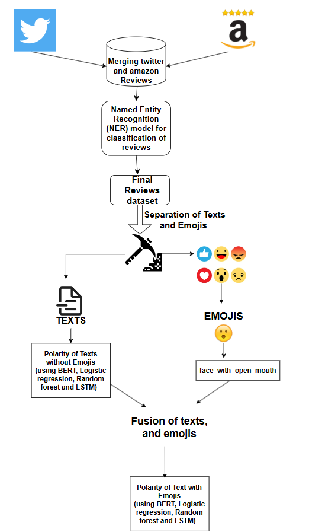

Proceedings of the Second International Conference on Automation, Computing and Renewable Systems (ICACRS-2023)
## IEEE Xplore Part Number: CFP23CB5-ART; ISBN: 979-8-3503-4023-5

•
o_t is the output gate activation.
W_o and b_o are learnable weights and biases for
the output gate.
Hidden State (h_t):
                         h_t = o_t * tanh(C_t)
      Where:

•
h_t is hidden state at time step t.
These equations describe the sequential flow of data through
an LSTM cell. The information that is sent to the hidden
layer of the following time step is decided by output gate,
how long previous information is retained is controlled by
the forget gate, and input gate controls the flow of new
information.
BERT: A pre-trained transformer-based model called the
BERT
(Bidirectional
Encoder
Representations
from
Transformers) technique was created for a variety of natural
language processing (NLP) problems.
Formula for a transformer encoder:
On top of the Transformer architecture, BERT is built.
The following equation is useful for figuring out a
Transformer encoder layer's output:

Attention (Q, K, V) = SoftMax (
)V

Where:

•
Q: Query Matrix
•
K: Key Matrix
•
V: Value Matrix
•
: Dimension of key vectors.
Multi-Head Self-Attention:
To capture various facets of the input text, BERT
employs multi-head self-attention. For every
attention head, there is a distinct set of parameters
that can be learned. The multi-head self-attention
equation is as follows:

## MultiHead (Q, K, V) = Contact (

= Attention (
)
Where:

•
h: Number of attention heads
•
: Learnable weight matrices for
each head
•
 : Learnable weight matrix for the output.

Contextual understanding, tokenization, text preprocessing,
and fine tuning are all used by the BERT model. Its job is to
obliterate stop words, extraneous noise, and punctuation—
emojis and not. The next step in the tokenization process is
treating emojis like tokens. BERT converts each token—
word, subword, or emoji—into high-dimensional vector
representations that express the word context of the text.
Being a bidirectional model, it can read text both from left
to right and from right to left. This bidirectionality helps
BERT properly grasp the context of words. After pretraining
on a large corpus of text, BERT is tuned on a specific
sentiment analysis task using labeled data. The conte xtual

embeddings are correlated with sentiment labels (satisfied,
neutral, and dissatisfied) by the model. Masked Language
Model (MLM) and Next Sentence Prediction (NSP) are the
two key tasks involved in the BERT-specific pre-training.

     While the NSP objective determines whether two
sentences are sequential, the MLM objective seeks to
predict masked words in a sentence. Cross-entropy loss for
predicting masked words based on MLM Loss Formula
calculations. The NSP Loss Formula uses cross-entropy loss
to determine if two sentences are sequential or not.
The formula for MLM loss is like cross-entropy loss:

MLM Loss = -Σ (log (P (x_i | δ)))

P (x_i | δ) represents the expected probability of the correct
token x_i, while δ denotes the parameters of the model.

## C. Description of Datasets, Requirements and Tools

Social Platform Reviews - A dataset of 1000 rows are
collected by considering Apple Air Pods product reviews.

## Fig. 2. A sample of reviews datasets

## C. Requirements
Google Collaboratory - Google Collaboratory, is a free
cloud-based tool that Google offers for creating and
executing Python-based machine learning and data science
experiments.
Python Libraries:


Keras – Python based Keras is an open-source
framework for deep learning [6]. It may be used by
both inexperienced and seasoned machine learning
practitioners [14].

NLP – Related text preparation tools are available
through NLTK.


TextBlob - This program makes routine text
processing operations easier. Text preparation is
where Text Blob shines.

979-8-3503-4023-5/23/$31.00 ©2023 IEEE
833
Authorized licensed use limited to: University of Auckland. Downloaded on April 12,2026 at 00:49:31 UTC from IEEE Xplore.  Restrictions apply.

Proceedings of the Second International Conference on Automation, Computing and Renewable Systems (ICACRS-2023)
## IEEE Xplore Part Number: CFP23CB5-ART; ISBN: 979-8-3503-4023-5


Matplotlib - Python's Matplotlib package is the
industry standard for data visualization. Line plots,
scatter plots, bar plots, histograms and pie charts.


NumPy – The Python library NumPy, which stands
for "Numerical Python," is the foundational library
for numerical and mathematical operations.


Demoji - Emojis and emoticons are extracted from
text data using the Python module Demoji.

# IV. RESULT ANALYSIS

## A. Results

## This chapter shows different visualization   techniques    that

are taken to estimate different types of Models. The central
theme of this study focuses on the Heatmaps and Bar graphs
to visualize the comparison between the different models
and compare the polarities between the texts and emojis.

Fig. 3. Named entity recognition for one of the reviews

From figure 3 using the Named Entity Recognition the
reviews have been filtered that contains the product value as
Air pods Second and third generation. The product-specific
and temporal sentiment data from reviews using the output
from named entity recognition are extracted and then
classified this NER model to preprocess the step more
effectively and used this output as the next input for the
futher sentiment analysis.

Fig. 4. Bar graph representation of Count of each sentiment in text along
with emojis

Fig 5. Bar graph representation of Count of each sentiment in text
without emojis.

Fig. 6. Performance Metrics Depiction of Regression and Random Forest
of text without emojis

Fig. 7. Performance Metrics Depiction of Regression and Random Forest
of text with emojis

Fig. 8. ML Model Accuracies of text with emojis

979-8-3503-4023-5/23/$31.00 ©2023 IEEE
834
Authorized licensed use limited to: University of Auckland. Downloaded on April 12,2026 at 00:49:31 UTC from IEEE Xplore.  Restrictions apply.

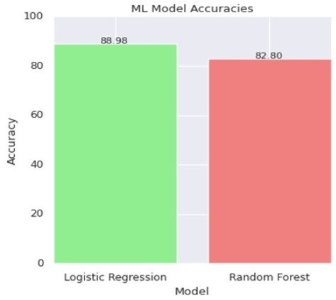

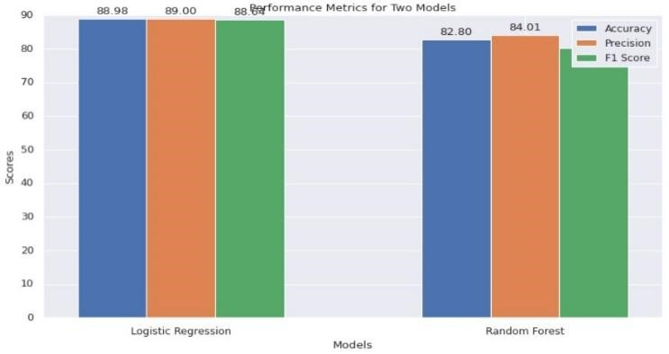

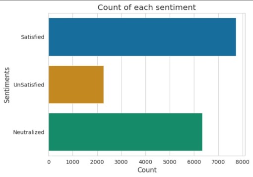

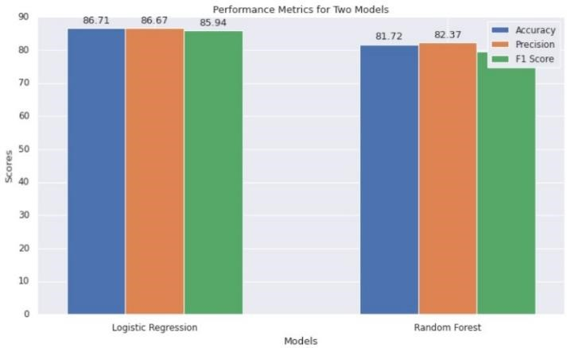

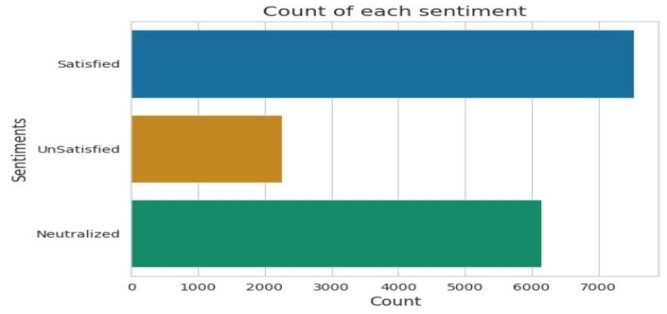

Proceedings of the Second International Conference on Automation, Computing and Renewable Systems (ICACRS-2023)
## IEEE Xplore Part Number: CFP23CB5-ART; ISBN: 979-8-3503-4023-5

Fig. 12. BERT model’s accuracy of 95.3% for text without emojis

Fig. 9. ML model accuracies of text without emojis

Fig. 13. BERT model’s accuracy of 96.2% for text with emojis

## B.  Observations

Fig. 10. LSTM model’s accuracy of 82.6% for text without emojis

The core of this research is to classify product review
comments as satisfied, neutralized, or dissatisfied by
considering both text and emojis. It also evaluated the
effectiveness
of
various
models,
including
BERT
(Bidirectional Encoder Representations from Transformers),
LSTM (Long Short-Term Memory), Random Forest and
logistic regression using regular expressions (logistic regex)
with reference to sentiment analysis. These are the
following observations that are emerged from the reviews.

With emojis, it reaches the highest accuracy of 96.2%. It
is foreseeable that using BERT model with emojis can
ensure that the classification of texts with emojis is high
accurate. Modern transformer-based natural language
understanding model BERT is well renowned for achieving
remarkable results in a variety of NLP tasks [7]. This model
exhibits the highest accuracy, demonstrating its efficiency in
capturing the subtleties of mood in product reviews. Emojis
are frequently used to express emotions, therefore this
model's strong performance in both instances (with and
without emojis) implies that it can handle a numerous usergenerated content types, making it appropriate for tasks
where this is the case.

Fig. 11. LSTM model’s accuracy of 83.6% for text with emojis

# TABLE I. COMPARISON OF THE ACCURACY
# BETWEEN THE DIFFERENT MODELS

## Accuracy %

Models

Text without
Emoji’s

Text
with
emoji’s

Logistic Regression
    86.7
88.9

However, while deploying BERT, it is valuable to
consider issues like computational resources and model
complexity because it might be more recourse-intensive
than conventional models like logistic regression or random

Random Forest
    81.7
82.7

LSTM
    82.6
83.7

BERT
    95.3
96.2

979-8-3503-4023-5/23/$31.00 ©2023 IEEE
835
Authorized licensed use limited to: University of Auckland. Downloaded on April 12,2026 at 00:49:31 UTC from IEEE Xplore.  Restrictions apply.

| Models | Accuracy % |  |
| --- | --- | --- |
|  | Text without Emoji’s | Text with emoji’s |
| Logistic Regression | 86.7 | 88.9 |
| Random Forest | 81.7 | 82.7 |
| LSTM | 82.6 | 83.7 |
| BERT | 95.3 | 96.2 |

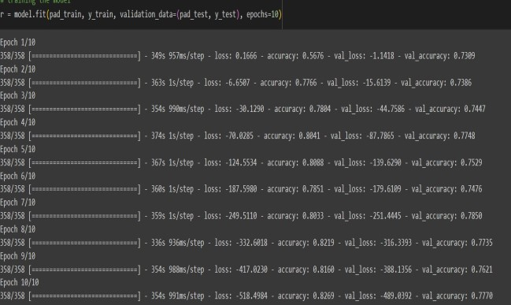

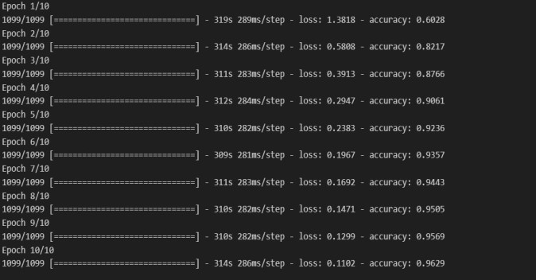

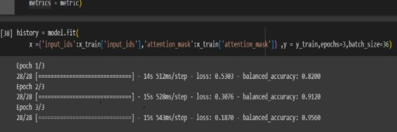

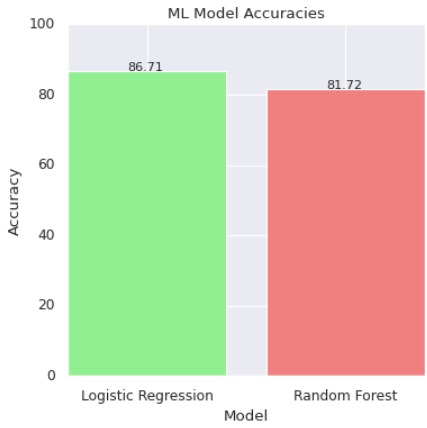

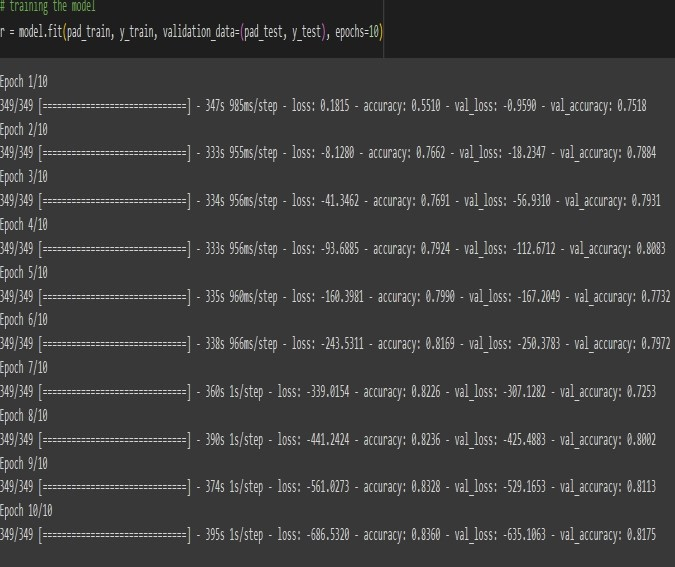

Proceedings of the Second International Conference on Automation, Computing and Renewable Systems (ICACRS-2023)
## IEEE Xplore Part Number: CFP23CB5-ART; ISBN: 979-8-3503-4023-5

forests. Additionally, the model opted accordingly should fit
the demands and limitations of this study. BERT is an
excellent choice for accurate sentiment analysis for product
reviews.

## V. CONCLUSION AND FUTURE STUDIES

## A. Conclusion

This research focuses on forming extraction of emojis and
text from Flipkart and Amazon reviews can enhance opinion
mining  by providing additional contextual information
about the sentiment and emotions expressed in the reviews.
By using Named Entity Recognition, the reviews that
contains the product information only about Air pods second
generation and third generation are filtered. After this
feature extraction the Deep learning and Machine learning
techniques, such as BERT, LSTM , Logistic regression and
Random Forest respectively , can be used to extract features
from both the text and emojis. Therefore, in this study the
BERT transformer and LSTM Model are used to classify the
sentiment of the review.

Overall, incorporating emojis into opinion mining using
deep learning techniques can improve the accuracy and
granularity of sentiment analysis, as emojis often convey
emotions and sentiments that are difficult to express through
text alone. BERT model has given more Accuracy when
compared to other models. So, the BERT model is preferred.
It is crucial to remember that the specific application and the
quality of the data will determine how effective this method
is, and further research is needed to fully understand the
potential benefits and limitations of incorporating emojis
into opinion mining.

## B. Further Studies

In the future, the extraction of emojis and text from
Twitter and Amazon reviews using deep learning techniques
is promising. As more and more data become available, the
accuracy of sentiment analysis algorithms can be expected
to improve. Here are some possible future scopes for this
area of research, they are Multimodal analysis, Real-time
sentiment
analysis,
Personalized
sentiment
analysis,
Emotion Detection, Applications beyond Opinion mining.

    Furthermore, this study would also like to encourage the
same research with Stickers and Gifs as they are demanding
and rapidly increasing in social media. Stickers and GIFs
frequently convey feelings more clearly than text alone
since they are filled with emotional substance. The
development of models that can recognize and interpret the
emotions conveyed by these visual components may be
necessary for the future of sentiment analysis. Future studies
might concentrate on building multimodal sentiment

analysis algorithms that combine data from several sources
to increase accuracy.
  To enhance the effectiveness of user perspective
acquisition across diverse languages and cultures, several
key strategies can be employed. Firstly, addressing emoji
challenges
involves
translating
emojis
into
textual
descriptions across languages and employing emotion
detection techniques to understand the sentiments conveyed.
Secondly, it is vital to curate multilingual and multicultural
datasets, incorporating samples from various regions and
languages to train the model effectively. Lastly, text
extraction and preprocessing steps, such as language
identification and character encoding, ensure the system can
handle different linguistic contexts, minimizing issues and
fostering a more culturally sensitive opinion mining process.

REFERENCES

[1]
Sancheng Peng a, Lihong Caob, Yongmei Zhou c, Zhouhao Ouyang
d, Aimin Yang e, Xinguang Li a, Weijia Jia f, Shui Yugv “A survey
on deep learning for textual emotion analysis in social networks”
published on 8 October 2022

[2]
Rajnish Pandey &amp; Jyoti Prakash Singh “BERT-LSTM model for
sarcasm detection in code-mixed social media post” published on
## October 2022

[3]
Mohammad Eid Alzahrani, 1 Theyazn H. H. Aldhyani, 2 Saleh Nagi
Alsubari, 3 Maha M.Althobaiti, “Developing an Intelligent System
with Deep Learning Algorithms for Sentiment Analysis of E-
Commerce Product Reviews” Published on 28 May 2022.

[4]
Mohammad Aman Ullah, Syeda Maliha Marium, ShamimAra
Begum, Nibadita Saha Dipa “An algorithm and method for sentiment
analysis using the text and emoticon” published on December 2020.

[5]
Leeja Mathew; V R Bindu“A Review of Natural Language
Processing Techniques for Sentiment Analysis using Pre-trained
Models” published on March 2020.

[6]
Kanish Shah, Henil Patel, Devanshi Sanghvi &amp; Manan Shah “A
Review of Natural Language Processing Techniques for Sentiment
Analysis using Pre-trained Models” published on December 2020.

[7]
Pankaj. Prashant Pandey, Muskan, Nitasha Soni “A Comparative
Analysis of Logistic Regression, Random Forest and KNN Models
for the Text Classification” published on February 2019.

[8]
Rajkumar S. Jagdale, Vishal S.Shirsat &amp; Sachin N. Deshmukh
“Sentiment Analysis on Product Reviews Using Machine Learning
Techniques” published on 12 August 2018.

[9]
## Y. Yorozu, M. Hirano, K. Oka, and Y. Tagawa, “Electron
spectroscopy studies on magneto-optical media and plastic substrate
interface,” IEEE Transl. J. Magn. Japan, vol. 2, pp. 740–741, August
1987 [Digests 9th Annual Conf. Magnetics Japan, p. 301, 1982].

[10] Gabriele de Seta, “The circulation of emoticons, emoji, stickers, and
custom images on Chinese digital media stickers, and custom images
on Chinese digital media platforms” published on 3 September 2018.

[11] Zeenia Singla; Sukhchandan Randhawa; Sushma Jain “Sentiment
analysis of customer product reviews using machine learning”
published in: 2017

[12] Manalee Datar &amp; Pranali Kosamkar, “A Novel Approach for
Polarity Determination Using Emoticons: Emoticon-Graph” published
on 26 February 2016.

[13] Anuj Sharma, Shubhamoy Dey “Performance Investigation of Feature
Selection Methods and Sentiment Lexicons for Sentiment Analysis”
announced on September 2013

979-8-3503-4023-5/23/$31.00 ©2023 IEEE
836
Authorized licensed use limited to: University of Auckland. Downloaded on April 12,2026 at 00:49:31 UTC from IEEE Xplore.  Restrictions apply.

Proceedings of the Second International Conference on Automation, Computing and Renewable Systems (ICACRS-2023)
## IEEE Xplore Part Number: CFP23CB5-ART; ISBN: 979-8-3503-4023-5

[14] Francesco Mureddu, David Osimo, “Research Challenge on Opinion
## Mining and Sentiment Analysis” publication September 2012

[15] Anuj Sharma, Shubhamoy Dey, “A comparative study of feature
selection and machine learning techniques for sentiment analysis”
published on 23 October 2012.

979-8-3503-4023-5/23/$31.00 ©2023 IEEE
837
Authorized licensed use limited to: University of Auckland. Downloaded on April 12,2026 at 00:49:31 UTC from IEEE Xplore.  Restrictions apply.
