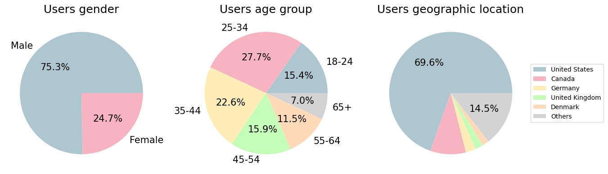
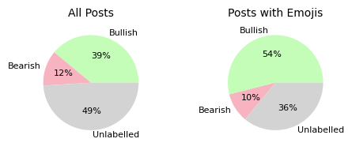
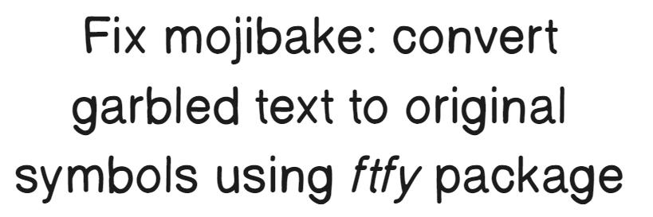
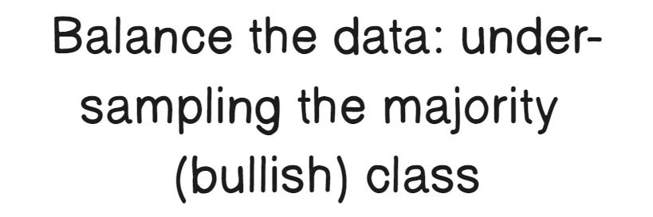
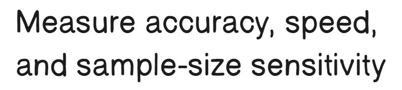
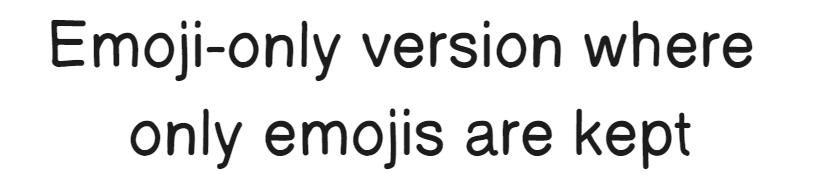
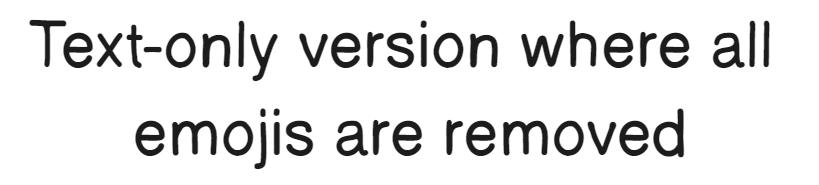
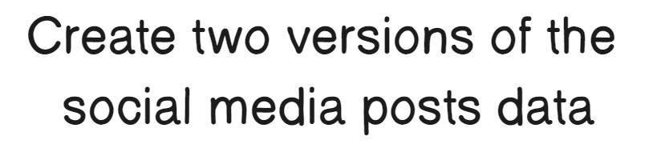
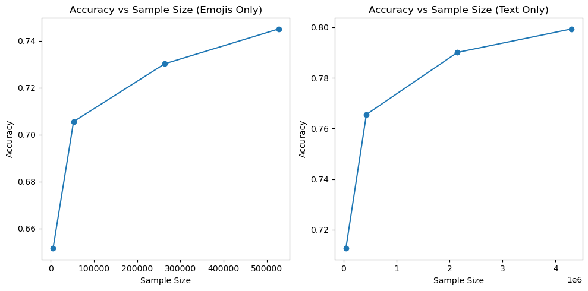
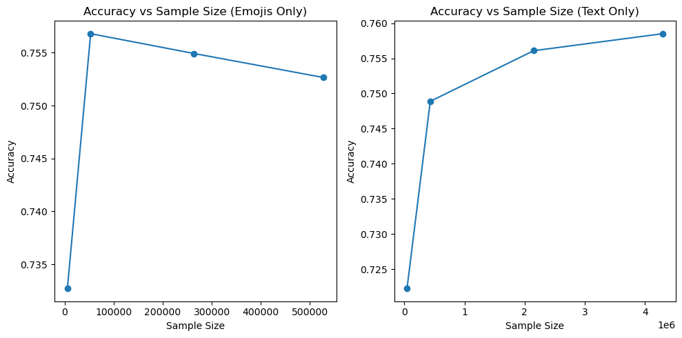

# The Role of Emojis in Sentiment Analysis of Financial Microblogs

## 2023 Fourth International Conference on Intelligent Data Science Technologies and Applications (IDSTA)

The Role of Emojis in Sentiment Analysis of
## Financial Microblogs

2023 Fourth International Conference on Intelligent Data Science Technologies and Applications (IDSTA) | 979-8-3503-3925-3/23/$31.00 ©2023 IEEE | DOI: 10.1109/IDSTA58916.2023.10317863

Ahmed Mahrous
College of Finance and Economics
Qatar University
Doha, Qatar
0000-0003-4694-5336

Jens Schneider
College of Science and Engineering
Hamad Bin Khalifa University
Qatar Foundation, Doha, Qatar
0000-0002-0546-2816

Roberto Di Pietro, Fellow, IEEE
RC3, CEMSE Division
KAUST
Thuwal, Saudi Arabia
0000-0003-1909-0336

financial news, and gain insights from the perspectives of
others.
Analyzing the sentiment of social media posts related
to financial markets has significant value. For instance,
the sentiment of financial posts can be used to construct an index of general investor sentiment [2]. Social
media sentiment can also be used to build potentially
profitable investing strategies. There are even investment
funds focusing solely on sentiment analysis [3]. Sentiment
analysis can also offer valuable information for researchers
seeking to understand financial market behavior [4]. Sentiment analysis for financial markets can be different from
sentiment analysis in other contexts. Some words carry
meanings specific to financial markets (e.g.: bull/bear).
Other words regarded as stop words in general sentiment
become especially important in a financial context (e.g.:
up/down). To have an idea of the subtleties related to this
type of analysis, it is worth noting that sentiment analysis
is required to interpret different semantics even within
the same financial domain, for instance when analyzing
formal financial texts, such as annual company reports,
or financial microblogging text. Financial microblogging
typically uses more informal language or slang, which
would be rarely used in a more formal context. Financial
microblogging can also have elements of speech that would
very rarely be used in a more formal context, such as
emojis.

Abstract—The application of sentiment analysis to
the financial sector is a field that has been revamped
thanks to social media, which has unleashed a trove of
data to analyze. In particular, text analysis techniques
have benefited from the attention that large part of
data science researchers have devoted to it. However,
as demographics evolve, so do the communication forms
on social media. In particular, the usage of emojis to
carry whole concepts is more and more diffused, though
research on the topic is lacking. That is exactly the
gap that we intend to cover with this contribution. In
particular, after collecting more than 18.5 million posts
from StockTwits, we use different supervised learning
models in order to determine the role of emojis in
sentiment analysis of financial posts on social media.
We assess model accuracy, training/prediction speed,
and sensitivity to training data set size for both emojisonly and text-only data, using logistic regression and
BiLSTM models.
Our main findings are staggering; we are the first to
show that, when training sentiment analysis models exclusively on emojis, compared to a text-only approach:
(i) achieved accuracy is competitive; (ii) training is 32
times faster; (iii) prediction times are reduced to a
third; and, (iv) 40 times less data is needed to train the
model. Additionally, we show some interesting patterns
regarding emoji usage in financial microblogs. The cited
contributions, other than being interesting on their
own, also pave the way for further research in the field.

Index Terms—sentiment analysis, emojis, finance,
microblogging, social media, machine learning, LSTM

## I. Introduction

Research questions.
Pre-existing work has focused
only on adding emojis to text to boost performance for
sentiment analysis. In contrast, this paper seeks to answer
the following research questions.

More than 4.8 billion people use social media around
the world, with an average usage of more than 2 hours
per day [1]. Needless to say, social media is a significant
technology that has become a major way for people to
communicate. Social media can be used to connect with
others, share ideas, and stay informed about current events
and news. Social media also serve as a valuable communication tool for financial market participants, offering
them a way to express their opinions, stay up-to-date with

Q1 How well can emojis alone serve as a proxy for public
sentiment in finance and is there a performance degradation vs. using the textual part of a social media
post?
Q2 How much data is needed to successfully train logistic
regression and bidirectional LSTM-based models to
predict financial trends (“bullish”, “bearish”, “neutral”) in social media micro-messages?

This publication was made possible by NPRP grants #0130-
200207 and GSRA #8-L-2-0517-21039, both from the Qatar National
Research Fund (a member of Qatar Foundation). The findings herein
are solely the responsibility of the authors.

979-8-3503-3925-3/23/$31.00 ©2023 IEEE
76

Authorized licensed use limited to: University of Auckland. Downloaded on April 12,2026 at 00:49:11 UTC from IEEE Xplore.  Restrictions apply.

## 2023 Fourth International Conference on Intelligent Data Science Technologies and Applications (IDSTA)

More specifically, Q2 can be seen as a measure of the
correlation between the components of messages (in our
case, text and emojis in StockTwits) and the implied
financial sentiment. Given that the narrow use of emojis in
the financial space is not as heavily subjected to cultural
biases as general-purpose use [5], [6], Q1 also implies an investigation if, in this context, emojis transcend languages.

et al. [12].

TABLE I: Different ways to use emojis.

Usage
Example
emphasizing text
What a great market!
substituting text
What a
market!
contradicting text
What a great market!

Contributions.
This paper sheds light on the added
value provided by emojis in the context of sentiment analysis for financial markets—with the analysis conducted on
data provided by microblogging platforms. In particular,
we contribute a structured analysis of the sentiment prediction performance obtained using only emojis vs. only
text—pre-existing work has focused only on adding emojis
to text to boost performance. Our work is supported by
a large amount of data (18.5 million posts) combined
with state-of-the-art analysis techniques —logistic regression and a bidirectional [7] Long Short-Term Memory
(LSTM)-based model citeHochreiter:1997:LSTM. Results
are staggering: in the context of finance, we are the first
to show that emojis are indeed strong proxies for financial
sentiment. We also show that using only emojis requires
less data to train on, making them an attractive choice if
models for the original language of a social media post are
immature or unavailable.

StockTwits platform. StockTwits started in 2008 and
has been called the Twitter of financial markets. It is a
microblogging platform that allows users to post and share
ideas about financial assets including stocks and cryptocurrencies. Reuters reported in 2022 that the platform
has more than 6 million registered users [13] and in 2019,
Stocktwits reported that more than 200,000 posts were
shared per day [14].
StockTwits is a highly valuable data source for finance
and computer science researchers. Firstly, virtually all
messages posted on StockTwits are related to financial
markets. Secondly, users on StockTwits have the option to
label their posts either as bullish (positive) or bearish (negative). These features allow researchers to create large data
sets of labeled posts related to financial markets. These
data sets can be useful for several analysis tasks, including
sentiment analysis using supervised learning algorithms.
Fig. 1 shows a visual breakdown of the demographics
of StockTwits users as reported by the web analytics
company Similarweb [15].

## II. Background

In this section, we provide the required info for the
comprehension of the remainder of the paper.
Emojis.
The word emoji is made up of two Japanese
words: e (絵, “picture”) + moji (文字, “letter”). Emojis
are widely used by social media users and have also been
utilized by researchers for sentiment analysis. Emojis are
believed to be first developed by the Japanese company
Softbank in 1997 [8]. However, they were popularized in
the 2010s after being standardized and released on several
platforms, including Apple’s iOS 5 [9]. In 2015, Instagram
engineers estimated that around 50% of the comments on
Instagram included an emoji [10]. In 2021, it was estimated
that more than 20% of Tweets have emojis [11].
Each emoji is assigned a unique code in the Unicode
encoding system, similar to characters such as letters.
For instance, the letter “A” is assigned the Unicode code
point U+0041, whereas the emoji
is assigned U+1F680.
Whereas this, in theory, allows them to be displayed consistently across different devices and platforms, in practice,
their appearance may vary due to font, software, and
device differences.
People can use emojis to emphasize text, substitute text
or contradict text (see also Table I). Emojis can offer
valuable information about a sentiment of a social media
post. Emojis can also be useful for understanding the
sentiment of posts in different languages. For a more indepth review of emojis including individual, cultural, and
platform use diversity (“biases”) we refer the reader to Bai

Fig. 1: Breakdown of StockTwits user demographics.

The majority of users on StockTwits are male. The age
distribution is relatively dispersed, with the largest group
being adults aged 25–44. Users are predominantly from
western countries, especially the USA; this is reflected in
the vast majority of posts being in English. Demography
is relevant, since people of different genders, different ages
and different cultures have been shown to use different
informal words and emojis on social media [5], [6], [16].

## III. Related Work

Given the role that emojis play in modern communications, they have attracted special attention from researchers in different fields, including marketing, psychology, medicine, education, and computer science [12].
Emojis have been used in sentiment analysis for social
media posts of different domains: posts including consumer
opinions of brands [17] or products [18], movie reviews [19],

77
Authorized licensed use limited to: University of Auckland. Downloaded on April 12,2026 at 00:49:11 UTC from IEEE Xplore.  Restrictions apply.

## 2023 Fourth International Conference on Intelligent Data Science Technologies and Applications (IDSTA)

political posts [20], financial posts [21], and general domain
posts [22].
An especially interesting aspect of emojis is their potential to transcending languages. A study found that emoji
sentiment scores are similar for 13 different European
languages [22]. Another study shows that sentiment scores
are similar for many but not all emojis when comparing
posts in English and Japanese [23]. Emojis have also
been used in sentiment analysis of social media posts in
Turkish [24], Chinese [25]–[28], Arabic [29]–[32] and several
other languages [33], [34]. Emojis can also be used to
detect more nuanced sentiments such as sarcasm, humor,
or irony [28], [35], [36].
In the context of sentiment analysis, emojis have been
used in different ways. Emojis have been used in the labeling process posts during pre-training, in order to overcome
the unlabeled nature of social media posts. Prior work has
assigned sentiment to Tweets based on the emojis they
contain [37], and even has assumed that posts with emojis
are non-neutral [28]. In addition, emojis have been used
as inputs to sentiment analysis algorithms, considering
emojis as special words [38]. In this context, a machine
learning algorithm to convert each emoji into a dense
vector representation to model its semantic meaning has
been used. These emoji vector representations were then
used as inputs to sentiment analysis algorithms to predict
the sentiment of a certain post containing an emoji [38].
Emojis have also been used as outputs of sentiment analysis algorithms, where the sentiment of text can be analyzed
to predict occurrences of emojis; this can be especially
useful for emoji recommendation systems. Recurrent neural networks have also been used to predict emojis from
text typed on mobile phone keyboards [39]. Some studies
also assign sentiment scores to emojis. Schwartz et al. [40]
first manually label 1.6 million Tweets as either positive,
negative or neutral; the sentiment scores of emojis are then
calculated based on the occurrences of each emoji in the
Tweets and the labels assigned to those Tweets.
Prior research has demonstrated that adding emojis as
inputs to sentiment analysis algorithms is useful [12], [21],
[26], [27], [32], [38], [41]–[47], not only in the context of
financial sentiment. One reason is that emojis often align
with the meaning of the text and underscore its meaning.
Therefore, emojis provide important clues to sentiment
analysers.
One sub-domain where sentiment analysis and emojis
can be of special interest is the domain of financial markets. Investor sentiment is a topic of significant interest
in the finance field. There are several methods used to
measure investor sentiment. The American Association of
Individual Investors (AAII) Survey is a weekly survey,
conducted since 1987, asking different groups of individual
investors whether they think the direction of the stock
market will be up (bullish), down (bearish), or experience
no change (neutral) [48]. The survey results have been used
as a measure of individual investor sentiment by many

researchers in the field of finance [49], [50]. In addition to
surveys, other proxy measures include the analysis of fund
flows (e.g., to mutual funds), retail trading volumes, the
premium paid for safe stocks, etc. [51].
A more recent trend is to measure investor sentiment
by analyzing social media since it offers a relatively inexpensive way to directly measure investor sentiment.
Dictionary-based sentiment analysis correlates with SP500
index intraday prices [52] and bitcoin prices [53]. However,
later studies highlight the difference between financial social media posts and general-purpose ones, demonstrated
by an improved performance of field-specific dictionaries [54].
Using machine learning for sentiment analysis, prior
art also finds that the sentiment of online forum posts is
related to future stock price movements [55], [56]. Simpler
approaches show that even inspecting Tweets for keywords
such as “bullish” and “bearish” has predictive value for
stock prices [57].
Underscoring the importance of sentiment, Bloomberg
terminal—a software platform that is widely used by
professional financial analysts—offers social media sentiment indicators for stocks. Prior art shows a clear relationship between Bloomberg sentiment indicators and
stock prices [58]–[60] but whether that is (considering the
significance of the platform) a “self-fulfilling prophecy” is
hard to analyze.
Some of the most recent work indicates that adding
emojis as a non-textual form of data to the sentiment
prediction process improves accuracy significantly, irrespective of whether a Naïve Bayes [21] or a deep neural
network [41] is used.
In contrast to the prior art, which all add emojis to preexisting text-based sentiment analysis, we investigate how
much predictive power the sole use of emojis in financial
social media posts carry.

## IV. Data and Stylized Facts

We gathered over 18.5 million posts on StockTwits.
Each of one these posts had the cashtag of at least one
stock or cryptocurrency, as listed in Tab. II. The “Others”
column in Tab. II represents a list of 14 stocks and
cryptocurrencies including a gold ETF, AMC stock, and
twelve cryptocurrencies.

Fig. 2: User-assigned label breakdown in the data set.

78
Authorized licensed use limited to: University of Auckland. Downloaded on April 12,2026 at 00:49:11 UTC from IEEE Xplore.  Restrictions apply.

## 2023 Fourth International Conference on Intelligent Data Science Technologies and Applications (IDSTA)

TABLE II: Number of posts by stock/cryptocurrency in the data sample.

Symbol
# S&P 500
Bitcoin
Dogecoin
Apple
GameStop
Shiba Inu
Others
Number of Posts
6,067,248
2,803,824
2,236,581
1,897,368
1,386,519
1,220,177
2,945,419
Percentage
33%
15%
12%
10%
7%
7%
16%

Fig. 3: Left to right: Emoji clouds of posts labeled as bullish, bearish, or left unlabeled by poster.

Fig. 2 shows the proportion of posts based on label for
all posts, and for posts that contain at least one emoji.
Of the 18.5 million posts, approximately 39% are labeled
as bullish, 12% are labeled as bearish and 49% are left
unlabeled by the poster. Note that the fact that the user
left the optional label unfilled does not mean that the post
was meant to be neutral.
We only included labeled Tweets, of which 77% are
labeled as bullish and 23% labeled as bearish. Around 14%
of all posts include emojis. For posts that contain emojis,
54% are labeled as bullish, 10% as bearish and 36% are
left unlabeled. Posts that contain emojis are, thus, more
likely to be bullish.
The green “emoji cloud” diagram in Fig. 3 shows the
emojis present in the posts labeled bullish by the poster,
with the emoji size reflecting the frequency of the emoji.
The larger the emoji, the higher the number of Tweets
in which it is mentioned. Many of the larger emojis in
the diagram clearly show a bullish sentiment such as
(fire, symbolizing that the market is “heating up”),
(gem-stone, symbolizing that an asset is valuable),
(rocket, symbolizing that the market is going up),
(money-mouth-face, symbolizing that the poster is excited
about making money), and
(chart with upwards trend).
Many of these emojis are much less used in non-financial
contexts.
The red “emoji cloud” in Fig. 3 shows the emojis
used in Tweets labeled as bearish by the poster. Some
of the prominent emojis that most likely carry a bearish
sentiment include
(bear-face),
(drop of blood,
symbolizing losing or “bleeding”),
(chart with downwards trend),
(police car revolving light, symbolizing
an emergency or a crisis), and
(pile of poo). Note
that the posts labeled as bearish by users include some
clearly bullish emojis, such as
or
, albeit at a lower
frequency compared to the posts labeled as bullish.
The grey “emoji cloud” in Fig. 3 represents the emojis used in posts that are left unlabeled by the poster.
Unlabeled posts are expected to be more bullish than
bearish. This is also evident in the presence of more bullish

emojis at a higher frequency in the “emoji cloud”. However,
some emojis seem to be larger than both the bullish and
the bearish “emoji cloud”, such as
(shrug emoji),
(grinning squinting face) and
(face with rolling eyes).
Note that some of the emojis present in the emoji clouds
are modifiers such as
(skin-tone modifier) or
(gender
modifier). Emoji modifiers are added on top of original
emojis in order to change certain characteristics such as
the skin tone or gender of the emoji. Some emojis, such as

, are popular among internet users in general and not
just in a financial context [61].

## V. Methodology
In the following, we detail the adopted methodology
that led to our results (see also Fig. 4 for a visual summary).

## A. Pre-processing Steps
We perform the following pre-processing steps.

## 1. Balancing: The original data is highly unbalanced,
with the majority of posts labeled by their poster as bullish
instead of bearish. Training a machine learning model on
an unbalanced data set can lead to results biased towards
the majority class. For instance, if the data contains 77%
of observations with a certain label (as in our case), the
model can achieve 77% accuracy by simply predicting
this label for all observations. To overcome this bias, we
balance the data set by under-sampling the majority class:
we take a random sample of posts from the bullish posts
which are equal in number to the bearish posts.

## 2. Fix mojibake: Mojibake is the “garbled text that is the
result of text being decoded using an unintended character
encoding” [62]. We noticed that our data contained many
instances of mojibake such as “&#39;”, “â € ” &gt”, “â
€ ™”,“ â € ” , etc. This mojibake has to be converted back
to symbols before proceeding (see Sec. VI for details).

## 3. Lowercase all text: Lowercasing text before performing sentiment analysis is important because it allows for
the standardization of input. For instance, without lowercasing the text, “Buy” and “buy” would be treated like

79
Authorized licensed use limited to: University of Auckland. Downloaded on April 12,2026 at 00:49:11 UTC from IEEE Xplore.  Restrictions apply.

| 6,067,248 | 2,803,824 | 2,236,581 | 1,897,368 | 1,386,519 | 1,220,177 |
| --- | --- | --- | --- | --- | --- |

## 2023 Fourth International Conference on Intelligent Data Science Technologies and Applications (IDSTA)

Fig. 4: Our methodology at a glance. Pre-processing (yellow, cf. Sec. V-A) generates two data sets, containing only
emojis and only text, respectively. We then feed each data set into both a logistic regression model (blue, cf. Sec. VI-B)
and our BiLSTM-based model (pink, cf. Sec. VI-C).

## 2. Removing punctuation marks can also affect the prediction of the sentiment of a financial post. For instance,
the post “I can’t explain how I’m feeling... :’(” would
show a different sentiment compared to “I can’t explain
how I’m feeling!!! :’)”. Removing punctuation marks would
transform them both into “I cant explain how Im feeling” which would carry much less information about the
sentiment compared to the previous examples. Removing
punctuation leads to a slight decrease in accuracy.

two different words, which they are not.

## 4. Replacing cashtags, usertags, and hyperlinks: All cashtags (eg: $AAPL, $BTC.X) were replaced by a common
word “cashtag”. All user mentions (eg: @user1, @elonmusk) were replaced by a common word “usertag”. All
hyperlinks (eg: https://blog.com/shockingnews) were replaced by a common word “linktag”.

## 5. Creating two versions of the data: After performing
the mentioned pre-processing steps, we create two versions
of the data: one version where all emojis are removed, and
another version where only emojis are retained. Details are
provided in Sec. VI.

## 3. Numbers also carry information that can help determine the sentiment of a post. For example, these two
Tweets contain the same characters except for numbers
but carry opposite sentiments: “The stock will go from 90
to 150” and ”The stock will go from 150 to 90”. Therefore,
we do not remove numbers.

## B. Common but excluded pre-processing Steps

Other pre-processing steps that can be performed include removing stop-words, removing punctuation marks,
removing numbers, stemming, lemmatization, and partof-speech (POS) tagging. However, a seminal contribution
by Renault, [21] shows that performing these steps reduces
accuracy for various reasons and varying degrees. We have
thus omitted the following pre-processing steps otherwise
commonly applied to general-purpose natural language
processing tasks.

## 4. Stemming is a process used to reduce words to their
base forms by removing suffixes or prefixes. Stemming
slightly reduces the accuracy of a sentiment analysis model
in a finance microblogging context. Words like “shorted”,
“shorts” and “shorties” would all be reduced to the form
“short” after stemming. The word “short” is important in
a financial context because it is equivalent to “sell”. This
example shows that stemming might remove important
information from a financial post.

## 1. Stop-words are a set of commonly used words that
are considered insignificant to sentiment analysis, such as
the words “a”, “the”, “is”, “are” etc. However, some words
that are usually considered stop-words can be important in
determining the sentiment of financial posts. Such words
include “up”, “down”, “over”, “under”, “below”, “above”
which are all included in the NLTK stop-words corpus.
Removing the NLTK stop-words corpus from finance microblogging posts significantly reduces the accuracy of a
sentiment analysis model.

## 5. Part-Of-Speech (POS) tagging involves analyzing
each word and giving it a label based on its part of the
speech (such as noun, verb, adjective etc.). Again, POS
tagging reduces the accuracy.

## C. Running Logistic Regression and BiLSTM models on
the emoji only data and the text only data

After performing the pre-processing steps and obtaining
two versions of the data—emoji-only and text-only, we
measure model accuracy, computational efficiency, and

80
Authorized licensed use limited to: University of Auckland. Downloaded on April 12,2026 at 00:49:11 UTC from IEEE Xplore.  Restrictions apply.

## 2023 Fourth International Conference on Intelligent Data Science Technologies and Applications (IDSTA)

a special padding token) or truncation (removing tokens
from the end of the Tweet). We split the tokenized input
into training, validation and testing sets, with 15% of the
entire data set as testing and 15% of the training data set
as validation.
We use a sequential-three layer model starting with an
embedding layer, followed by a bidirectional LSTM layer
and, finally, a dense layer. The embedding layer converts
the tokenized input into dense vector representations with
a size of 128, capturing semantic relationships between the
tokens. The bidirectional LSTM layer processes the output
of the embedding layer in both forward and backward
directions. Both the forward and backward LSTM layers
have 64 neurons. We set a dropout parameter of 0.2 to
prevent overfitting. The dense layer maps the output of the
LSTM layer into a single output neuron which is converted
into a scalar value using the sigmoid function.
The model is compiled with the binary cross-entropy
loss function and the Adam optimizer. The accuracy metric is also specified for evaluation during training. The
model is trained using 10 epochs but the training stops
if the validation loss does not improve for two consecutive
epochs; the model with the lowest validation loss is saved
and used. This is done to save time as the training time
for each epoch is high due to the large data set size.

sample size sensitivity of emoji-only data vs. text-only
data using two models: a simple logistic regression model
and a more advanced BiLSTM model. The full details of
our two models are discussed in the next section.

VI. Implementation Details
In the following, we report the detailed steps followed
to obtain our results. The info reported in this section,
together with the detailed methodology discussed above,
allows for complete reproducibility of our experiments.

## A. Pre-processing
We use the Python module “ftfy” to convert mojibake
(step 2. in Sec. V-A). For instance, the following input:

â € ”&gt; and ✔ werenâ € ™t decoded correctly.

## Let&#39;s use ftfy 🌠to fix that \x85

can be transformed to the following output:

—> and
weren’t decoded correctly.
Let’s use ftfy
to fix that...

To generate a “text only” copy of posts containing
emojis (step 5. in Sec. V-A), we replaced any emoji
with an empty string. To do so, we use a function from
the emoji module: emoji.replace_emoji(). For the “emojis
only” copy, we used a function from the emoji module, to
extract emojis from text: emoji.emoji_list().

## VII. Results

In the following, we report and discuss the results
obtained by performing the above introduced experiments.

## B. Logistic Regression Model
To tokenize the text data, we used a custom tokenization
pattern that includes all non-whitespace characters (regular expression \w+|[^\s]). Using the default tokenization
function of the vectorizer would have eliminated emojis. For vectorization, we used a Term Frequency-Inverse
Document Frequency (TF-IDF) vectorizer with default
settings from the sklearn library. The data was split into
training and testing samples, with the testing sample being
20% of the data. The LogisticRegression() model from the
sklearn library was used with the default parameters. The
logistic regression model assigns a probability to each row.
Rows with a probability of 0.5 or above are labeled as 1.

## A. Logistic Regression Model

Model performance. Tab. III (top) summarizes the
performance metrics using our logistic regression model,
whereas the bottom part of the same table summarizes
training and prediction times.
As can be seen, emojis-only achieve almost the same
performance as text-only sentiment analysis under all
metrics while requiring significantly less data.
The training time is the average time taken for training
the model 10 times on a sample size of 100,000 posts. The
prediction time is the average time taken for predicting
the labels of 100,000 posts, which was done 50 times. We
observe that using only emojis is not only significantly
faster to train (32×), but also faster to predict (almost
2.9×)—the latter being important for high-speed intraday
trading.
Sensitivity to data set size. Fig. 5(a) shows the predictive accuracy of using only emojis (left) vs. using only
text (right), plotted over data set size. As can be seen in
the figure, the model trained on emojis-only data reaches
high accuracy much faster, but then degrades, though
very mildly. We assume that this is due to significant
imbalances in the data, leading the model to assign a
fraction of its approximation capacity to memoization.
While a full investigation of this effect is left for future
work, it underscores that in the case of logistic regression,

## C. BiLSTM Model
In addition to the logistic regression model, we also
utilize a bidirectional LSTM (Long Short-Term Memory)
model. The LSTM model is effective in capturing sequential information and dependencies. The bidirectional
version of LSTM (BiLSTM) is able to analyze a meaning of
a word taking into consideration not just the words before
it, but also the words after it.
To enable the model to process textual data, we tokenize the text data using the Twitter-RoBERTa base
sentiment tokenizer. This tokenizer, loaded from the
cardiffnlp/twitter-roberta-base-sentiment-latest
model, was trained on over a hundred million Tweets and
fine-tuned for sentiment analysis. We set the length of each
Tweet to 128 tokens by performing either padding (adding

81
Authorized licensed use limited to: University of Auckland. Downloaded on April 12,2026 at 00:49:11 UTC from IEEE Xplore.  Restrictions apply.

## 2023 Fourth International Conference on Intelligent Data Science Technologies and Applications (IDSTA)

(a)
(b)

Fig. 5: Size sensitivity for our (a) logistic regression and (b) LSTM-based models—emojis (left) vs. text (right).

TABLE IV: BiLSTM Model. Top: accuracy metrics. Bottom: Training and prediction speed.

TABLE III: Logistic regression model. Top: accuracy metrics. Bottom: Training and prediction speed.

Performance Metrics
text only
emojis only
Accuracy
0.75
0.75
Recall (weighted avg)
0.75
0.76
Precision (weighted avg)
0.75
0.75
F1 Score (weighted avg)
0.75
0.75
Training Sample Size
3,439,201
422,033

Performance Metrics
text only
emojis only
Accuracy
0.80
0.74
Accuracy
0.80
0.74
Recall (weighted avg)
0.80
0.74
Precision (weighted avg)
0.81
0.74
F1 Score (weighted avg)
0.80
0.74
Training Sample Size
3,439,201
422,033
Epochs
6
10

Timings
text only
emojis only
Training time (seconds)
21.10
0.66
Training Sample Size
100,000
100,000
Prediction time (seconds)
0.0021
0.00074
Prediction Sample Size
100,000
100,000

Timings
text only
emojis only
Training time (seconds)
25.04
25.08
Training Sample Size
100,000
100,000
Prediction time (seconds)
7.88
7.85
Prediction Sample Size
100,000
100,000

strong performance can be reached using very little data
(less than 100,000 posts vs. 4m).

Sensitivity to data set size.
Fig. 5(b) shows the accuracy using only emojis (left) vs. using only text (right).
As was the case for logistic regression, using only emojis
requires much less data (approx. 500,000 vs. 4m), at the
expense of a minor performance gap between the two.

## B. BiLSTM Model

Model performance.
Like for the logistic regression
model, Tab. IV summarizes our results for our BiLSTMbased model. The top half shows our performance metrics,
indicating that using only emojis is a good proxy for sentiment that potentially transcends languages. It also demonstrates that significantly heavier machinery (e.g., deep
learning) is necessary to harness the additional predictive
information contained in (mostly English) text. This boost
in performance comes from the sequential nature of text:
emoji positions can often be permuted without changing
the meaning, resulting in a lack of temporal context for
the (Bi-)LSTM. The training time is reported per epoch,
as the average of 10 epochs of training the model on
100,000 posts. The prediction time is taken as the average
of predicting 100,000 posts 10 times. It is noteworthy that
the deep learning approach results in a severely slower
prediction speed but boosts text-based performance in
terms of accuracy when compared to the faster logistic
regression approach by around 5% (absolute). We also note
that the times reported for the logistic regression model is
the average time for each complete model fitting, further
increasing the gap in terms of training speed between the
two.

## VIII. Conclusion & Future Work

In this contribution, to the best of our knowledge, we
are the first in the literature to analyse the possibility of
an emojis-only approach for sentiment analysis of financial
social media posts. Leveraging a large dataset (18.5M
posts) and adopting state of the art techniques (logistic
regression and LSTM), we found that, for a given choice of
model (logistic regression), an emojis-only approach shows
the same accuracy as a text-only approach. Moreover,
when the two approaches are compared, the emojis-only
approach emerges as the champion: it is 32 times more
efficient in training while requiring 40 times less data, and
it is almost 3 times more efficient in decision making. The
speed advantage is particularly valuable for intra-day highspeed analysis, especially in the volatile cryptocurrency
space. In our future work, we wish to extend the setting
presented in this paper to include a combined text+emoji
approach, as well as to investigate in more details the
relationship between training-data and performance.

82
Authorized licensed use limited to: University of Auckland. Downloaded on April 12,2026 at 00:49:11 UTC from IEEE Xplore.  Restrictions apply.

## 2023 Fourth International Conference on Intelligent Data Science Technologies and Applications (IDSTA)

References

in Proceedings of the 20th International Conference on Information Integration and Web-based Applications & Services, 2018,
pp. 310–313.
[24] Ç. Ü. Yurtoz and I. B. Parlak, “Measuring the effects of emojis
on turkish context in sentiment analysis,” in 2019 7th International Symposium on Digital Forensics and Security (ISDFS).
IEEE, 2019, pp. 1–6.
[25] J. Wu, K. Lu, S. Su, and S. Wang, “Chinese micro-blog sentiment analysis based on multiple sentiment dictionaries and
semantic rule sets,” IEEE Access, vol. 7, pp. 183 924–183 939,
2019.
[26] C. Liu, F. Fang, X. Lin, T. Cai, X. Tan, J. Liu, and X. Lu,
“Improving sentiment analysis accuracy with emoji embedding,”
Journal of Safety Science and Resilience, vol. 2, no. 4, pp.
246–252, 2021.
[27] Y. Lou, Y. Zhang, F. Li, T. Qian, and D. Ji, “Emoji-based
sentiment analysis using attention networks,” ACM Transactions on asian and low-resource language information processing
(TALLIP), vol. 19, no. 5, pp. 1–13, 2020.
[28] D. Li, R. Rzepka, M. Ptaszynski, and K. Araki, “Hemos: A novel
deep learning-based fine-grained humor detecting method for
sentiment analysis of social media,” Information Processing &
Management, vol. 57, no. 6, p. 102290, 2020.
[29] S. A. A. Hakami, R. J. Hendley, and P. Smith, “Emoji sentiment
roles for sentiment analysis: A case study in arabic texts,”
in Proceedings of the The Seventh Arabic Natural Language
Processing Workshop (WANLP), 2022, pp. 346–355.
[30] H. Abdellaoui and M. Zrigui, “Using tweets and emojis to build
tead: an arabic dataset for sentiment analysis,” Computación y
Sistemas, vol. 22, no. 3, pp. 777–786, 2018.
[31] S. O. Alhumoud and A. A. Al Wazrah, “Arabic sentiment
analysis using recurrent neural networks: a review,” Artificial
Intelligence Review, vol. 55, no. 1, pp. 707–748, 2022.
[32] S. Al-Azani and E.-S. M. El-Alfy, “Combining emojis with
arabic textual features for sentiment classification,” in 2018 9th
International Conference on Information and Communication
Systems (ICICS).
IEEE, 2018, pp. 139–144.
[33] N. Choudhary, R. Singh, V. A. Rao, and M. Shrivastava, “Twitter corpus of resource-scarce languages for sentiment analysis
and multilingual emoji prediction,” in Proceedings of the 27th
international conference on computational linguistics, 2018, pp.
1570–1577.
[34] S. Smetanin, “Rusentitweet: a sentiment analysis dataset of
general domain tweets in russian,” PeerJ Computer Science,
vol. 8, p. e1039, 2022.
[35] B. Felbo, A. Mislove, A. Søgaard, I. Rahwan, and S. Lehmann,
“Using millions of emoji occurrences to learn any-domain
representations for detecting sentiment, emotion and sarcasm,”
in Proceedings of the 2017 Conference on Empirical Methods in
Natural Language Processing.
Association for Computational
Linguistics, 2017, pp. 1615–1625. [Online]. Available: https:
//aclanthology.org/D17-1169
[36] A. Singh, E. Blanco, and W. Jin, “Incorporating emoji descriptions improves tweet classification,” in Proceedings of the 2019
Conference of the North American Chapter of the Association
for Computational Linguistics: Human Language Technologies,
Volume 1 (Long and Short Papers), 2019, pp. 2096–2101.
[37] M. Li, E. Ch’ ng, A. Y. L. Chong, and S. See, “Multi-class twitter
sentiment classification with emojis,” Industrial Management &
Data Systems, vol. 118, no. 9, pp. 1804–1820, 2018.
[38] Y. Chen, J. Yuan, Q. You, and J. Luo, “Twitter sentiment analysis via bi-sense emoji embedding and attention-based lstm,”
in Proceedings of the 26th ACM international conference on
Multimedia, 2018, pp. 117–125.
[39] S. Ramaswamy, R. Mathews, K. Rao, and F. Beaufays, “Federated learning for emoji prediction in a mobile keyboard,” arXiv
preprint arXiv:1906.04329, 2019.
[40] H. Schwartz, J. Eichstaedt, M. Kern, L. Dziuzynski, S. Ramones,
and M. e. a. Agrawal, “Personality, gender and age in the
language of social media: The open-vocabulary approach,” PloS
one, vol. 8, no. 9, p. e73791, 2013.
[41] N. Mahmoudi, P. Docherty, and P. Moscato, “Deep neural networks understand investors better.” Decision Support Systems,
vol. 112, pp. 23–34, 2018.

[1] Datareportal, “Global social media statistics,” www.datareportal.com/social-media-users accessed 14-Jun-2023, 2023.
[2] S&P Dow Jones Indices, “Social media sentiment,” www.spglobal.com/spdji/en/index-family/strategy/factors/socialmedia-sentiment/ accessed 14-Jun-2023, 2023.
[3] VanEck,
“Buzz
|
VanEck
social
sentiment
ETF,”
www.vaneck.com/us/en/investments/social-sentiment-etfbuzz/overview/ accessed 14-Jun-2023, 2021.
[4] J. Bukovina, “Social media big data and capital markets-an
overview,” Behavioural and Experimental Finance, vol. 11, pp.
18–26, 2016.
[5] M. Kejriwal, Q. Wang, H. Li, and L. Wang, “An empirical study
of emoji usage on twitter in linguistic and national contexts,”
Online Social Networks and Media, vol. 24, p. #100149, 2021.
[6] S. C. G. Guntuku, M. Li, L. Tay, and L. H. Ungar, “Studying
cultural differences in emoji usage across the east and the west,”
in International AAAI Conference on Web and Social Media
(ICWSM), 2019, pp. 226–235.
[7] M. Schuster and K. Paliwal, “Bidirectional recurrent neural
networks,” IEEE Transactions on Signal Processing, vol. 45,
no. 11, pp. 2673–2681, 1997.
[8] J. Burge, “Correcting the record on the first emoji set,”
blog.emojipedia.org/correcting-the-record-on-the-first-emojiset/ accessed 14-Jun-2023, 2019.
[9] ——, “Apple emoji turns 10,” blog.emojipedia.org/apple-emojiturns-10/ accessed 14-Jun-2023, 2018.
[10] T. Dimson, “Emojineering part 1: Machine learning for emoji
trends,” www.instagram-engineering.com/emojineering-part-1machine-learning-for-emoji-trendsmachine-learning-for-emojitrends-7f5f9cb979ad?gi=0e35c0c4c3a0
accessed
14-Jun-2023,
2015.
[11] K. Broni, “Top emoji trends of 2021,” blog.emojipedia.org/topemoji-trends-of-2021/ accessed 14-Jun-2023, 2021.
[12] Q. Bai, Q. Dan, Z. Mu, and M. Yang, “A systematic review of
emoji: Current research and future perspectives,” Frontiers in
psychology, vol. 10, p. 2221, 2019.
[13] M. Singh, “After crypto, stocktwits takes aim at stocks trading,”
www.reuters.com/technology/after-crypto-stocktwits-takesaim-stocks-trading-2022-07-19/ accessed 14-Jun-2023, 2022.
[14] Stocktwits Inc., “Advanced search is now on stocktwits,”
blog.stocktwits.com/advanced-search-is-now-on-stocktwits-
8a4f1f590fee accessed 14-Jun-2023, 2019.
[15] Similarweb.com, “stocktwits.com,” www.similarweb.com/website/stocktwits.com/#geography accessed 14-Jun-2023, 2023.
[16] Z. Chen, X. Lu, W. Ai, H. Li, Mei, Q., and X. Liu, “Through a
gender lens: Learning usage patterns of emojis from large-scale
android users,” in Proc. World Wide Web Conference, 2018, pp.
763–772.
[17] M. Ghiassi, D. Zimbra, and S. Lee, “Targeted twitter sentiment analysis for brands using supervised feature engineering
and the dynamic architecture for artificial neural networks,”
Journal of Management Information Systems, vol. 33, no. 4,
pp. 1034–1058, 2016.
[18] M. Rathan, V. R. Hulipalled, K. Venugopal, and L. Patnaik,
“Consumer insight mining: aspect based twitter opinion mining
of mobile phone reviews,” Applied Soft Computing, vol. 68, pp.
765–773, 2018.
[19] I. Rabbimov, I. Mporas, V. Simaki, and S. Kobilov, “Investigating the effect of emoji in opinion classification of uzbek movie
review comments,” in Speech and Computer: 22nd International
Conference, SPECOM 2020, St. Petersburg, Russia, October
7–9, 2020, Proceedings 22.
Springer, 2020, pp. 435–445.
[20] R. Sandoval-Almazan and D. Valle-Cruz, “Facebook impact and
sentiment analysis on political campaigns,” in Proceedings of
the 19th annual international conference on digital government
research: governance in the data age, 2018, pp. 1–7.
[21] T. Renault, “Sentiment analysis and machine learning in finance: a comparison of methods and models on one million
messages,” Digital Finance, vol. 2, no. 1-2, pp. 1–13, 2020.
[22] P. Kralj Novak, J. Smailović, B. Sluban, and I. Mozetič, “Sentiment of emojis,” PloS one, vol. 10, no. 12, p. e0144296, 2015.
[23] M. Kimura and M. Katsurai, “Investigating the consistency of
emoji sentiment lexicons constructed using different languages,”

83
Authorized licensed use limited to: University of Auckland. Downloaded on April 12,2026 at 00:49:11 UTC from IEEE Xplore.  Restrictions apply.

## 2023 Fourth International Conference on Intelligent Data Science Technologies and Applications (IDSTA)

2014.
[53] F. Mai, Z. Shan, Q. Bai, X. Wang, and R. H. Chiang, “How does
social media impact bitcoin value? a test of the silent majority
hypothesis,” Management Information Systems, vol. 35, no. 1,
pp. 19–52, 2018.
[54] T. Renault, “Intraday online investor sentiment and return
patterns in the US stock market,” Banking & Finance, vol. 84,
pp. 25–40, 2017.
[55] Y. Yu, W. Duan, and Q. Cao, “The impact of social and
conventional media on firm equity value: A sentiment analysis approach,” Decision Support Systems, vol. 55, no. 4, pp.
919–926, 2013.
[56] S. Sabherwal, S. K. Sarkar, and Y. Zhang, “Do internet stock
message boards influence trading? evidence from heavily discussed stocks with no fundamental news.” Business Finance &
Accounting, vol. 38, no. 9 ‐ 10, pp. 1209–1237, 2011.
[57] H. Mao, S. Counts, and J. Bollen, “Quantifying the effects of
online bullishness on international financial markets,” Statistics
Paper Series 9, European Central Bank, 2015.
[58] X. Cui, D. Lam, and A. Verma, “Embedded value in Bloomberg
news and social sentiment data,” www.bloomberg.com/professional/sentiment-analysis-white-papers/ Bloomberg Whitepaper, 2016.
[59] C. Gu and A. Kurov, “Informational role of social media:
Evidence from twitter sentiment,” Banking & Finance, vol. 121,
p. #105969, 2020.
[60] S. Behrendt and A. Schmidt, “The Twitter myth revisited:
Intraday investor sentiment, Twitter activity and individuallevel stock return volatility.” Banking & Finance, vol. 96, pp.
355–367, 2018.
[61] J. Daniel, “The most frequently used emoji of 2021,” home.unicode.org/emoji/emoji-frequency/ accessed 14-Jun-2023, 2021.
[62] R. King, “Will Unicode soon be the universal code?” IEEE
Spectrum, vol. 49, no. 7, p. 60, 2012.

[42] T. LeCompte and J. Chen, “Sentiment analysis of tweets including emoji data,” in 2017 International Conference on Computational Science and Computational Intelligence (CSCI).
IEEE,
2017, pp. 793–798.
[43] M. Shiha and S. Ayvaz, “The effects of emoji in sentiment
analysis,” Int. J. Comput. Electr. Eng.(IJCEE.), vol. 9, no. 1,
pp. 360–369, 2017.
[44] A. Hogenboom, D. Bal, F. Frasincar, M. Bal, F. De Jong, and
## U. Kaymak, “Exploiting emoticons in sentiment analysis,” in
Proceedings of the 28th annual ACM symposium on applied
computing, 2013, pp. 703–710.
[45] A. G. Ganie, “Presence of informal language, such as emoticons, hashtags, and slang, impact the performance of sentiment analysis models on social media text?” arXiv preprint
arXiv:2301.12303, 2023.
[46] M. A. Ullah, S. M. Marium, S. A. Begum, and N. S. Dipa, “An
algorithm and method for sentiment analysis using the text and
emoticon,” ICT Express, vol. 6, no. 4, pp. 357–360, 2020.
[47] M. Fernández-Gavilanes, J. Juncal-Martínez, S. García-Méndez,
## E. Costa-Montenegro, and F. J. González-Castano, “Creating
emoji lexica from unsupervised sentiment analysis of their descriptions,” Expert Systems with Applications, vol. 103, pp.
74–91, 2018.
[48] AAII, “Aaii investor sentiment survey,” www.aaii.com/sentimentsurvey accessed 14-Jun-2023, 2023.
[49] K. Fisher and M. Statman, “Investor sentiment and stock returns,” Financial Analysts, vol. 56, no. 2, pp. 16–23, 2000.
[50] G. Brown and M. Cliff, “Investor sentiment and the near-term
stock market,” Empirical Finance, vol. 11, no. 1, pp. 1–27, 2004.
[51] M. Baker and J. Wurgler, “Investor sentiment in the stock
market,” Economic Perspectives, vol. 21, no. 2, pp. 129–151,
2007.
[52] I. Zheludev, R. Smith, and T. Aste, “When can social media lead
financial markets?” Scienfific Reports, vol. 4, no. 1, p. #4213,

84
Authorized licensed use limited to: University of Auckland. Downloaded on April 12,2026 at 00:49:11 UTC from IEEE Xplore.  Restrictions apply.
